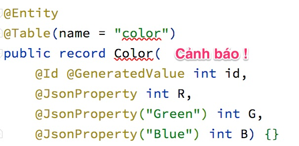

# Spring Boot với JDK 16

Trong bài này tôi chia sẻ trải nghiệm chạy ứng dụng Spring Boot dùng JDK 16 bản mới nhất vào tháng 4/2021. Tôi thử nghiệm tính năng được kỳ vọng nhất là ```record``` giúp giảm tối đa các đoạn code getter, setter, constructor mà lập trình viên phải viết khi khai báo Java class.

Tôi sử dụng [APIController.java](src/main/java/vn/techmaster/hellojdk16/controller/APIController.java) để trả về mảng các kiểu được annotate bởi Lombok và record xem thế nào.
## Thử nghiệm dùng record

### Cách cổ điển sử dụng Lombok
Lombok là một dependency giúp lập trình viên có thể rút ngắn các đoạn code getter, setter, constructor. Xem [Colour.java](src/main/java/vn/techmaster/hellojdk16/model/Colour.java)
```java
import lombok.AllArgsConstructor;
import lombok.Data;

@Data
@AllArgsConstructor
public class Colour {
	private int Red;
	private int Green;
	private int Blue;
}
```

Cách này phải dùng dependency Lombok khai báo trong [pom.xml](pom.xml)
```xml
<dependency>
  <groupId>org.projectlombok</groupId>
  <artifactId>lombok</artifactId>
  <optional>true</optional>
  <version>1.18.20</version>
</dependency>
```

### Sử dụng tính năng record trong JDK 16
Thực ra từ JDK 14 đã có tính năng record rồi. Đến JDK 16, tính năng này đã tiến gần đến trạng thái hoàn thiện (finalized).

Khác với Java class được annotate với ```@Data``` của Lombok được mặc định hỗ trợ tính năng JSON serialize, record không mặc định hỗ trợ JSON serialize. Do đó trong constructor, chúng ta phải định rõ trường nào sẽ được chuyển sang JSON bằng annotation ```@JsonProperty```. Có thể định nghĩa lại tên mới khi serialize trường đó sang Json bằng ```@JsonProperty("new_name")```

```java
import com.fasterxml.jackson.annotation.JsonProperty;
import java.util.Objects;

public record Color(
		@JsonProperty int R,
		@JsonProperty("Green") int G,
		@JsonProperty("Blue") int B) {}
```

Nhờ annotate các trường với ```@JsonProperty``` mà trong [APIController.java](src/main/java/vn/techmaster/bookstore/controller/APIController.java), chúng ta có thể định nghĩa phương thức để trả về danh sách Color
```java
@GetMapping("/colors")
public List<Color> getColors() {
  ArrayList<Color> colors = new ArrayList<>();
  colors.add(new Color(12, 15, 255));
  colors.add(new Color(255, 0, 0));
  colors.add(new Color(0, 255, 0));
  colors.add(new Color(0, 0, 255));
  return colors;
}
```

Chạy thử ứng dụng và vào địa chỉ http://localhost:8080/api/colors để xem dữ liệu trả về nhé.


### Để VSCode hỗ trợ chức năng mới trong JDK cần làm vài bước

Để dùng tính năng mới trong JDK 15, trong Visual Studio Code phải làm mấy động tác:

Trong file [launch.json](.vscode/launch.json), phải bổ xung ```"vmArgs": "--enable-preview"```
```xml
{
  "version": "0.2.0",
  "configurations": [
    {
      "type": "java",
      "name": "Launch Hellojdk16Application",
      "request": "launch",
      "mainClass": "vn.techmaster.hellojdk16.Hellojdk16Application",
      "projectName": "hellojdk16",
      "vmArgs": "--enable-preview"
    }
  ]
}
```

Sau đó trong [pom.xml](pom.xml), lại bổ xung 
```xml
<build>
  <plugins>      
    <plugin>
      <artifactId>maven-compiler-plugin</artifactId>
      <configuration>
        <release>16</release>
        <compilerArgs>--enable-preview</compilerArgs>
      </configuration>
    </plugin>
  </plugins>
</build>
```

## Lỗi khi dùng Lombok version cũ trên JDK16
Hiện nay (4/2021), đã có phiên bản JDK 16, khi biên dịch mã nguồn có 
Spring Boot với Lombok dependency có thể phát sinh lỗi như sau

```
JDK 16 class lombok.javac.apt.LombokProcessor (in unnamed module @0xb4de809) cannot access class com.sun.tools.javac.processing.JavacProcessingEnvironment (in module jdk.compiler) because module jdk.compiler does not export com.sun.tools.javac.processing to unnamed module @0xb4de809
```

Phiên bản Lombok v1.18.20 đã hỗ trợ JDK 16. Do đó chỉnh lại trong pom.xml bằng cách
thêm thẻ phiên bản ```<version>1.18.20</version>```
```xml
<dependency>
  <groupId>org.projectlombok</groupId>
  <artifactId>lombok</artifactId>
  <optional>true</optional>
  <version>1.18.20</version>
</dependency>
```

## record có hỗ trợ định nghĩa JPA Entity không?

Nếu bạn dùng VSCode, thì bạn có thể khai báo như sau:
```java
@Entity
@Table(name = "color")
public record Color(
		@Id @GeneratedValue int id,
		@JsonProperty int R,
		@JsonProperty("Green") int G,
		@JsonProperty("Blue") int B) {}
```

Nhưng khi bạn dùng Intellij Ultimate vẫn cảnh báo lỗi rất khó hiểu: 


## Kết luận

1. JDK 16 có nhiều tính năng rất hay ho. record là cái gần gũi với lập trình Java back end hơn cả. Hiện mới chỉ có VSCode hỗ trợ tốt. Còn IntelliJ thì chưa !
2. Nếu bạn lập trình một ứng dụng Java monolithics to khủng vài chục nghìn dòng code, bạn sẽ phải bó buộc ở những phiên bản JDK cũ ổn định như 11 dài dài. Còn nếu bạn lập trình các microservice, bạn có thể thoải mái thử nghiệm JDK mới, Groovy, Kotline để tận hưởng những tính năng mới nhất, miễn là chương trình vượt quá các kiểm thử. Đừng bảo thủ bám lấy những bản JDK cũ.
3. Tính năng record chưa có gì xuất sắc hơn Lombok, do đó tạm thời mình vẫn dùng Lombok để nhiều bạn có thể chạy được.
4. À mình đang dạy lập trình Spring Boot ở Techmaster. Bạn nào nghiêm túc muốn trở thành lập trình viên Java back end thì nên đăng ký khoá học này [Full stack Java Developer](https://java.techmaster.vn/). Học trong 7 tháng với nhiều môn học thiết thực.

*Hẹn gặp lại trong bài viết tới !*