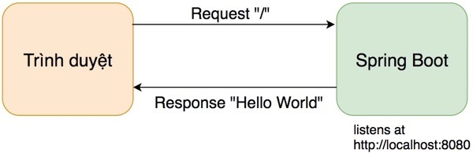

# Trả về text/html

Khi chạy Spring Boot sẽ hứng ở cổng 8080, trong ví dụ này cần in ra dòng chữ "This is Amazon Book Store" ở đường dẫn gốc "/"


## Thực hành từng bước
1. Tạo một thư mục [controller](src/main/java/vn/techmaster/bookstore/controller)
2. Tạo một class [HomeController.java](src/main/java/vn/techmaster/bookstore/controller/HomeController.java)
3. Thêm @Controller đánh dấu loại class này để điều hướng các request
4. Tạo phương thức ```public String getHome()```
5. Thêm @ResponseBody để phương thức trả về dữ liệu ngay mà không qua View Template Engine

```java
package vn.techmaster.bookstore.controller;

import org.springframework.http.MediaType;
import org.springframework.stereotype.Controller;
import org.springframework.web.bind.annotation.GetMapping;
import org.springframework.web.bind.annotation.ResponseBody;

@Controller
public class HomeController {
  @ResponseBody // 
  @GetMapping(value="/", produces=MediaType.TEXT_HTML_VALUE)
  public String getHome() {
    return "This is Amazon Book Store";
  }
}
```
**Giải thích một số annotation**
- ```@Controller``` đánh dấu một class thành component, và chuyên xử lý các request gọi đến
- ```@GetMapping``` đánh dấu một phương thức sẽ hứng (handle), xử lý (process) các yêu cầu (request) kiểu [GET](https://www.w3schools.com/tags/ref_httpmethods.asp). Các tham số cho annotation là ```value``` mô tả đường dẫn yêu cầu (request path), mà phương thức sẽ bắt, ```produces``` mô tả kiểu dữ liệu sẽ trả về (content type of response). ```MediaType``` thuộc package ```org.springframework.http.MediaType```
  
- ```@ResponseBody``` đánh dấu phương thức sẽ trả về dữ liệu luôn mà không qua View Engine xử lý thêm
  

## Cấu trúc thư mục dự án
```
.
├── main
│   ├── java
│   │   └── vn
│   │       └── techmaster
│   │           └── bookstore
│   │               ├── controller
│   │               │   └── HomeController.java
│   │               └── BookstoreApplication.java  <-- Viết code chủ yếu ở đây
│   └── resources
│       ├── static
│       ├── templates
│       └── application.properties
```
## Thí nghiệm 1: thử Live Reload
Hãy trải nghiệm chức năng LiveReload bằng cách thay đổi đoạn text trả về ```"This is Amazon Book Store"``` đổi thành ```"This is my Book Store"```

Không cần biên dịch lại ứng dụng mà chỉ refresh lại trình duyệt

## Thí nghiệm 2: bổ xung about page
Thêm phương thức getAbout()

```java
@ResponseBody
@GetMapping(value="/about", produces=MediaType.TEXT_HTML_VALUE)
public String getAbout() {
  return "About page";
}
```

không cần biên dịch lại hãy truy cập để thấy tính năng Live Reload của spring-boot-devtools
http://localhost:8080/about

## Tổng kết
Trong bài này chúng ta đã lập trình ứng dụng Spring Boot Helloworld đầu tiên. Một số keyword cần nhớ
- ```@Controller```
- ```@GetMapping```
- Request
- Response
- MediaType
- Live Reload