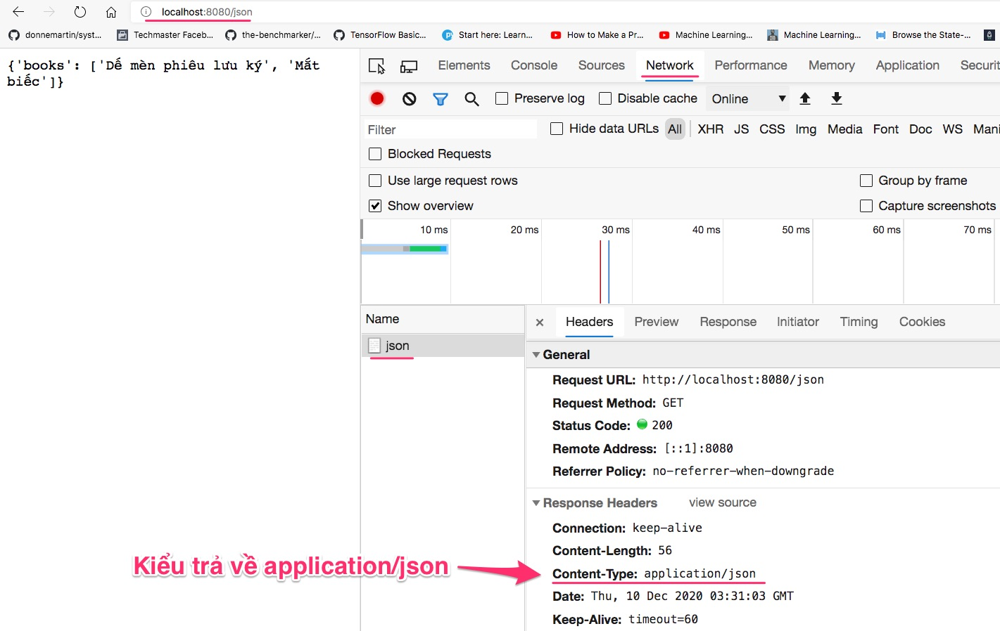
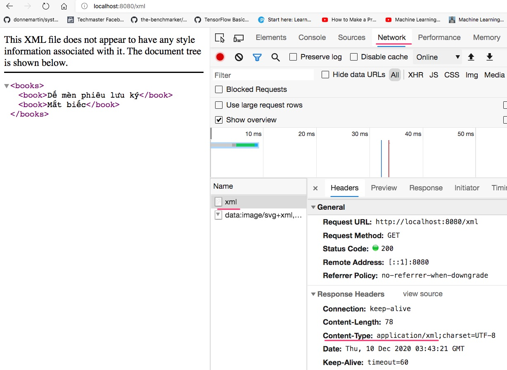

# Trả về JSON và XML

Ứng dụng web có thể trả về rất nhiều loại dữ liệu. Kiểu dữ liệu sẽ được ghi trong header của Response

## Cấu trúc thư mục
```
├── java
│   └── vn
│       └── techmaster
│           └── bookstore
│               ├── controller
│               │   └── HomeController.java
│               ├── model
│               │   └── Car.java
│               └── BookstoreApplication.java
└── resources
    ├── static
    ├── templates
    └── application.properties
```

## Thí nghiệm 1: trả về JSON ở đường dẫn http://localhost:8080/json
1. Bổ xung thêm phương thức
   ```java
    @ResponseBody
    @GetMapping(value="/json", produces=MediaType.APPLICATION_JSON_VALUE)
    public String getJson() {
      return "{'books': ['Dế mèn phiêu lưu ký', 'Mắt biếc']}";
    }
   ```
  ```MediaType.APPLICATION_JSON_VALUE``` thực chất là chuỗi ```application/json```
  ```java
  public static final String APPLICATION_JSON_VALUE = "application/json";
  ```
2. Vào http://localhost:8080/json thấy kết quả trả về như sau
  
   

## Thí nghiệm 2: trả về dữ liệu kiểu XML ở đường dẫn http://localhost:8080/xml
1. Bổ xung thêm phương thức
   ```java
    @ResponseBody
    @GetMapping(value="/xml", produces=MediaType.APPLICATION_XML_VALUE)
    public String getXml() {
      return "<books><book>Dế mèn phiêu lưu ký</book><book>Mắt biếc</book></books>";
    }
   ```
2. Vào đường dẫn http://localhost:8080/xml
   

## Thí nghiệm 3: convert một mảng String sang JSON sử dụng jackson.databind.ObjectMapper 
Phương thức trả về chỉ nhận kiểu String, nếu muốn trả về một mảng, một đối tượng chúng ta cần chuyển đổi (convert) chúng sang JSON string. Thư viện [thư viện jackson-databind](https://mvnrepository.com/artifact/com.fasterxml.jackson.core/jackson-databind) sẽ làm nhiệm vụ chuyển đổi.

1. Vào pom.xml bổ xung vào giữa thẻ ```<dependencies></dependencies>``` thư viên jackson-databind
```xml
<dependency>
  <groupId>com.fasterxml.jackson.core</groupId>
  <artifactId>jackson-databind</artifactId>
</dependency>
```
2. Bổ xung phương thức ```public String getBooks()```
```java
@ResponseBody
  @GetMapping(value="/books", produces=MediaType.APPLICATION_JSON_VALUE)
  public String getBooks() {
    String[] books = {"Dế mèn phiêu lưu ký", "Mắt biếc", "Thám tử Conan"};
    ObjectMapper objectMapper = new ObjectMapper();
    try {
      return objectMapper.writeValueAsString(books);
    } catch (Exception e) {
      return "{'error': 'cannot return books'}";
    }    
  }
```
objectMapper sẽ ghi đối tượng book ra thành String để trả về.

3. Vào đường dẫn http://localhost:8080/books xem kết quả trả về

## Thí nghiệm 4: convert một đối tượng Car ra json và trả về ở http://localhost:8080/car

1. Tạo class Car ở model/Car.java. Đoạn này hãy sử dụng SourceAction để sinh getter, setter và constructor
   
  ```java
package vn.techmaster.bookstore.model;
public class Car {
  private String name;
  private String manufacturer;

  public String getName() {
    return name;
  }

  public void setName(String name) {
    this.name = name;
  }

  public String getManufacturer() {
    return manufacturer;
  }

  public void setManufacturer(String manufacturer) {
    this.manufacturer = manufacturer;
  }

  public Car(String name, String manufacturer) {
    this.name = name;
    this.manufacturer = manufacturer;
  }
}
```
1. Thêm phương thức public String getCar()
  ```java
  @ResponseBody
  @GetMapping(value="/car", produces=MediaType.APPLICATION_JSON_VALUE)
  public String getCar() {
    Car car = new Car("Triton 2020", "Mitsubishi");
    ObjectMapper objectMapper = new ObjectMapper();
    try {
      return objectMapper.writeValueAsString(car);
    } catch (Exception e) {
      return "{'error': '" + e.toString() +"'}";
    }    
  }
  ```
3. Vào đường dẫn http://localhost:8080/car xem kết quả trả về