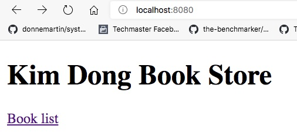

# Sử dụng Thymeleaf căn bản

Trong ví dụ này thay vì trả dữ liệu trực tiếp với annotation @ResponseBody, chúng ta sẽ sử dụng một ViewTemplate Engine. Bản chất của View Template Engine là cơ chế ghép dữ liệu (data) với khuôn mẫu (template).
Lập trình có thể tuỳ biến dữ liệu và cả khuôn mẫu. Với hàng nghìn record dữ liệu, chỉ cần chỉnh một khuôn mẫu chúng ta đã có 1000 trang trả về được thay đổi.

SpringBoot hỗ trợ vài View Template Engine:
1. [Thymeleaf](https://www.thymeleaf.org/)
Maven dependency tương ứng là: [Spring Boot Starter Thymeleaf](https://mvnrepository.com/artifact/org.springframework.boot/spring-boot-starter-thymeleaf)

```xml
<!-- https://mvnrepository.com/artifact/org.springframework.boot/spring-boot-starter-thymeleaf -->
<dependency>
    <groupId>org.springframework.boot</groupId>
    <artifactId>spring-boot-starter-thymeleaf</artifactId>
    <version>2.4.0</version>
</dependency>
```
2. [Freemaker](https://freemarker.apache.org/)
Maven dependency tương ứng là [Apache FreeMarker](https://mvnrepository.com/artifact/org.freemarker/freemarker)
```xml
<!-- https://mvnrepository.com/artifact/org.freemarker/freemarker -->
<dependency>
    <groupId>org.freemarker</groupId>
    <artifactId>freemarker</artifactId>
    <version>2.3.30</version>
</dependency>
```

Trong ví dụ này chúng ta dùng Thymeleaf.
## Cấu trúc thư mục
Các file Controller sẽ nằm ở main/java/vn/techmaster/bookstore/controller
Các file view templates sẽ nằm ở thư mục main/resources/templates
File định nghĩa kiểu Book sẽ năm ở main/java/vn/techmaster/bookstore/model

```
├── main
│   ├── java
│   │   └── vn
│   │       └── techmaster
│   │           └── bookstore
│   │               ├── controller
│   │               │   └── HomeController.java
│   │               ├── model
│   │               │   └── Book.java
│   │               └── BookstoreApplication.java
│   └── resources
│       ├── static
│       ├── templates
│       │   ├── book.html
│       │   └── home.html
│       └── application.properties
```

## Thí nghiệm 1: bổ xung Home.html view cho đường dẫn "/"
Mong muốn, không những render sử dụng [home.html](/src/main/resources/templates/home.html) mà chúng
ta còn trả về dữ liệu trong biến appName. Biến appName lại nhận giá trị từ file cấu hình application.properties. Hãy xem lại bài trước [04readproperty](https://github.com/TechMaster/SpringBootBasic/tree/main/basic/04readproperty/bookstore)

```java
@GetMapping(value = "/")
  public String getHome(Model model) {
    model.addAttribute(APP_NAME, appName);
    return "home";
}
```
Giờ phía trên phương thức getHome không còn ```@ResponseBody``` nữa. Phương thức này không trả về dữ liệu ngay, mà nó đổ dữ liệu vào đối tượng ```Model model``` rồi trả về Thymeleaf view template là ```home.html```

Trong ```@GetMapping``` cũng không còn tham số ```produces``` nữa.

File [home.html](/src/main/resources/templates/home.html) giờ có đoạn mã đặc trưng cú pháp Thymeleaf để
lấy giá trị từ đối tượng ```model``` đó là ```th:text="${appName}"```

```html
<body>
  <h1 th:text="${appName}">Amazon Book Store</h1>
  <a th:href="@{/book}">Book list</a>
</body>
```

Kết quả xem được ở đường dẫn http://localhost:8080


```<a th:href="@{/book}">Book list</a>``` cho kết quả tương tự như ```<a href="/book">Book list</a>``` nhưng sử dụng ```th:href``` có thể động hoá giá trị href trong link

## Thí nghiệm 2: Hãy tự bổ xung about.html cho đường dẫn /about
Phần này các bạn tự làm nhé

## Thí nghiệm 3: Trả về danh sách mảng các String là tiêu đề sách ở đường dẫn /book

Tạo phương thức ```public String getBook(Model model)```

```java
  // Trả về books là mảng của String
  @GetMapping(value = "/book")
  public String getBook(Model model) {
    String[] bookCollection ={"Deep Work","Nhà Giả Kim ","Cafe cùng Tony","Tôi đi code dạo"};
    model.addAttribute("books", bookCollection);
    model.addAttribute(APP_NAME, appName);
    return "book";
  }
```

```html
<body>
  <h1 th:text="${appName}"></h1>
  <ul>
    <li th:each="book: ${books}" th:text="${book}"></li>
  </ul>
</body>
```


