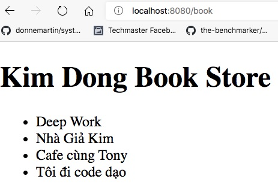
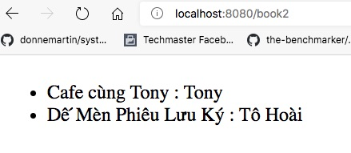

# Sử dụng Thymeleaf căn bản

Trong ví dụ này thay vì trả dữ liệu trực tiếp với annotation @ResponseBody, chúng ta sẽ sử dụng một ViewTemplate Engine. Bản chất của View Template Engine là cơ chế ghép dữ liệu (data) với khuôn mẫu (template).
Lập trình có thể tuỳ biến dữ liệu và cả khuôn mẫu. Với hàng nghìn record dữ liệu, chỉ cần chỉnh một khuôn mẫu chúng ta đã có 1000 trang trả về được thay đổi.

SpringBoot hỗ trợ vài View Template Engine:
1. [Thymeleaf](https://www.thymeleaf.org/)
Maven dependency tương ứng là: [Spring Boot Starter Thymeleaf](https://mvnrepository.com/artifact/org.springframework.boot/spring-boot-starter-thymeleaf)

```xml
<!-- https://mvnrepository.com/artifact/org.springframework.boot/spring-boot-starter-thymeleaf -->
<dependency>
    <groupId>org.springframework.boot</groupId>
    <artifactId>spring-boot-starter-thymeleaf</artifactId>
    <version>2.4.0</version>
</dependency>
```
2. [Freemaker](https://freemarker.apache.org/)
Maven dependency tương ứng là [Apache FreeMarker](https://mvnrepository.com/artifact/org.freemarker/freemarker)
```xml
<!-- https://mvnrepository.com/artifact/org.freemarker/freemarker -->
<dependency>
    <groupId>org.freemarker</groupId>
    <artifactId>freemarker</artifactId>
    <version>2.3.30</version>
</dependency>
```

Trong ví dụ này chúng ta dùng Thymeleaf.
## Cấu trúc thư mục
Các file Controller sẽ nằm ở [main/java/vn/techmaster/bookstore/controller](src/main/java/vn/techmaster/bookstore/controller)
Các file view templates sẽ nằm ở thư mục [main/resources/templates](src/main/resources/templates)
File định nghĩa kiểu Book sẽ năm ở [main/java/vn/techmaster/bookstore/model](src/main/java/vn/techmaster/bookstore/model)

```
.
├── main
│   ├── java
│   │   └── vn
│   │       └── techmaster
│   │           └── bookstore
│   │               ├── controller
│   │               │   └── HomeController.java
│   │               ├── model
│   │               │   └── Book.java
│   │               └── BookstoreApplication.java
│   └── resources
│       ├── static
│       ├── templates <-- Viết mã HTML cho Thymeleaf View Template ở đây
│       │   ├── book.html
│       │   ├── book2.html
│       │   └── home.html
│       └── application.properties
```

## Thí nghiệm 1: bổ xung Home.html view cho đường dẫn "/"
Mong muốn, không những render sử dụng [home.html](src/main/resources/templates/home.html) mà chúng
ta còn trả về dữ liệu trong biến appName. Biến appName lại nhận giá trị từ file cấu hình application.properties. Hãy xem lại bài trước [04readproperty](https://github.com/TechMaster/SpringBootBasic/tree/main/basic/04readproperty/bookstore)

```java
@GetMapping(value = "/")
  public String getHome(Model model) {
    model.addAttribute(APP_NAME, appName);
    return "home";
}
```
Giờ phía trên phương thức getHome không còn ```@ResponseBody``` nữa. Phương thức này không trả về dữ liệu ngay, mà nó đổ dữ liệu vào đối tượng ```Model model``` rồi trả về Thymeleaf view template là ```home.html```

Trong ```@GetMapping``` cũng không còn tham số ```produces``` nữa.

File [home.html](src/main/resources/templates/home.html) giờ có đoạn mã đặc trưng cú pháp Thymeleaf để
lấy giá trị từ đối tượng ```model``` đó là ```th:text="${appName}"```

```html
<body>
  <h1 th:text="${appName}">Amazon Book Store</h1>
  <a th:href="@{/book}">Book list</a>
</body>
```

Kết quả xem được ở đường dẫn http://localhost:8080


```<a th:href="@{/book}">Book list</a>``` cho kết quả tương tự như ```<a href="/book">Book list</a>``` nhưng sử dụng ```th:href``` có thể động hoá giá trị href trong link

## Thí nghiệm 2: Hãy tự bổ xung about.html cho đường dẫn /about
Phần này các bạn tự làm nhé

## Thí nghiệm 3: Trả về danh sách mảng các String là tiêu đề sách ở đường dẫn /book

1. Tạo phương thức ```public String getBook(Model model)```
2. Bổ xung attribute "books" cho model, trỏ đến mảng bookCollection
3. Bạn có thể thêm bao nhiêu attribute cho model cũng được 

```java
  // Trả về books là mảng của String
  @GetMapping(value = "/book")
  public String getBook(Model model) {
    String[] bookCollection ={"Deep Work","Nhà Giả Kim ","Cafe cùng Tony","Tôi đi code dạo"};
    model.addAttribute("books", bookCollection);
    model.addAttribute(APP_NAME, appName);
    return "book";
  }
```
4. Trong [book.hml](src/main/resources/templates/book.html) tạo một vòng lặp để liệt kê tất cả các phần tử trong biến ```books``` rồi gán vào biến ```book```

```html
<body>
  <h1 th:text="${appName}"></h1>
  <ul>
    <li th:each="book: ${books}" th:text="${book}"></li>
  </ul>
</body>
```

Kết quả xem được ở đường dẫn http://localhost:8080/book



## Thí nghiệm 4: Trả về mảng các đối tượng kiểu Book. Kiểu Book sẽ có vài thuộc tính

1. Định nghĩa [class Book](src/main/java/vn/techmaster/bookstore/model/Book.java) trong thư mục model như sau

```java
public class Book {
  private int id;
  private String title;
  private String author;
```

Toàn bộ phần còn lại hãy sử dụng SourceAction trong VSCode hoặc tính năng hỗ trợ trong IntelliJ để tự sinh.

2. Bổ xung phương thức ```getBooks2()```
```java
  // Trả về books là mảng của đối tượng kiểu Book
  @GetMapping(value = "/book2")
  public String getBook2(Model model) {
    Book[] bookCollection = { 
      new Book(1, "Cafe cùng Tony", "Tony"),
      new Book(2, "Dế Mèn Phiêu Lưu Ký", "Tô Hoài")
    };

    model.addAttribute("books", bookCollection);
    model.addAttribute(APP_NAME, appName);
    return "book2";
  }
```

3. Tạo mới view template [book2.html](src/main/resources/templates/book2.html)

Hãy chú ý cú pháp cộng chuỗi trong th:text
```html
<ul>
<li th:each="book: ${books}" th:text="${book.title + ' : ' + book.author}"></li>
</ul>
```

Kết quả thu được ở đường dẫn http://localhost:8080/books2



## Thí nghiệm 5: Bổ xung ảnh ở trang about.html tại đường dẫn /about

Bổ xung ảnh  vào thư mục [resources/static/images](src/main/resources/static/images)

```
├── main
│   └── resources
│       ├── static
│       │   └── images  <-- Tạo thư mục này để chứa ảnh
│       │       └── bookstore.jpg
```

Code ở file [about.html](src/main/resources/templates/about.html) như sau
```html
<body>
  <h1 th:text="${appName}"></h1>
  
</body>
```

## Thí nghiệm 6: Bổ xung ảnh cho từng đầu sách

Mỗi đầu sách được thể hiện bằng một đối tượng kiểu [Book.java](src/main/java/vn/techmaster/bookstore/model/Book.java). Kiểu này có một trường id unique để phân biệt các đối tượng sách với nhau. Chúng ta sẽ dùng id để đặt tên cho file ảnh cover của sách.

Trong thực tế đây không phải cách tối ưu vì:
- Sách sử dụng mã ISBN để định danh
- Một đầu sách khi đưa lên mạng có thể ứng với 1-nhiều ảnh chứ không phải.

Tuy nhiên bài đầu, hãy chọn phương án đơn nhất đã.

Ảnh cover của sách sẽ lưu ở thư mục [resource/static/images](src/main/resources/static/images)
```
├── main
│   └── resources
│       ├── static
│       │   └── images
│       │       ├── 1.jpg
│       │       ├── 2.jpg
│       │       └── bookstore.jpg
```

Mã thymelead để hiển thị ảnh đại diện của sách
```html
  <ul>
    <li th:each="book: ${books}">
      
      <span th:text="${book.title + ' : ' + book.author}"></span></li>
  </ul>
```

Nếu view source ở địa chỉ http://localhost:8080/book3 ta sẽ thấy

```html
  <ul>
    <li>
      
      <span>Cafe cùng Tony : Tony</span></li>
    <li>
      
      <span>Dế Mèn Phiêu Lưu Ký : Tô Hoài</span></li>
  </ul>
```

## Thí nghiệm 6: Bổ xung thuộc tính alt cho từng ảnh đại diện của sách

Tham khảo [thymeleaf iterate over String to create img tags](https://stackoverflow.com/questions/36595190/thymeleaf-iterate-over-string-to-create-img-tags)

Chú ý ```
    <li th:each="book: ${books}">
      
      <span th:text="${book.title + ' : ' + book.author}"></span></li>
  </ul>
```

## Thí nghiệm 7: Bổ xung CSS cho /book3 nhìn đẹp hơn
