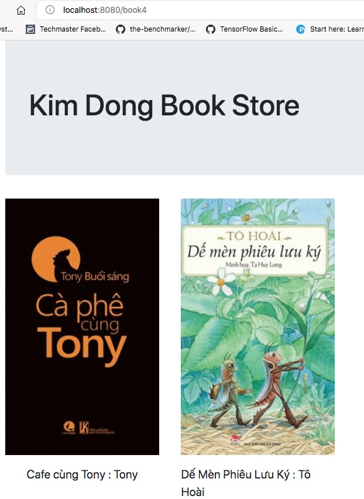

# Sử dụng Thymeleaf căn bản
Đây là phần nâng cấp của ví dụ [05bookcollection](../../05bookcollection/bookstore/)
## Thí nghiệm 7: Bổ xung CSS cho /book4 nhìn đẹp hơn
Bổ xung [style.css](src/main/resources/static/css/style.css) vào thư mục resource/static/css
```
.
├── main
│   ├── java
│   │   └── vn
│   │       └── techmaster
│   │           └── bookstore
│   │               ├── controller
│   │               │   └── HomeController.java
│   │               ├── model
│   │               │   └── Book.java
│   │               └── BookstoreApplication.java
│   └── resources
│       ├── static
│       │   ├── css <-- bổ xung thư mục css
│       │   │   └── style.css  <-- thêm styless.css để giao diện đẹp hơn
│       │   └── images
│       │       ├── 1.jpg
│       │       ├── 2.jpg
│       │       └── bookstore.jpg
│       ├── templates
│       │   ├── about.html
│       │   ├── book.html
│       │   ├── book2.html
│       │   ├── book3.html
│       │   ├── book4.html
│       │   └── home.html
│       └── application.properties
```

Kết quả 

