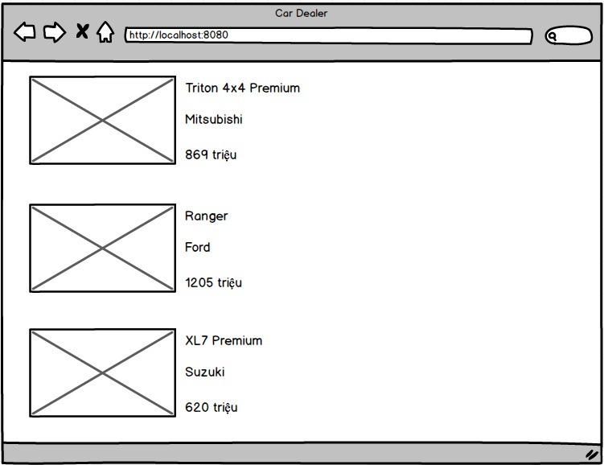

# Bài tập về nhà

Hãy tham khảo code ở thư mục [06bookwithcss](../06bookwithcss/bookstore) hãy làm các bước sau đây

1. Định nghĩa class Car có 3 thuộc tính:
   - int id (unique id, tuần tự tăng 1, 2, 3, 4, 5,...)
   - String name
   - String manufacturer
   - int price (triệu VND)
   - photo
2. Hiển thị giao diện danh sách 10 loại xe đang bán chạy tại thị trường Việt nam 11/2020
   


# Câu hỏi ôn tập kiến thức
1. Spring Boot khác gì với Spring Framework?
2. Những cải tiến Spring Boot so với Servlet JSP trước đây
3. JAR khác WAR ở những điểm nào?
4. Maven khác Gradle ở những điểm nào?
5. annotation ```@ResponseBody``` có ý nghĩa gì?
6. annotation ```@GetMapping``` có tác dụng gì đối với phương thức trong Controller?
7. annotation ```@Controller``` thuộc package nào?
8. annotation ```@SpringBootApplication``` bao gồm những annotation nào bên trong?
9. Khi biên dịch một ứng dụng SpringBoot tải trên mạng, IDE báo lỗi không tìm thấy JDK version phù hợp vậy phải vào file pom.xml để sửa thuộc tính nào?
10. Khi muốn trả về dữ liệu kiểu JSON cần phải thêm tham số nào vào ```@GetMapping```?
11. Nếu có hai controller khác nhau nhưng có 2 phương thức mà ```@GetMapping``` cùng trỏ vào một đường dẫn khi chạy ứng dụng, điều gì sẽ xảy ra?
12. Trong file pom.xml có nhiều element <dependency>, trong đó lại có element <scope>, thường có 2 giá trị trong scope là ```runtime``` và ```test```
```xml
<dependency>
	<groupId>org.springframework.boot</groupId>
	<artifactId>spring-boot-devtools</artifactId>
	<scope>runtime</scope>
	<optional>true</optional>
</dependency>
<dependency>
	<groupId>org.springframework.boot</groupId>
	<artifactId>spring-boot-starter-test</artifactId>
	<scope>test</scope>
</dependency>
13. Khi ta tạo một class Book như dưới đây
```java
public class Book {
  private int id;
  private String title;
  private String author;
}
```
Hãy liệt kê các cách trong Visual Studio Code hay IntelliJ để tự động sinh ra các phương thức getter, setters, equalsTo, hash, toString
14. Cách để thay đổi port mặc định của ứng dụng Spring Boot sang port 9000 trong file application.yml như thế nào?
15. Có thể định nghĩa một key/value mới trong application.properties được không?
16. Trong một dự án SpringBoot có thể có 2 file cấu hình application.yml và application.properties cùng song song tồn tại được không?
17. Tại sao các thuộc tính của một class trong Model thường có access modifier là private? Tại không để mặc định hoặc là public cho dễ truy xuất?
```java
public class Book {
  private int id;  //thường là private
}
```
18. Trong thư mục dự án Spring Boot, chúng ta thường thấy các thư mực controller, model, service, repository. Hỏi liệu có thể để các file class XXXController.java ở thư mục cùng cấp với Application.java?
Việc bố trí thư mục này có ý nghĩa gì?

19. Trong tiến trình khởi động ứng dụng Spring Boot, 