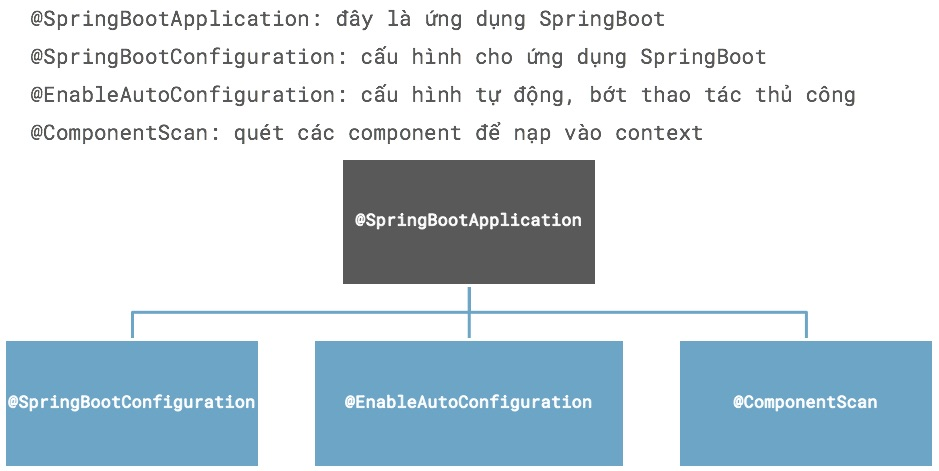

# Component, Bean, Component Scan
Trong bài này chúng ta làm quen cơ chế quét tất cả các ```@Component``` và ```@Bean``` ở bất kể cấp độ thư mục nào để nạp vào ApplicationContext

## Cấu trúc thư mục
```
── main
│   ├── java
│   │   ├── vn
│   │   │   ├── techmaster
│   │   │   │   ├── demobean
│   │   │   │   │   ├── bean
│   │   │   │   │   │   └── Engine.java
│   │   │   │   │   ├── component
│   │   │   │   │   │   └── Car.java
│   │   │   │   │   ├── configuration
│   │   │   │   │   │   └── AppConfig.java
│   │   │   │   │   ├── entity
│   │   │   │   │   │   └── Book.java
│   │   │   │   │   ├── grandgrand
│   │   │   │   │   │   ├── grand
│   │   │   │   │   │   │   ├── father
│   │   │   │   │   │   │   │   ├── son
│   │   │   │   │   │   │   │   │   └── Son.java
│   │   │   │   │   └── DemobeanApplication.java
```

## Thí nghiệm 1: Tạo Bean, Component và Component Scan
Class [DemobeanApplication](src/main/java/vn/techmaster/demobean/DemobeanApplication.java) chứa hàm main chỉ được annotate bằng ```@ComponentScan``` chứ không phải ```@SpringbootApplication```, có nghĩa nó chưa phải là một ứng dụng SpringBoot hoàn chỉnh.



1. Tạo class [Engine](src/main/java/vn/techmaster/demobean/bean/Engine.java)
2. Tạo class [Car](src/main/java/vn/techmaster/demobean/component/Car.java). Chú ý annotation         ```@Component``` trên class Car
   ```java
   @Component
   public class Car {
  
   }
   ```
3. Tạo class [Son](src/main/java/vn/techmaster/demobean/grandgrand/grand/father/son/Son.java) trong một thư mục rất sâu.
4. Class ```Car``` và ```Son``` đều được đánh dấu là @Component, nhưng class Engine chỉ là một class thông thường. Tuy nhiên nhờ AppConfig.java, tôi sẽ biến Engine thành một ```@Bean```
5. Tạo [AppConfig.java](src/main/java/vn/techmaster/demobean/configuration/AppConfig.java)
   ```java
   @Configuration
   public class AppConfig {
     @Bean
     public Engine myEngine() {
       return new Engine();
     }
   }
   ```

6. Giờ chúng ta bàn đến phương thức static main trong [DemobeanApplication.java](src/main/java/vn/techmaster/demobean/entity/Book.java)
  ```java
   public static void main(String[] args) {
	  context = new AnnotationConfigApplicationContext(DemobeanApplication.class);
	  System.out.println("------------------------------------");
	  for (String beanName : context.getBeanDefinitionNames()) {
		  System.out.println(beanName);
	  }
	  Car car = context.getBean(Car.class);
   }
  ```
  Hàm này tạo một ApplicationContext với tham số là kiểu ```DemobeanApplication.class```
  Sau đó có một vòng lặp for để in ra tất cả các Bean trong Application Context. Khi đã nạp vào Application Context, Spring Boot không còn phân biệt đâu là Component và đâu là Bean. Chúng được gọi chung là Bean !

7. Biên dịch sẽ có kết quả như sau:   
  ```
    Creating shared instance of singleton bean 'demobeanApplication'
    Creating shared instance of singleton bean 'car'
    Creating shared instance of singleton bean 'appConfig'
    Creating shared instance of singleton bean 'son'
    Creating shared instance of singleton bean 'myEngine'
    ------------------------------------
    org.springframework.context.annotation.internalConfigurationAnnotationProcessor
    org.springframework.context.annotation.internalAutowiredAnnotationProcessor
    org.springframework.context.annotation.internalCommonAnnotationProcessor
    org.springframework.context.event.internalEventListenerProcessor
    org.springframework.context.event.internalEventListenerFactory
    demobeanApplication
    car
    appConfig
    son
    myEngine
  ```

  Nhìn vào log, bạn sẽ thấy các bean này được tạo ra duy nhất singleton.
  Bean ```myEngine``` là kết quả của phương thức này đây
  ```java
  @Bean
  public Engine myEngine() {
    return new Engine();
  }
  ```


## Thí nghiệm 2: Tuỳ biến hàm tạo ra Bean

1. Bổ xung thuộc tính model cho class [Engine](src/main/java/vn/techmaster/demobean/bean/Engine.java)
   ```java
    public class Engine {
     private String model;
     public String getModel() {
       return model;
     }
     public Engine(String model) {
       this.model = model;
     }
    }
   ```
2. Thêm phương thức mới ```public Engine teslaEngine()``` vào [AppConfig.java](src/main/java/vn/techmaster/demobean/configuration/AppConfig.java)
   ```java
   @Configuration
   public class AppConfig {
     @Bean
     public Engine myEngine() {
       return new Engine("Ford Engine");
     }
   
     @Bean
     public Engine teslaEngine() {
       return new Engine("Electric Tesla Engine");
     }
   }
   ```
   Vậy là có 2 phương thức cùng trả về kiểu Engine, cùng được đánh dấu là @Bean
3. Chạy lại xem log ở Terminal bạn sẽ thấy 2 bean: myEngine và testlaEngine
   ```
   demobeanApplication
   car
   appConfig
   son
   myEngine <--
   teslaEngine <--
   ```


## Tổng kết
**```@Component``` khác ```@Bean``` như thế nào?**
Các hai đều khởi tạo đối tượng và nạp vào Application Context quản lý. Thường là Singleton object.
- Chức năng của ``@Component``` và ```@Bean``` giống nhau, cách khởi tạo khác nhau thôi.
- ```@Component``` đánh dấu ở cấp độ class
- ```@Bean``` đánh dấu cho phương thức public trả về đối tượng cần nạp vào ApplicationContext. Tên phương thức sẽ là tên của Bean. Phương thức này phải thuộc một class được đánh đấu là ```@Configuration```
- Tại sao cần có ```@Bean```? Bởi vì chúng ta không thể tuỳ biến quá trình khởi tạo Component, nhưng tuỳ biến được (truyền tham số) khi tạo Bean. Bài sau sẽ nói kỹ hơn nhé. Nói nhiều quá loạn mất!
- Bean đăng ký vào Application không phải bằng kiểu mà với tên phương thức trả về nó
- Có thể có nhiều phương thức đánh dấu @Bean cùng trả về một kiểu
- Khi đã nạp vào Application Context, mọi đối tượng đều được gọi chung là Bean