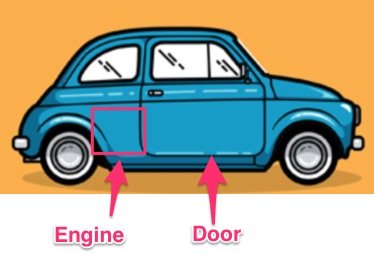
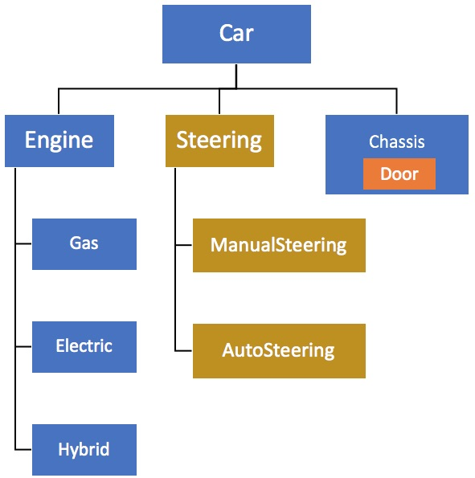

# 03 phương pháp Dependency Injection khác nhau
- Cách 1: Constructor Based Injection
- Cách 2: Setter Based Injection
- Cách 3: Field Based Injection (hay dùng nhất vì dễ)

Ví dụ phỏng theo cấu tạo của xe ô tô



## Cách 1: Constructor Based Injection
Trong [CarConfig.java](src/main/java/vn/techmaster/demobean/DemobeanApplication.java), có phương thức ```public Car car()``` trả về Bean.
ở dòng cuối cùng ```return new Car(engine);```: đối tượng engine được truyền vào constructor của Car
```java
@Bean
public Car car() {
  Engine engine;
  // Đoạn code này rất linh hoạt, giúp tuỳ biến kiểu động cơ rồi truyền vào đối tượng Car
  switch (engineType) {
    case "gas":
      engine = (Engine) context.getBean("gasEngine");
      break;
    case "electric":
      engine = (Engine) context.getBean("electricEngine");
      break;
    case "hybrid":
      engine = (Engine) context.getBean("hybridEngine");
      break;
    default:
      engine = (Engine) context.getBean("gasEngine");
  }
  return new Car(engine); //Construction based Dependency Injection, truyền engine vào tham số của Car constructor
}
```
**Chú ý:**
Với những class được annotated bởi ```@Component```, ```@Controller```, ```@Service```, ```@Respository``` , chúng ta phải sử dụng phương pháp inject qua constructor dùng ```@Autowired```

Xem [FunRepository.java](src/main/java/vn/techmaster/demobean/bean/FunRepository.java)
```java
@Repository
public class FunRepository {
  @Autowired
  public FunRepository(@Value("${engineType}") String engineType) {
    System.out.println("FunRepository :" + engineType);
  }  
}
```

Ở đây tôi inject giá trị ```engineType``` lưu trong file cấu hình [application.properties](src/main/resources/application.properties). Constructor của FunRepository cần được đánh dấu với ```@Autowired``` và trong tham số truyền vào cần thêm ```@Value("${engineType}")``` để lấy giá trị từ cấu hình gán vào tham số ```engineType```


## Cách 2: Setter Based Injection
Hãy xem file [ChassisConfig.java](src/main/java/vn/techmaster/demobean/configuration/ChassisConfig.java) ở phương thức ```public Chassis chassis()``` trả về Bean kiểu Chassis

đoạn lệnh dùng đối tượng Bean trả về từ phương thức ```door()``` truyền vào Setter method của chassis:
```java
chassis.setDoor(door());
```

Chi tiết
```java
@Configuration
public class ChassisConfig {
  @Bean
  public Door door() {    
    return new Door();
  }
  @Bean
  public Chassis chassis() {
    Chasis chassis = new Chasis();
    chassis.setDoor(door()); //Setter based Dependency Injection
    return chasis;
  }
}
```
Cách này không khác cách số 1 nhiều lắm.
## Cách 3: Field Based Injection
DI cho thuộc tính, chúng ta sử dụng ```@Autowired``` đánh dấu cho thuộc tính.
Tôi ưu dùng cách này nhất vì nó dễ và trực quan
```java
public class Car {
  @Autowired
  @Qualifier("manualsteering")
  private Steering steering; //Field based Dependency Injection
  ...  
}
```


## Tham khảo
- [Intro to Inversion of Control and Dependency Injection with Spring](https://www.baeldung.com/inversion-control-and-dependency-injection-in-spring)
