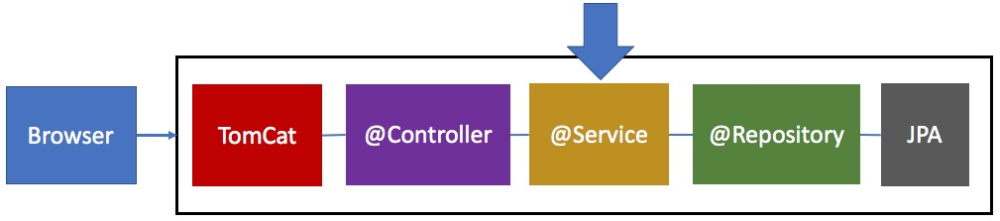

# Component kiểu Service chuyên xử lý nghiệp vụ

## Giới thiệu
Trong phần này chúng ta đã làm quen với ```@Component```, ```@Bean```, ComponentScan, ApplicationContext, ```@Autowired```,```@Qualifier```, ```@Value```, ```@Primary```. Nếu không có những ứng dụng thực tế, bạn cảm giác chúng buồn tẻ, vô vị. 


[Ở bài đầu tiên](../../basic/02returntexthtml), chúng ta đã làm quen với annotation ```@Controller```. Khái niệm Controller phổ biến trong mọi web framework vì chúng đều chung một design patter là MVC (Model - View - Controller)

- Controller làm nhiệm vụ hứng các lời gọi đến (request)
- View làm nhiệm vụ tạo ra giao diện hiển thị. Chúng ta đã học Thymeleaf Template Engine
- Model là dữ liệu sẽ kết hợp với View Template để tạo thành giao diện

## Thực hành
1. Trong Controller, chúng ta tạo nên model. Xem ví dụ [05bookcollection](../../basic/05bookcollection/bookstore).
```java
  @GetMapping(value = "/book4")
  public String getBook4(Model model) {
    Book[] bookCollection = { 
      new Book(1, "Cafe cùng Tony", "Tony"),
      new Book(2, "Dế Mèn Phiêu Lưu Ký", "Tô Hoài")
    };
    // Dựng model để trả về cho View Template đây
    model.addAttribute(BOOKS, bookCollection);
    model.addAttribute(APP_NAME, appName);
    return "book4";
  }
```

Tuy nhiên một kiến trúc ứng dụng hợp lý (dễ đọc, dễ code, dễ bảo trì) thì cần tách biệt phần Model ra. Controller chỉ làm nhiệm vụ tiếp nhận (handle request), kiểm tra hợp lệ (validate). Đừng bắt nó làm những logic quá phức tạp. Việc xử lý logic nghiệp hãy để cho tầng tiếp theo là Service. Spring Boot có một annotation ```@Service``` dùng để đánh dấu cho loại component sẽ được Controller sử dụng để đọc / ghi dữ liệu.

2. Tạo thư mục service, sau đó tạo [TopCarService.java](src/main/java/vn/techmaster/topcar/service/TopCarService.java)

3. Lập trình phương thức trả về danh sách top 10 ô tô bán chạy nhất
    ```java
    @Service //Đánh đấu đấy là Bean ở tầng Service
    public class TopCarService {
      public List<Car> getTop10SoldCar() {
        try {
          File file = ResourceUtils.getFile("classpath:static/topcar.csv");

          CsvMapper mapper = new CsvMapper(); // Dùng để ánh xạ cột trong CSV với từng trường trong POJO
          CsvSchema schema = CsvSchema.emptySchema().withHeader(); // Dòng đầu tiên sử dụng làm Header
          ObjectReader oReader = mapper.readerFor(Car.class).with(schema); // Cấu hình bộ đọc CSV phù hợp với kiểu Car.class
          ArrayList<Car> cars = new ArrayList<>();

          Reader reader = new FileReader(file);
          MappingIterator<Car> mi = oReader.readValues(reader); // Iterator đọc từng dòng trong file
          while (mi.hasNext()) {
            Car current = mi.next();
            cars.add(current);
          }
          return cars;
        } catch (IOException e) {
          return Collections.emptyList(); //Trong phần xử lý Exception cần trả về collection rỗng để tuần thủ đúng phương thức
        }
      }
    }
    ```

4. Việc đóng gói logic xử lý nghiệp vụ vào Service component mang lại nhưng ưu điểm gì?
  - Đơn giản hoá bớt logic của Controller
  - Đúng người đúng việc - [Single Responsibility pattern](https://viblo.asia/p/solid-single-responsibility-principle-nguyen-ly-don-nhiem-PaLkDmKMvlX)
  - Phần Service đó có thể được gọi bởi nhiều Controller khác nhau.
    ```java
    @Controller
    public class CarController {
      @Autowired
      private TopCarService topCarService;

      @ResponseBody
      @GetMapping(value = "/topcar", produces = MediaType.TEXT_HTML_VALUE)
      public String getTopCar() {
        List<Car> cars = topCarService.getTop10SoldCar();
        StringBuilder sb = new StringBuilder();
        for (Car car: cars) {
          sb.append(car.toString() + "<br>");
        }
        return sb.toString();
      }
    }
    ```
    
  - Service component thường là Singleton (duy nhất). Chúng ta tận dụng tính chất này để tối ưu tốc độ xử lý request ví dụ caching nội dung mà Service component tính toán. Khi có request mới, chỉ cần lấy ra nội dung đã chuẩn bị phục vụ, giảm thiểu rất nhiều thời gian tính toán, phục vụ. Lập trình web giao diện đẹp, chạy được là một thành công rất lớn. Tuy nhiên khi triển khai môi trường thực, việc đáp ứng xử lý số lượng lớn request mà vẫn ổn định (không bị quá tải, sập hệ thống) cũng rất quan trọng. Chúng ta sẽ cải tiến Service component ở bài Caching để tăng hiệu năng phục vụ lên.

## Tổng kết
Trong bài này chúng ta làm quen thêm một annotation nữa là ```@Service``` bản chất của nó cũng là một ```@Component```. Service cũng cấp phương thức xử lý nghiệp vụ cho Controller.

Đây là bằng chứng cho thấy ```@Service``` kế thừa từ ```@Component```
```java
@Target({ElementType.TYPE})
@Retention(RetentionPolicy.RUNTIME)
@Documented
@Component
public @interface Service {

	/**
	 * The value may indicate a suggestion for a logical component name,
	 * to be turned into a Spring bean in case of an autodetected component.
	 * @return the suggested component name, if any (or empty String otherwise)
	 */
	@AliasFor(annotation = Component.class)
	String value() default "";

}
```
  