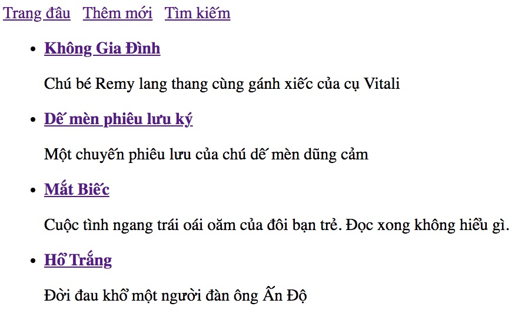

# 01GetAllBooks - Căn bản về CRUD

Ứng dụng BookStore trong series CRUD (Create . Read . Update . Delete) này chỉ có một Entity (Model, Table) duy nhất là Book. Để đơn giản hoá, Book chỉ có 3 trường:
```java
public class Book {
   int id;  //Trường này phải là duy nhất trong cả tập tất cả đối tượng Book
   String title;
   String description;
}
```

Có những hành động (activities) đối với Book:
1. Liệt kê tất cả đầu sách
2. Thêm mới một đầu sách
3. Sửa đổi, cập nhật một đầu sách
4. Xoá một đầu sách
5. Tìm kiếm đầu sách theo từ khoá. Nếu title và description có chứa keyword thì trả về

Ở series này, chúng ta không cần dùng cơ sở dữ liệu quan hệ, JDBC hay JPA, Lombook mà sẽ tự viết Data Access Object (DAO). Khi bạn đã hiểu DAO thì bạn sẽ hiểu cơ chế của Repository và JPA.

Trong bài này, chúng ta chỉ làm một việc duy nhất là liệt kê các đầu sách

### Cấu trúc thư mục
```
.
├── main
│   ├── java
│   │   ├── vn
│   │   │   ├── techmaster
│   │   │   │   ├── bookstore
│   │   │   │   │   ├── config
│   │   │   │   │   │   └── RepoConfig.java
│   │   │   │   │   ├── controller
│   │   │   │   │   │   └── BookController.java
│   │   │   │   │   ├── model
│   │   │   │   │   │   └── Book.java
│   │   │   │   │   ├── repository
│   │   │   │   │   │   ├── BookDao.java
│   │   │   │   │   │   └── Dao.java
│   │   │   │   │   └── BookstoreApplication.java
│   ├── resources
│   │   ├── static
│   │   ├── templates
│   │   │   └── allbooks.html
│   │   └── application.properties
```


### 1. Khởi tạo dự án
Sử dụng [https://start.spring.io/](https://start.spring.io/) hoặc [Spring Initializr](https://marketplace.visualstudio.com/items?itemName=vscjava.vscode-spring-initializr) để khởi tạo dự án.

Chọn các dependencies sau đây:
1. spring-boot-starter-web
2. spring-boot-devtools
3. spring-boot-starter-thymeleaf

Xem chi tiết file [pom.xml](pom.xml) được sinh ra

### 2. Xây dựng mô hình
Ở bài thực hành số 1, chúng ta chỉ tập trung vào model Book thôi.

1. Tạo thư mục [model](src/main/java/vn/techmaster/bookstore/m)
2. Tạo file [Book.java](src/main/java/vn/techmaster/bookstore/model/Book.java)

### 3. Định nghĩa abstract class Dao.java
Xem [Dao.java](src/main/java/vn/techmaster/bookstore/repository/Dao.java)
Đây là một abstract class nhận vào một tham số kiểu T. Đây là kỹ thuật lập trình Generics trong Java để dùng chung các thao tác cho kiểu T bất kỳ.
Tham khảo bài viết này [Làm Quen Với Generics Trong Java](https://codelearn.io/sharing/lam-quen-voi-generics-trong-java)

```java
public abstract class Dao<T> {
  protected  List<T> collections = new ArrayList<>();

  public abstract List<T> getAll();

  public abstract Optional<T> get(int id);
 
  public abstract void add(T t);

  public abstract void update(T t);

  public abstract void deleteByID(int id);

  public abstract void delete(T t);  
}
```
DAO định nghĩa mẫu các phương thức phổ biến thao tác với dữ liệu:
- Liệt kê (List All)
- Đọc (Read)
- Thêm (Create / Add)
- Sửa (Edit / Update)
- Xoá (Delete)
- Tìm kiếm (Search)

### 4. Tạo một class BookDao hiện thực hoá Dao
```java
package vn.techmaster.bookstore.repository;

import java.util.List;
import java.util.Optional;
import vn.techmaster.bookstore.model.Book;

public class BookDao extends Dao<Book> {

  @Override
  public List<Book> getAll() {
    // TODO Auto-generated method stub
    return null;
  }

  @Override
  public Optional<Book> get(int id) {
    // TODO Auto-generated method stub
    return null;
  }

  @Override
  public void add(Book t) {
    // TODO Auto-generated method stub
  }

  @Override
  public void update(Book t) {
    // TODO Auto-generated method stub
  }

  @Override
  public void deleteByID(int id) {
    // TODO Auto-generated method stub
  }

  @Override
  public void delete(Book t) {
    // TODO Auto-generated method stub
  }  
}
```

Viết logic cho 2 phương thức đầu tiên
```java
public class BookDao extends Dao<Book> {

  public BookDao() {
    collections.add(new Book(1, "Không gia đình", "Chú bé Remy lang thang theo gánh xiếc của bác Vitaly"));
    collections.add(new Book(2, "Cuốn theo chiều gió", "Nội chiến Hoa kỳ, cuộc tình giữa Red Butler và Ohara"));
  }

  @Override
  public List<Book> getAll() {
    return collections;
  }
}
```

### 5. Đánh dấu BookDao là một @Repository
```java
@Repository
public class BookDao extends Dao<Book> {
}
```

### 6. Tạo cấu hình để biến BookDao thành một Bean
Tạo thư mục [config](src/main/java/vn/techmaster/bookstore/config)

Tạo [class RepoConfig](src/main/java/vn/techmaster/bookstore/config/RepoConfig.java)
```java
@Configuration
public class RepoConfig {

  @Bean
  public BookDao bookDao() {
    return new BookDao();
  }  
}
```


### 6. Tạo BookController
Tạo thư mục [controller](src/main/java/vn/techmaster/bookstore/controller), sau đó tạo [BookController.java](src/main/java/vn/techmaster/bookstore/controller/BookController.java)

```java
@Controller
@RequestMapping("/book")  //Đường dẫn /book sẽ là đường dẫn gốc chung cho các phương thức bên trong BookController
public class BookController {
  @Autowired
  private BookDao bookDao; //Gán Bean bookDao vào biến này

  @GetMapping
  public String listAll(Model model) {
    model.addAttribute("books", bookDao.getAll());
    return "allbooks";
  }  
}
```

### 7. Tạo Thymeleaf template
Trong thư mục [static/templates] tạo file [allbooks.html](src/main/resources/templates/allbooks.html)

Đoạn code này duyệt qua các đối tượng Book trong mảng để hiển thị
```html
<ul>
  <li th:each="book: ${books}">
    <a th:href="@{/book/{id}(id=${book.id})}"><strong th:text="${book.title}"></strong></a><br>
    <p th:text="${book.description}"></p>
  </li>
</ul>
```

### 9: Biên dịch và vào http://localhost:8080/book
Kết quả nhận được sẽ như sau

