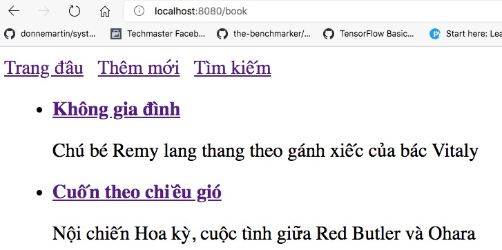

# Nạp dữ liệu từ CSV vào BookDao

1. Thêm file [book.csv](src/main/resources/static/book.csv) vào thư mục [resources/static](src/main/resources/static).

**Chú ý file book.csv này delimiter là dấu | chứ không phải là dấu phẩy thông thường**


2. Thêm đoạn này vào [pom.xml](src/main/java/vn/techmaster/bookstore/controller/BookController.java)
```xml
<dependency>
  <groupId>com.fasterxml.jackson.dataformat</groupId>
  <artifactId>jackson-dataformat-csv</artifactId>
</dependency>
```

3. Thêm mẫu phương thức này vào [Dao.java](src/main/java/vn/techmaster/bookstore/repository/Dao.java)
```java
public abstract void readCSV(String csvFile);
```

4. Ở file [BookDao.java](src/test/java/vn/techmaster/bookstore/BookstoreApplicationTests.java) hãy implement phương thức 
```public void readCSV(String csvFile)```

```java
@Override
  public void readCSV(String csvFile) {
    try {
      File file = ResourceUtils.getFile("classpath:static/" + csvFile);
      CsvMapper mapper = new CsvMapper(); // Dùng để ánh xạ cột trong CSV với từng trường trong POJO
      CsvSchema schema = CsvSchema.emptySchema().withHeader().withColumnSeparator('|'); // Dòng đầu tiên sử dụng làm Header
      ObjectReader oReader = mapper.readerFor(Book.class).with(schema); // Cấu hình bộ đọc CSV phù hợp với kiểu
      Reader reader = new FileReader(file);
      MappingIterator<Book> mi = oReader.readValues(reader); // Iterator đọc từng dòng trong file
      while (mi.hasNext()) {
        Book book = mi.next();
        this.add(book);
      }
    } catch (IOException e) {
      System.out.println(e);   
    }
  }
```

Chú ý:  ```CsvSchema schema = CsvSchema.emptySchema().withHeader().withColumnSeparator('|');``` có thêm đoạn **withColumnSeparator('|')** để đọc đúng file CSV ngăn bằng dấu pipe |. Nếu CSV dùng dấu phẩy thì bỏ lệnh này đi.

và phương thức ```public void add(Book book)``` vì nó được gọi khi đọc file CSV
```java
@Override
public void add(Book book) {
  //Cơ chế tự tăng id
  int id;
  if (collections.isEmpty()) {
    id = 1;
  } else {
    Book lastBook = collections.get(collections.size() - 1);
    id = lastBook.getId() + 1;      
  }
  book.setId(id);
  collections.add(book);
}
```
Nếu collections chưa có phần tử thì gán id của đối tượng book là 1. Ngược lại sẽ là id phần tử cuối cùng tăng thêm 1.
Do chúng ta không thay đổi vị trí phần tử trong mảng, nên id của đối tượng Book trong mảng là tăng dần.

5. Sửa lại constructor của [BookDao.java](src/main/java/vn/techmaster/bookstore/repository/BookDao.java)
từ bản cũ
```java
public BookDao() {
  collections.add(new Book(1, "Không gia đình", "Chú bé Remy lang thang theo gánh xiếc của bác Vitaly"));
  collections.add(new Book(2, "Cuốn theo chiều gió", "Nội chiến Hoa kỳ, cuộc tình giữa Red Butler và Ohara"));
}
```
sang bản mới, đọc CSV vào
```java
public BookDao(String csvFile) {
    this.readCSV(csvFile);
}
```

6. Vào [RepoConfig.java](src/main/java/vn/techmaster/bookstore/config/RepoConfig.java)

Sửa từ 
```java
@Bean
public BookDao bookDao() {
  return new BookDao();
}
```
thành để đọc vào CSV file
```java
@Bean
public BookDao bookDao() {
  return new BookDao("book.csv");
}
```

7. Trong file [book.csv](src/main/resources/static/book.csv) không có cột id, nhưng trong class [Book.java](src/main/java/vn/techmaster/bookstore/model/Book.java) lại có. Khi đọc từ CSV sẽ báo lỗi. Do đó chúng bổ xung annotation ```@JsonIgnore``` để quá trình đọc từ CSV vào bỏ qua trường id.
```java
public class Book {
  @JsonIgnore  //Bỏ qua id khi nạp từ CSV
  int id;  
  String title;
  String description;
```

8. Cần bỏ construstor này ra khỏi Book.java
```java
public Book(int id, String title, String description) {
    this.id = id;
    this.title = title;
    this.description = description;
}
```
vì nếu nó tồn tại sẽ báo lỗi này khi biên dịch

```Factory method 'bookDao' threw exception; nested exception is com.fasterxml.jackson.databind.RuntimeJsonMappingException: Cannot construct instance of "vn.techmaster.bookstore.model.Book"
```

9. Biên dịch và vào địa chỉ http://localhost:8080/book

