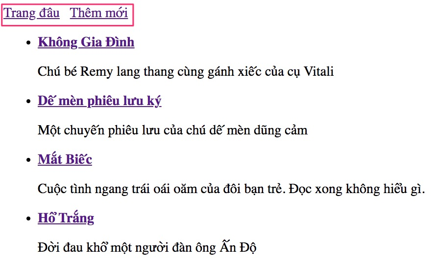

# Add New: Thêm mới một đầu sách

1. Tạo phương thức GET trả về form nhập dữ liệu
2. Tạo phương thức POST để hứng dữ liệu gửi lên

## Cấu trúc thư mục
```
.
├── java
│   ├── vn
│   │   ├── techmaster
│   │   │   ├── bookstore
│   │   │   │   ├── config
│   │   │   │   │   └── RepoConfig.java
│   │   │   │   ├── controller
│   │   │   │   │   └── BookController.java <-- Thêm 2 phương thức GET Form Add New và hứng POST request
│   │   │   │   ├── model
│   │   │   │   │   └── Book.java
│   │   │   │   ├── repository
│   │   │   │   │   ├── BookDao.java
│   │   │   │   │   └── Dao.java
│   │   │   │   └── BookstoreApplication.java
├── resources
│   ├── static
│   │   └── book.csv
│   ├── templates
│   │   ├── allbooks.html <-- Thêm link đến Form Add New
│   │   ├── book.html
│   │   └── form.html <-- Form Add New
│   └── application.properties
```
## Thực hành từng bước

1. Tạo phương thức GET trả về form nhập dữ liệu

Trong [BookController.java](src/main/java/vn/techmaster/bookstore/controller/BookController.java)
thêm phương thức này 

```java
@GetMapping("/add")
public String add(Model model) {
  model.addAttribute("book", new Book()); //Tạo đối tượng Book rỗng để truyền vào th:object="${book}"
  return "form";
}
```

2. Thêm [form.html](src/main/resources/templates/form.html)
```html
<!DOCTYPE html>
<html lang="en">
<head>
  <meta charset="UTF-8">
  <meta name="viewport" content="width=device-width, initial-scale=1.0">
  <title>Add book</title>
</head>
<body>
  <form action="#" th:action="@{/book/save}" th:object="${book}" method="post"
          novalidate="novalidate">
      <input type="text" placeholder="title" th:field="*{title}"/><br><br>
      <input type="text" placeholder="description" th:field="*{description}"/><br><br>
      <button type="submit">Save</button>
  </form>
</body>
</html>
```

Chú ý một số thuộc tính của form:
- ```action="#"```: bỏ qua
- ```th:action="@{/book/save}"```: đường dẫn hứng post request gửi lên
- ```th:object="${book}"```: form có các trường ứng với các trường của đối tượng ```book```
- ```method="post"```: Sử dụng phương thức POST chứ không GET
- ```novalidate="novalidate"```: bỏ qua validation

Biên dịch, chạy và vào http://localhost:8080/book/add sẽ thấy


3. Chỉnh lại [allbooks.html](src/main/resources/templates/allbooks.html) để thêm link tạo đầu sách
```html
  <body>
  <a href="/book/">Trang đầu</a>&nbsp;&nbsp;
  <a href="/book/add">Thêm mới</a><br>
```


4. Thêm phương thức hứng POST request vào [BookController.java](src/main/java/vn/techmaster/bookstore/controller/BookController.java)

```java
@PostMapping("/save") //Chú ý th:action="@{/book/save}"
public String save(Book book, BindingResult result) {
  if (result.hasErrors()) {
    return "form";
  }
  bookDao.add(book);     
  return "redirect:/book"; //Chuyển về đường dẫn /book
}
```
Chú ý ở [form.html](src/main/resources/templates/form.html), chúng ta có thuộc tính ```th:action="@{/book/save}"``` nên ở phương thức này cần đánh dấu ```@PostMapping("/save")```

```BindingResult result``` là kết quả của quá trình chuyển dữ liệu trong Body của POST request sang đối tượng Book:

Nội dung trong POST request sẽ có 2 trường title và description
```html
<input type="text" placeholder="title" th:field="*{title}"/><br><br>
<input type="text" placeholder="description" th:field="*{description}"/><br><br>
```
rồi gán vào 2 thuộc tính của đối tượng [Book](src/main/java/vn/techmaster/bookstore/model/Book.java)
```java
String title;
String description;
```

Lỗi khi chuyển đổi sẽ được trả về qua phương thức ```BindingResult.hasErrors()```

5. Chạy và thử tạo một số đầu sách mới.


