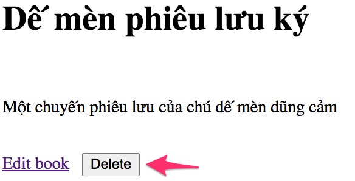

# Delete bằng phương thức POST

Ở bài trước, chúng ta xoá sách bằng phương thức GET. Sếp nhìn thấy là không ưng bụng đâu.
http://localhost:8080/book/delete/id

Bài này chuyển qua phương thức POST, có bảo mật hơn một chút. Sếp nào dễ tính cũng tạm cho qua. Sếp khó tính thì sẽ yêu cầu check quyền, rồi đưa ra cảnh báo trước khi xoá....

## Cấu trúc thư mục
```
.
├── java
│   ├── vn
│   │   ├── techmaster
│   │   │   ├── bookstore
│   │   │   │   ├── config
│   │   │   │   │   └── RepoConfig.java
│   │   │   │   ├── controller
│   │   │   │   │   └── BookController.java <-- Thay phương thức GET /book/delete/{id} bằng POST
│   │   │   │   ├── model
│   │   │   │   │   └── Book.java
│   │   │   │   ├── repository
│   │   │   │   │   ├── BookDao.java
│   │   │   │   │   └── Dao.java
│   │   │   │   ├── request
│   │   │   │   │   └── DeleteRequest.java <-- dùng để binding dữ liệu trong Request.Body
│   │   │   │   └── BookstoreApplication.java
├── resources
│   ├── static
│   │   └── book.csv
│   ├── templates
│   │   ├── allbooks.html
│   │   ├── book.html <-- Sửa link GET /book/delete/id thành button trong form POST /book/delete
│   │   └── form.html
│   └── application.properties
```

## Thực hành từng bước

1. Trong [book.html](src/main/resources/templates/book.html), sửa
```html
  <h1 th:text="${book.title}"></h1><br>
  <p th:text="${book.description}"></p><br>
  <a th:href="@{/book/edit/{id}(id=${book.id})}">Edit book</a>&nbsp;&nbsp;
  <a th:href="@{/book/delete/{id}(id=${book.id})}">Delete book</a><br>
```
thành

```html
  <form action="#" th:action="@{/book/delete}" th:object="${book}" method="post" novalidate="novalidate">
    <input type="hidden" th:field="*{id}"/>
    <h1 th:text="${book.title}"></h1><br>
    <p th:text="${book.description}"></p><br>
    <a th:href="@{/book/edit/{id}(id=${book.id})}">Edit book</a>&nbsp;&nbsp;
    <button type="submit">Delete</button>
  </form>
```

Chú ý ```<form action="#" th:action="@{/book/delete}" th:object="${book}" method="post"``` được thêm.

Có thêm một trường ẩn ```<input type="hidden" th:field="*{id}"/>```. Khi post lên /book/delete, trường id
sẽ dùng để tìm kiếm đầu sách để xoá.



2. Tạo class [DeleteRequest.java](src/main/java/vn/techmaster/bookstore/request/DeleteRequest.java)

```java
public class DeleteRequest {
  private int id;

  public int getId() {
    return id;
  }

  public void setId(int id) {
    this.id = id;
  }
  
}
```
Class này chỉ có duy nhất một thuộc tính id

3. Trong [BookController.java](src/main/java/vn/techmaster/bookstore/controller/BookController.java), bỏ phương thức
```java
@GetMapping(value = "/delete/{id}")
public String deleteByID(@PathVariable("id") int id) {    
  bookDao.deleteByID(id);        
  return "redirect:/book";
}
```

Thêm phương thức POST
```java
@PostMapping(value = "/delete")
public String deleteByID(@ModelAttribute DeleteRequest request, BindingResult result) {
  if (!result.hasErrors()) {
    bookDao.deleteByID(request.getId());
  }            
  return "redirect:/book";
}
```

4. Chạy lại để kiểm tra chức năng Delete


