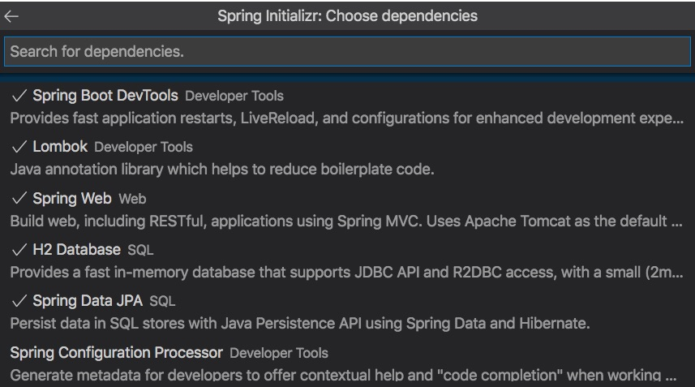

# Dự án eBook Store
### 1. Khởi tạo dự án
Sử dụng [https://start.spring.io/](https://start.spring.io/) hoặc [Spring Initializr](https://marketplace.visualstudio.com/items?itemName=vscjava.vscode-spring-initializr) để khởi tạo dự án.

Chọn các dependencies sau đây:
1. spring-boot-starter-web
2. spring-boot-devtools
3. spring-boot-starter-data-jpa
4. h2
5. lombok



Xem chi tiết file [pom.xml](pom.xml) được sinh ra

### 2. Xây dựng mô hình
Ở bài thực hành số 1, chúng ta chỉ tập trung vào model Book thôi.

1. Tạo thư mục [model](src/main/java/vn/techmaster/bookstore/m)
2. Tạo file [Book.java](src/main/java/vn/techmaster/bookstore/model/Book.java)
   ```java
   ```
   Annotation ```@Entity``` thuộc package ```javax.persistence.Entity```

### 3. Nạp dữ liệu mẫu vào H2

### 4. H2 console

