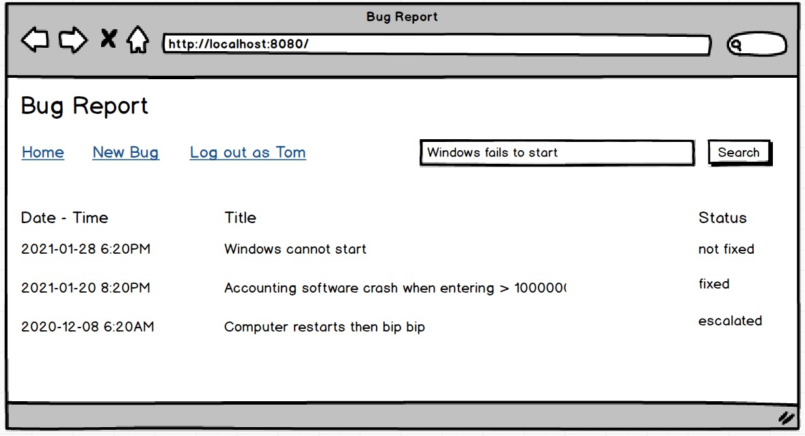

# Thiết kế tổng thể.

1. Mô tả các chức năng chính (main features)
2. Danh sách các role, loại người dùng
3. Luồng màn hình (screen flow)
4. Vẽ Balsamiq Mock up đầy đủ các màn hình
5. Quan hệ giữa các bảng viết bằng lời

Hãy chụp màn hình Balsamiq, và vẽ các diagram mô tả luồng màn hình vào đây. Nhà tuyển dụng hay giảng viên luôn hiểu ngay khi xem hình vẽ minh hoạ.

# Ví dụ mẫu

## Đồ án: Xây dựng web site tuyển dụng việc làm

Tên sinh viên: Nguyễn Văn X
Ngày sinh: 11/09/1996
Email: xnguyen@gmail.com
Di động: xxxxxx
