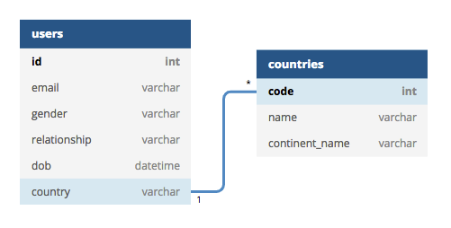

# Định nghĩa các model (Entity)

Bước này nâng cấp từ bước 1. Sinh viên tạo dự án SpringBoot với đầy đủ các dependencies. Sau đó định nghĩa các model sử dụng JPA, và Lombok package

1. Cần liệt kê đủ các bảng
2. Các khoá primary
3. Tính chất các cột ```@Column```
4. Quan hệ ```@OneToMany```,```@ManyToMany```
5. Các phương thức thêm (add), bớt (remove)
6. Bổ xung Exception

Tham khảo bước này [Midterm Hackathon 1 - BugReport](../../midtermhackathon/01DefineModels/bugreport)

Sử dụng [https://dbdiagram.io/](https://dbdiagram.io/) để vẽ sơ đồ quan hệ. Nhìn vào là nhà tuyển dụng nắm được bạn có thiết hợp lý hay không. Một hình vẽ giá trị 1000 từ.

