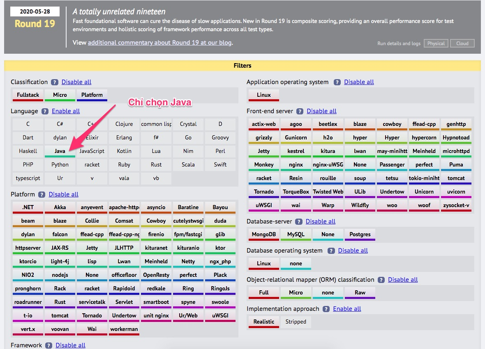
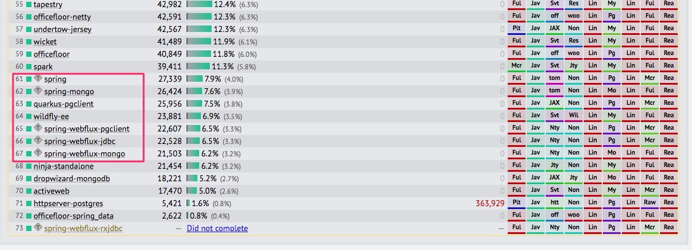

# Kinh nghiệm đi xin việc: viết CV, tìm kiếm công ty, ứng tuyển, hẹn phỏng vấn, phỏng vấn, nhận lời mời thử việc

## Lời nói đầu
Có việc làm tốt, có lương là một niềm tự hào đối với bất kỳ thanh niên trẻ nào. Ở Nhật Bản, trong triết lý Ikigai, có việc làm phù hợp năng lực bản thân, có ích cho xã hội và được trả lương là hạnh phúc và lòng tự trọng.

Trong các loại ngành nghề hiện nay, thì xin việc lập trình vừa thoáng (không yêu cầu bằng cấp, không hối lộ, hay quan hệ thân quen) nhưng lại vừa khó (muốn ứng viên vào làm việc được ngay). Nghề lập trình hết sức thú vị bạn có thể bắt đầu làm từ rất sớm khoảng năm 17 tuổi, nhưng có thể phải kết thúc nghề năm 40 tuổi nếu bạn không tiếp tục học hỏi công nghệ mới.

Bài viết này chia sẻ những kinh nghiệm tôi đã trải qua khi tự mình đi xin việc. Tôi đã thất bại khoảng 6 công ty trong lần đầu tiên đi xin việc năm 1994-1995, lúc đó tôi mới học năm thứ 4 đại học và không học CNTT. Nhưng sau khi đã làm việc ở một công ty phần mềm trong 3 năm, thì việc xin việc ở nhiều nơi khác rất dễ dàng. Thậm chí đăng profile lên Linked In hoặc một số trang tuyển dụng, head hunter nhà tuyển dụng tự tìm đến mình.

Bài viết này cũng sẽ trả lời:
- Có nên fake CV hay không?
- Có nên phải chuẩn bị thật hoàn hảo các kỹ năng rồi mới đi xin việc? 
- Có cần thư giới thiệu hoặc ai đó giới thiệu để xin được việc?
- Làm thế nào để demo sản phẩm thuyết phục nhà tuyển dụng nhất? 
- Mức lương nhà tuyển dụng quảng cáo có đúng như thực tế khi bạn vào làm?
- Làm thế nào khi được nhận vào và đối mặt với công việc không đúng như quảng cáo, khó hơn, hoặc khác hẳn với quảng cáo.
- Khi nào thì bạn nên chuẩn bị tìm việc mới (nhảy việc)?

Do nó trả lời nhiều câu hỏi nên tôi sẽ viết từ từ, nhớ được những kinh nghiệm bản thân, hay từ những gì mình quan sát được để tổng hợp viết dần.

## 1. Chọn công nghệ để làm chủ và xin việc

Trong lập trình có rất nhiều kỹ năng: mobile, web front end, web back end, database, devOps. Trong web front end lại có cắt HTML, jQuery, Angulars, Vuejs, React...Web back end thì không kể hết các ngôn ngữ lập trình và web framework. Mobile thì chủ yếu iOS, Android, React Native, Flutter

Hãy vào trang web [https://www.techempower.com/benchmarks](https://www.techempower.com/benchmarks) để xem đánh giá tốc độ của các web framework qua nhiều bài kiểm thử điển hình.
Chỉ cần chọn web framework sử dụng Java, đã có 73 biến thể từ khoảng 60 web framework khác nhau.

Chú ý tìm đến Spring Boot các bạn sẽ thấy nó gần ở cuối bảng, có nghĩa là chạy khá chậm.

Nhưng tại sao Spring Boot chạy chậm nhưng ở thị trường Việt nam số lượng job tuyển dụng lại nhiều đến vậy? Khi bạn chọn Spring Boot bạn đã hình dung công ty bạn vào làm to hay bé, năng động hay ổn định?

Khi chọn Java Spring Boot để đào tạo đầu năm 2019, tôi hiểu rõ mấy điểm sau:
1. Java là ngôn ngữ lập trình phổ biến nhất thế giới tại lúc đó. Nay xuống thứ 2 sau Python vì nhu cầu AI, Deep Learning lên quá mạnh.
2. Java là ngôn ngữ lập trình đầy đủ, kinh điển và dễ học hơn so với C++, RUST, chặt chẽ hơn JavaScript, PHP.
3. Nhiều tổ chức lớn đã dùng Java trong cả một lộ trình dài, và không thể thay thế. Bản thân Java cũng liên tục phát triển, cải tiến để đáp ứng tình hình thực tế. Nên nó vẫn là ngôn ngữ có sức sống tốt.
4. Spring Boot có mấy đối thủ là Play Framework, Vaadim, VertX... Nhưng ở Việt nam, đến 80% doanh nghiệp các công ty sử dụng Spring Boot do đó không dại gì mà không chọn Spring Boot. Cá biệt có một số đội dự án ngân hàng sử dụng [Vertx.io](https://vertx.io/) hoặc [Micronaut](https://micronaut.io/) để lập trình. Nhưng nếu bạn đã lập trình vững Spring Boot, mô hình MVC, REST, JPA, hiểu bản chất http request-response, authentication, authorization thì chuyển sang học các framework không quá khó. Vẫn ngôn ngữ Java, vẫn OOP, vẫn interface và các khái niệm công nghệ giống nhau.

Thông tin dài dòng này để bạn an tâm, giả sử khi phỏng vấn nhà tuyển dụng chỉ để chung chung tuyển lập trình viên Java Web. Nhưng khi vào thực tế lại là dự án VertX hay Micronaut, Play Framework thì cứ bình tĩnh học, sẽ học được công nghệ mới cũng rất hay ho.

Thực tế là khi chuyển sang đào tạo Java Spring Boot, các hợp đồng đào tạo đến liên tục, không kịp thở. VinID 2 lớp (30), Smart OSC 1 lớp (8), BIDV 1 lớp (14), Luvina 1 lớp (25), lớp dài hạn 3 lớp (45)...Nhu cầu là có thật, giờ tập trung làm tốt công nghệ mình đã chọn thôi.

## 2. Chuẩn bị gì để bắt đầu đi xin việc
Nếu như người trưởng thành tiền cổ mỗi ngày phải vào rừng săn bắt hái lượm kiếm ăn, thì người trưởng thành hiện đại khi chưa có việc làm luôn phải trăn trở làm thế nào để có việc làm đúng năng lực và lương tốt.

Chuẩn bị gì cho hành trình săn việc đầy thú vị?
1. Kinh nghiệm lập trình thực tế. Nhiều bạn đã bắt đầu học từ tháng 5/2020, giờ đã là tháng 2/2021, vậy là được 9 tháng. Lớp Spring Boot bắt đầu học đầu tháng 12/2020, như vậy cho đến tháng 3/2021, nếu các bạn đi xin việc, các bạn có khoảng 3-6 tháng kinh nghiệm lập trình tuy thuộc 