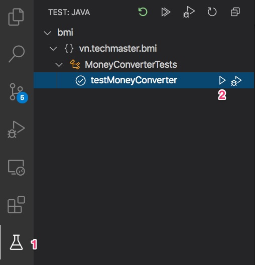

# Gợi ý các bước tiến hành

1. Phân tích nghiệp vụ
2. Tìm nguồn dữ liệu, lấy dữ liệu về, xử lý thô
3. Định nghĩa cấu trúc dữ liệu phù hợp
4. Nạp dữ liệu vào ```@Service``` component


## 1. Phân tích nghiệp vụ
Tỷ giá ngoại tệ luôn biến động và được cập nhật theo ngày. Ứng dụng cần phải lấy dữ liệu từ một nguồn có sẵn nào đó. Vậy đi tìm nó!

1. Cần lấy danh sách các mã tiền tệ
2. Tỷ giá các ngoại tệ so với đồng Đô La Mỹ
3. Công thức tính chuyển đổi Amount * Currency A sang Currency B là

```
Amount * Exchange_Rate(B) / Exchange_Rate(A)
```

Ví dụ
```
1 USD = 23220.1468 VND (Vietnamese Đồng)
1 USD = 30.1615 THB (Thái Baht)

1,000,000 VND = 1,000,000 * 30.1615 / 23220.1468 = 1298.93 ~ 1299 THB
```

## 2. Lấy dữ liệu

Đây là một dịch vụ cung cấp tỷ giá các đồng tiền với 1 dollar Mỹ. Dùng miễn phí cho 2000 lần gọi.
https://app.exchangerate-api.com/dashboard
Your API Key: da65c8cd73399287d4171fed
Example Request: https://v6.exchangerate-api.com/v6/da65c8cd73399287d4171fed/latest/USD

```java
// Setting URL
String url_str = "https://v6.exchangerate-api.com/v6/YOUR-API-KEY/latest/USD";

// Making Request
URL url = new URL(url_str);
HttpURLConnection request = (HttpURLConnection) url.openConnection();
request.connect();

// Convert to JSON
JsonParser jp = new JsonParser();
JsonElement root = jp.parse(new InputStreamReader((InputStream) request.getContent()));
JsonObject jsonobj = root.getAsJsonObject();

// Accessing object
String req_result = jsonobj.get("result").getAsString();
```

**Có 3 hướng xử lý:**
1. Mỗi lần có request từ phía người dùng thì gián tiếp gọi vào dịch vụ exchangerate-api.com để lấy dữ liệu mới nhất. Cách này hạ sách vì quá tốn kém. Nếu dịch vụ exchangerate-api.com tạm ngưng hoạt động thì chức năng money converter của chúng ta cũng die theo ! Ưu điểm duy nhất là luôn có dữ liệu cập nhật nhất.
2. Định thời, mỗi ngày 1 hoặc 2 lần gọi đến exchangerate-api.com sao lưu vào bộ nhớ tạm thời. Khi khách hàng dùng money converter chúng ta chỉ dùng lại dữ liệu đã được cache sẵn. Cách này tối ưu nhất nhưng chúng ta sẽ phải học lập trình định thời theo thời gian để tạo cuộc gọi.
3. Gọi một lần duy nhất, lấy file json về, chỉ lấy phần dữ liệu cần thiết để lập trình chức năng Money Converter phiên bản 1.0. Đây là cách các bạn nên bắt đầu làm để có kết quả ngay, nộp bài cho nhà tuyển dụng trong 48 tiếng.

Nếu ấn vào link này [https://v6.exchangerate-api.com/v6/da65c8cd73399287d4171fed/latest/USD](https://v6.exchangerate-api.com/v6/da65c8cd73399287d4171fed/latest/USD), thì dữ liệu json trả về có dạng như file này [exchangerate-api.json](src/main/resources/static/exchangerate-api.json).

Để đơn giản hoá, tôi lược bỏ bớt thông tin ngày tháng, chỉ giữ lại các cặp Key / Value với Key là Currency Code còn Value là tỷ lệ chuyển đối đồng tiền đó với 1 USD.

## 3. Định nghĩa cấu trúc dữ liệu phù hợp

Trong class [CurrencyRate.java](src/main/java/vn/techmaster/bmi/model/CurrencyRate.java) dùng để load dữ liệu từ file [currency.csv](src/main/resources/static/currency.csv)

Tuy nhiên có một trường ```private float rate```. Trường này sẽ không có trong currency.csv mà sẽ phải lấy từ file [exchange_rate.json](src/main/resources/static/exchange_rate.json)

Để xây dựng một mảng các đối tượng ExchangeRate gồm đầy đủ các trường, chúng ta làm như sau:
1. Đọc dữ liệu từ [currency.csv](src/main/resources/static/currency.csv) vào mảng các đối tượng [CurrencyRate.java](src/main/java/vn/techmaster/bmi/model/CurrencyRate.java)
2. Đọc dữ liệu từ [exchange_rate.json](src/main/resources/static/exchange_rate.json) vào mảng các đối tượng [ExchangeRate.java](src/main/java/vn/techmaster/bmi/model/ExchangeRate.java). Xem ví dụ mẫu ở đây
```java
public void parseExchangeRate() {
    try {
      File file = ResourceUtils.getFile("classpath:static/exchange_rate.json");
      FileReader reader = new FileReader(file);
      BufferedReader bufferedReader = new BufferedReader(reader);
      ObjectMapper objectMapper = new ObjectMapper();
      JsonNode masterNode = objectMapper.readTree(bufferedReader);

      Iterator<Map.Entry<String, JsonNode>> iter = masterNode.fields();
      while (iter.hasNext()) {
         var node = iter.next(); 
         System.out.println(node.getKey() + " = " +  node.getValue()); 
      }

    } catch (FileNotFoundException e) {
      System.out.println(e);
    } catch (IOException e) {
      System.out.println(e);
    }
}
```
Muốn chạy thử thì vào nút chạy Unit Test rồi chạy hàm kiểm thử ```testMoneyConverter```


Kết quả xem ở Console log khi chạy test sẽ ra thế này
```
USD = 1
AED = 3.6725
AFN = 77.3994
ALL = 100.8878
AMD = 523.25
ANG = 1.79
AOA = 650.283
ARS = 83.4033
AUD = 1.3165
AWG = 1.79
AZN = 1.7033
BAM = 1.5976
...
```
3. 


