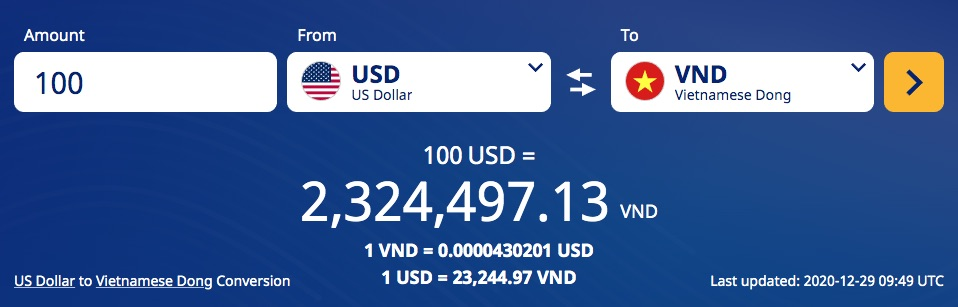

# Tính toán Body Mass Index và Money Converter

Trong bài này chúng ta sẽ thực hành 2 bài tập tình huống tính BMI và Money Converter để ôn tập kỹ năng:

1. Xử lý form POST request ở file [BMIController.java](src/main/java/vn/techmaster/bmi/controller/BMIController.java)
2. Hai nguyên lý đầu tiên của SOLID pattern là [Single Resposibility Principle](SingleResponsibility.md) và [Open/Close Principle](OpenClose.md) viết tắt của Open for Extension/Close for Modification
3. Xây dựng ```@Service``` component để xử lý nghiệp vụ thay cho ```@Controller```
4. Làm quen với ```@RestController``` ở file [BMIRest.java](src/main/java/vn/techmaster/bmi/rest/BMIRest.java)
5. Học cách parse file JSON [exchange_rate.json](src/main/resources/static/exchange_rate.json) lấy dữ liệu dạng key/value

## Body Mass Index Calculator

Chức năng này đã hoàn thiện và được refactor vài lần. Hãy xem
- [Single Resposibility Principle](SingleResponsibility.md)
- [Open/Close Principle](OpenClose.md) 

## Money Converter

Tình huống như sau: bạn đến xin việc ở một ngân hàng lớn. Họ đang cần xây dựng một dịch vụ tra tỷ giá ngoại tệ với giao diện tương tự như sau:



Bạn sẽ làm như thế nào? [Xem gợi ý ở đây nhé](MoneyConverter.md)