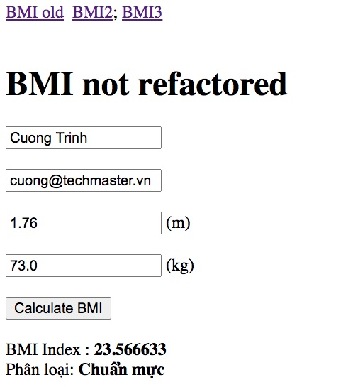
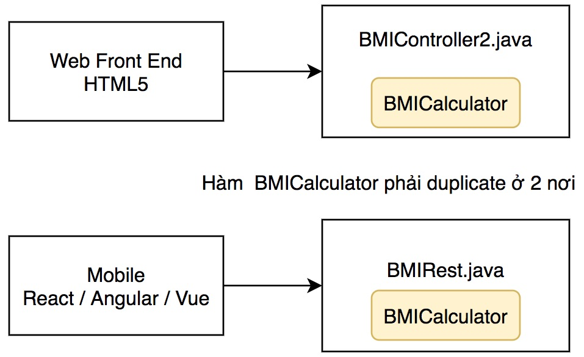
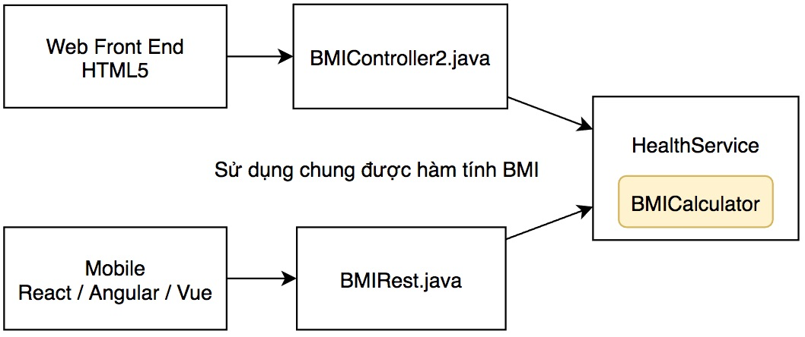
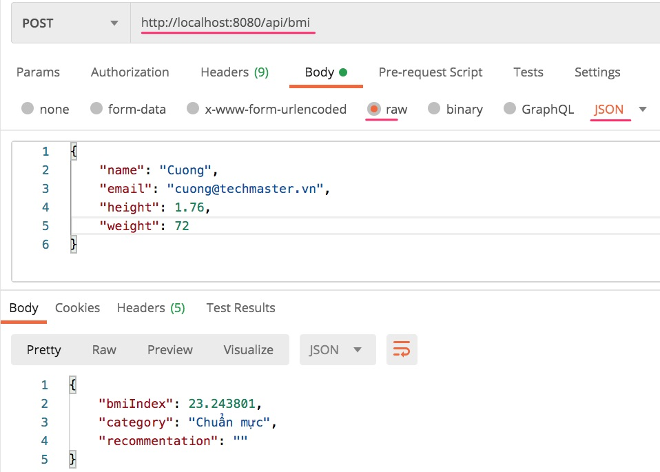

# Single Responsibility

## Refactor ứng dụng trợ lý ảo

Nhân sự kiện Zalo AI 2020 ra mắt ứng dụng trợ lý Kiki, trong khoá học CleanCode chúng ta cũng sẽ làm một ứng dụng trợ lý ảo đơn giản để rèn kỹ năng refactor, tái cấu trúc code.

**Chức năng ứng dụng trợ lý ảo này gồm có:**

1. Tính chỉ số Body Mass Index (BMI)
2. Chuyển đổi tiền tệ (Money Converter)
3. Dự báo thời tiết (Weather Forecast)



Ứng dụng này được viết bằng Java, Spring Boot. Các bạn có thể dùng Intellij community hoặc VSCode để lập trình. Cần cài bổ xung Java Extension Pack và Sppring Boot Extension Pack

**Các bước tôi thường làm khi phát triển phần mềm**

1. Thiết kế giao diện đẹp, chạy như thật demo cho khách hàng. Họ ưng, ký hợp đồng đã.
2. Code để chạy được những chức năng chính căn bản, tiếp tục cho khách hàng xem lấy ý kiến.
3. Refactor code để dễ mở rộng, dễ bảo trì
4. Dự án gia công thường giới hạn về thời gian và chi phí. Nếu khách hàng yêu cầu,bổ xung phần kiểm thử End to End Testing. Tôi thường không viết Unit Test vì các dự án khá gấp gáp, chức năng liên tục thay đổi.
5. Nếu team code lập trình viên DevOps thì nên cấu hình CI/CD ngay từ đầu để kiểm thử trên môi trường development 

# Các bước thực hành

## 1. BMIController.java

[BMIController.java](src/main/java/vn/techmaster/bmi/controller/BMIController.java) có một phương thức 
```public String handleBMIForm(@ModelAttribute BMIRequest request, BindingResult bindingResult, Model model)```
làm rất nhiều chức năng:
  1. Hứng post request gửi tới địa chỉ ```/bmi```
  2. Parse request này, bind request.body vào đối tượng [BMIRequest.java](src/main/java/vn/techmaster/bmi/request/BMIRequest.java), kết quả binding thì trả về ở tham số ```BindingResult bindingResult``
  3. Nếu không có lỗi thì tính toán chỉ số BMI, rồi trả về qua đối tượng [BMIResult](src/main/java/vn/techmaster/bmi/response/BMIResult.java)

 Vấn đề của phương thức này là mặc dù nó không dài hơn 20 line, nhưng nó phức tạp trộn lẫn nhiều chức năng, kiểu, tham số, khác nhau. Rõ ràng là hàm tính chỉ số BMI rất đơn giản chỉ là Weight / (Height * Height) không liên quan đến giao diện, hay cơ sở dữ liệu. Vậy hãy tách nó ra để nó đứng độc lập, vừa dễ viết Unit Test vừa đáp ứng tiêu chí Single Resposibility trong bmi

## 2. BMIController2.java
[BMIController2.java](src/main/java/vn/techmaster/bmi/controller/BMIController2.java) đã chuyển logic tính BMI thành một hàm riêng. Cách này tốt hơn cách cũ nhưng vẫn có nhược điểm: nếu dự án sẽ cung cấp thêm RESTApi  thì logic tính BMI sẽ phải đặt ra ngoài controller, mới có thể tái sử dụng



## 3. BMIController3.java, BMIRest.java và HealthService.java: chuyển logic vào Service
Khách hàng yêu cầu cung cấp dịch vụ REST để phục vụ dữ liệu cho ứng dụng di động và Single Page App kiểu như React.js, Angular.js hay Vue.js.
Chúng ta tạo [BMIRest.java](src/main/java/vn/techmaster/bmi/rest/BMIRest.java) hứng post request ở địa chỉ http://localhost:8080/api/bmi


Cả [BMIController3.java](src/main/java/vn/techmaster/bmi/controller/BMIController3.java) và [BMIRest.java](src/main/java/vn/techmaster/bmi/rest/BMIRest.java) đều gọi đến [HealthService.java](src/main/java/vn/techmaster/bmi/service/HealthService.java)



Sử dụng POST Man để gửi POST request vào địa chỉ http://localhost:8080/api/bmi
