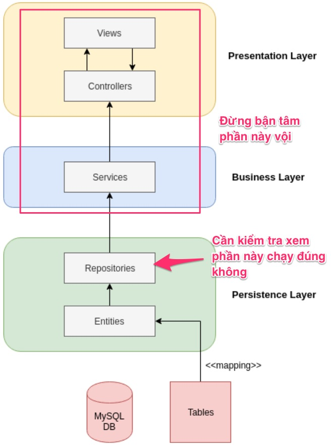

# Bài tập cuối năm 2020

Hạn nộp 8/1/2021. Sẽ chấm bài tại lớp.

1. Hãy import dữ liệu từ file [person.csv](src/main/resources/static/person.csv)

```csv
id,fullname,job,city
1,Roldan Glennon,Soldier,Dubai
2,Sharla Beaman,Banker,Tokyo
3,Aindrea Coare,Taxi Driver,Tokyo
4,Dona Hauxby,Banker,Barcelona
5,Slade Holliar,Police,Da nang
6,Maxine Henryson,Teacher,Tokyo
7,Teriann Maddy,Graphics Designer,Sandiego
8,Briny Bullivent,Police,Barcelona
```

2. Viết nốt logic của [PersonRepositoryCSV.java](src/main/java/vn/techmaster/learncollection/repository/PersonRepositoryCSV.java) tuân thủ theo [PersonRepositoryInterface.java](src/main/java/vn/techmaster/learncollection/repository/PersonRepositoryInterface.java)

```java
HashMap<String, List<Person>> groupPeopleByCity(); //Gom tất cả những người trong cùng một thành phố lại
  /* - Hanoi 
        - Nguyen Văn X  |
        - Nguyên Văn Y  | -> List<Person>
        - Bui Thi Z     |
      - New York
        - John Lenon
        - Iron Man
        - John Biden
      - Tokyo
        - Ajino Moto
        - Murakami
        - Kawazaki   
  */
  HashMap<String, Integer> groupJobByCount();  //Nhóm các nghề nghiệp và đếm số người làm mỗi nghề
  /* 
  Pharmacist  - 2
  Data Coordiator - 3
  Sales Representative - 5
  */
  HashMap<String, Integer> findTop5Jobs(); //Tìm 5 nghề có số lượng người làm nhiều nhất sắp xếp từ cao xuống thấp

  HashMap<String, Integer> findTop5Citis(); //Tìm 5 thành phố có số người thuộc danh sách sinh sống đông nhất từ vị trí thứ 5 đến vị trí thứ 1

  HashMap<String, String> findTopJobInCity(); //Ở mỗi thành phố, tìm nghề nào có nhiều người làm nhất

  HashMap<String, Float> averageJobSalary(); //Ứng với mỗi nghề nghiệp (job - String), tính mức lương trung bình (float)

  HashMap<String, Float> top5HighestSalaryCities(); //Tìm 5 thành phố có mức lương trung bình cao nhất, sắp xếp từ cao xuống thấp

  HashMap<String, Float> averageJobAge(); //Ứng với mỗi loại job hãy tính độ tuổi trung bình

  HashMap<String, Float> averageCityAge(); //Ứng với mỗi thành phố hãy tính độ tuổi trung bình

  List<String> find5CitiesHaveMostSpecificJob(String job); //Với một nghề cụ thể, hãy tìm ra 5 thành phố có nhiều làm nghề đó nhất
```

3. Tạo một trang chủ gồm các link sau đây
   - Liệt kê danh sách tất cả người -> http://localhost:8080/getAll
   - Liệt kê danh sách sắp xếp theo tên full name từ A-Z  -> http://localhost:8080/sortPeopleByFullName
   - Lấy danh sách tất cả nghề nghiệp đã được sắp xếp từ A-Z  -> http://localhost:8080/getSortedJobs
   - Lấy danh sách tất cả thành phố đã được sắp xếp từ A-Z  -> http://localhost:8080/getSortedCities
   ...
   Xem mẫu hàm trên sẽ tự hiểu.

4. Với mỗi link hãy tạo view Thymeleaf để hiện thị dữ liệu sao cho dễ đọc, dễ hiểu.

Gợi ý nên dùng thêm thư viện [Guava của Google](https://github.com/google/guava)

- [Immutable Collection](https://github.com/google/guava/wiki/ImmutableCollectionsExplained)
- [New Collection Types](https://github.com/google/guava/wiki/NewCollectionTypesExplained)
- [Implementing GroupBy using Google guava Multimap and Function](http://www.gregbugaj.com/?p=228)
- [Guide to Guava Multiset](https://www.baeldung.com/guava-multiset)
- [Guava – Sets](https://www.baeldung.com/guava-sets)
-----
## Hướng dẫn làm bài tập này

### Tip 1: Hãy thu nhỏ, đơn giản hoá dữ liệu để dễ quan sát
Khi xử lý với lượng dữ liệu quá 20 dòng, chúng ta rất khó trong việc kiểm tra tính đúng đắn của logic.
Do đó hãy tạo một file csv khoảng 20 dòng, [personsmall.csv](src/main/resources/static/personsmall.csv)

### Tip 2: Hãy mạnh dạn ứng dụng kỹ thuật Dependency Injection (DI)
DI không phải là kỹ thuật gì cao siêu. Nó giống như lắp Lego vậy thôi.

Trong bài này, chúng ta phải truy vấn dữ liệu từ bảng / danh sách Person rất nhiều. Do đó cần phải tạo một class là Repository.

**Hỏi**: Repository khác gì với Service? Em thấy chúng có giống nhau quá !

**Đáp**: Spring Boot cung cấp 2 annotation ```@Repository``` và ```@Service``` trong package org.springframework.stereotype. Đây là định nghĩa của 2 annotation này. Chúng chả khác gì nhau về cú pháp cả!

```java
@Target({ElementType.TYPE})
@Retention(RetentionPolicy.RUNTIME)
@Documented
@Component
public @interface Repository
```

```java
@Target({ElementType.TYPE})
@Retention(RetentionPolicy.RUNTIME)
@Documented
@Component
public @interface Service
```

Tuy nhiên ```@Service``` đánh dấu cho class tầng dịch vụ ~ service layer. Tầng dịch vụ có thể kết nối đến database qua repository, có thể gửi email, gọi đến REST API khác để lấy dữ liệu, có thể publish một event vào message queue hoặc subscribe một event từ queue. Một service có thể gọi đến nhiều repository.

```@Repository``` đánh dấu cho class tập trung thao tác dữ liệu với CSDL quan hệ MySQL, Postgresql, Oracle, MSSQL... hay phi quan hệ như MongoDB.

Một lập trình viên ngược đời (nerd programmer) có thể đánh dấu một class với ```@Service``` nhưng trong class đó thao tác dữ liệu dùng [JPA](https://spring.io/projects/spring-data-jpa). Việc này có thể được, nhưng nó vi phạm quy ước (break convention) cấu trúc dự án Spring Boot.

**Hỏi:** Tầng Controller có gọi trực tiếp Repository được không hay phải luôn thông qua Service?

**Đáp:** Service layer/component chỉ thực sự hữu ích khi nó tổng hợp, điều phối thao tác dữ liệu từ nhiều Repository, validate dữ liệu, biến đổi dữ liệu.
Nếu máy móc bổ xung thêm tầng ở giữa nhưng không làm gì hữu ích chỉ làm tốc độ ứng dụng chậm lại.

**Hỏi:** Tại sao thầy lại tạo một public Interface [PersonRepositoryInterface.java](src/main/java/vn/techmaster/learncollection/repository/PersonRepositoryInterface.java) rồi sau đó lại tạo class  [PersonRepositoryCSV.java](src/main/java/vn/techmaster/learncollection/repository/PersonRepositoryCSV.java) tuân thủ Interface. Việc này có vẻ thừa, vì controller có thể dùng trực tiếp class ```PersonRepositoryCSV```?

**Đáp:**
Nếu bạn để ý trong thư mục [resources/static](src/main/resources/static) có 2 file:
- [person.csv](src/main/resources/static/person.csv)
- [person.sql](src/main/resources/static/person.sql)

Phiên bản đầu tiên của ứng dụng này chúng ta thao tác với file CSV. Nhưng sau đó phiên bản tiếp theo chúng ta nâng cấp lên CSDL quan hệ H2 hoặc MySQL. Nếu tầng Service hoặc Controller kết nối đến một concrete repository class (một class cụ thể), thì chúng ta đã tạo ra một quan hệ cứng nhắc tight coupling. Tight coupling là điều không mong muốn khi nâng cấp, cải tiến phần mềm. Quy tắc là "Programming against Interface not Implementation".
### Tip 3: Hãy sử dụng Automation Test.

Trong Java có một thư viện Automation Test rất tốt là JUnit. Phiên bản hiện này là [JUnit5](https://junit.org/junit5/) có rất nhiều cải tiến so với JUnit4.

- [A Guide to JUnit 5](https://www.baeldung.com/junit-5)
- [JUnit 5 Tutorial](https://howtodoinjava.com/junit-5-tutorial/)

**Hỏi:** JUnit dùng để viết kiểm thử sao lại dùng vào bài tập nặng về xử lý dữ liệu Collection này?

**Trả lời:** Kiến trúc của ứng dụng Spring Boot là multi-layers (nhiều tầng): View <-> Controller -> Service -> Repository -> Entity -> Database


Bài tập này tập trung vào lập trình phần xử lý dữ liệu ở Repository. Nếu phải lập trình đầy đủ các tầng Controller, View rồi Service thì rất khó kiểm soát lỗi. 

Nguyên tắc số 1 trong quản lý chất lượng sản phẩm đó là kiểm soát, kiểm tra, giám sát thành phần ở tại chỗ nó được tạo ra. Nếu có lỗi, dừng dây truyền sản xuất để tìm lỗi, khắc phục rồi mới chạy tiếp.

Nguyên tắc số 2: đó là tiến hành kiểm tra chất lượng ngay từ đầu, không để sản xuất sau một thời gian mới kiểm tra.

Trong dự án này chúng ta sẽ dùng [JUnit5](https://junit.org/junit5/) và [AssertJ](https://assertj.github.io/doc/).

Đây là phần XML các bạn cần thêm vào file [pom.xml](pom.xml)
```xml
<dependency>
  <groupId>org.junit.jupiter</groupId>
  <artifactId>junit-jupiter-params</artifactId>
  <version>5.7.0</version>
  <scope>test</scope>
</dependency>
<dependency>
  <groupId>org.assertj</groupId>
  <artifactId>assertj-core</artifactId>
  <scope>test</scope>
  <version>3.18.1</version>
</dependency>
```

**Hỏi:** Viết mã test vào thư mục nào?

**Đáp:** Trong thư mục src có 2 thư mục main và test. Thư mục test là nới các bạn sẽ đặt các Testing class. Khi kiểm thử, IDE sẽ quét tất các các phương thức trong thư mục này.
```
.
├── src
│   ├── main
│   ├── test
│   │   └── java
│   │       └── vn
│   │           └── techmaster
│   │               └── learncollection <-- Viết các testing class vào đây
│   │                   └── PersonRepositoryTest.java
```

**Hỏi:** Có thể viết bao nhiêu testing class trong một ứng dụng Spring Boot?

**Đáp:** Bạn có thể viết bao nhiêu tuỳ thích. Tốt nhất mỗi testing class tập trung kiểm thử một class chức năng tương ứng. Ví dụ trong bài này [PersonRepositoryTest.java](src/test/java/vn/techmaster/learncollection/PersonRepositoryTest.java) sẽ kiểm thử [PersonRepositoryCSV.java](src/main/java/vn/techmaster/learncollection/repository/PersonRepositoryCSV.java)