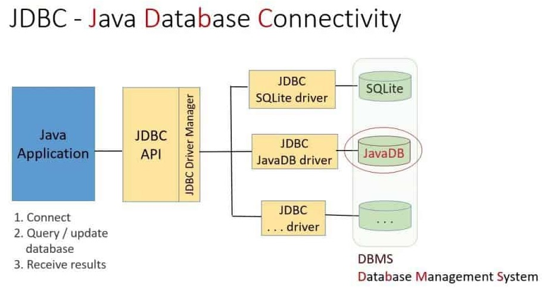

# JPA
JPA là viết tắt của Java Persistence API. Đây là một công nghệ để giúp ánh xạ, chuyển đổi 2 chiều dữ liệu Java Class/Object vào CSDL quan hệ. Công nghệ này gọi là Object Relational Mapping, viết tắt là ORM.

Trước khi có ORM, chúng ta sử dụng các thư viện như ODBC (Windows), JDBC (Java) để kết nối vào CSDL quan hệ, rồi gửi các câu lệnh SQL đến CSDL. CSDL thực hiện lệnh đó rồi trả về kết quả. Ứng dụng sẽ phải bóc tách kết quả theo cách khá thủ công và tốn nhiều dòng code đó là duyệt qua mảng các bản ghi (array of records), ở mỗi dòng (record), lấy ra từng trường, kiểm tra kiểu dữ liệu từng trường




Đây là đoạn code kết nối MySQL qua JDBC
```java
//STEP 1. Import required packages
import java.sql.*;

public class FirstExample {
   // JDBC driver name and database URL
   static final String JDBC_DRIVER = "com.mysql.jdbc.Driver";  
   static final String DB_URL = "jdbc:mysql://localhost/EMP";

   //  Database credentials
   static final String USER = "username";
   static final String PASS = "password";
   
   public static void main(String[] args) {
   Connection conn = null;
   Statement stmt = null;
   try{
      //STEP 2: Register JDBC driver
      Class.forName("com.mysql.jdbc.Driver");

      //STEP 3: Open a connection
      System.out.println("Connecting to database...");
      conn = DriverManager.getConnection(DB_URL,USER,PASS);

      //STEP 4: Execute a query
      System.out.println("Creating statement...");
      stmt = conn.createStatement();
      String sql;
      sql = "SELECT id, first, last, age FROM Employees";
      ResultSet rs = stmt.executeQuery(sql);

      //STEP 5: Extract data from result set
      while(rs.next()){
         //Retrieve by column name
         int id  = rs.getInt("id");
         int age = rs.getInt("age");
         String first = rs.getString("first");
         String last = rs.getString("last");

         //Display values
         System.out.print("ID: " + id);
         System.out.print(", Age: " + age);
         System.out.print(", First: " + first);
         System.out.println(", Last: " + last);
      }
      //STEP 6: Clean-up environment
      rs.close();
      stmt.close();
      conn.close();
   }catch(SQLException se){
      //Handle errors for JDBC
      se.printStackTrace();
   }catch(Exception e){
      //Handle errors for Class.forName
      e.printStackTrace();
   }finally{
      //finally block used to close resources
      try{
         if(stmt!=null)
            stmt.close();
      }catch(SQLException se2){
      }// nothing we can do
      try{
         if(conn!=null)
            conn.close();
      }catch(SQLException se){
         se.printStackTrace();
      }//end finally try
   }//end try
   System.out.println("Goodbye!");
}//end main
}//end FirstExample
``` 
## Object Relation Mapping - ORM

Ưu điểm của ORM so với công nghệ kết nối CSDL trước đây JDBC/ODBC là gì?

1. 


##


Persistence annotations can be applied at three different levels: class, method, and field
The @Id annotation indicates not only that the id field is the persistent identifier or primary key for the entity

## Tham khảo
- [Spring Boot With H2 Database](https://www.baeldung.com/spring-boot-h2-database)
- [Loading Initial Data with Spring Boot](https://www.baeldung.com/spring-boot-data-sql-and-schema-sql)
- [https://stackoverflow.com/questions/24508223/multiple-sql-import-files-in-spring-boot](https://stackoverflow.com/questions/24508223/multiple-sql-import-files-in-spring-boot)
- [Spring Boot with Multiple SQL Import Files](https://www.baeldung.com/spring-boot-sql-import-files)

https://vladmihalcea.com/prepersist-preupdate-embeddable-jpa-hibernate/

https://vladmihalcea.com/the-best-way-to-map-a-onetomany-association-with-jpa-and-hibernate/


https://vladmihalcea.com/14-high-performance-java-persistence-tips/