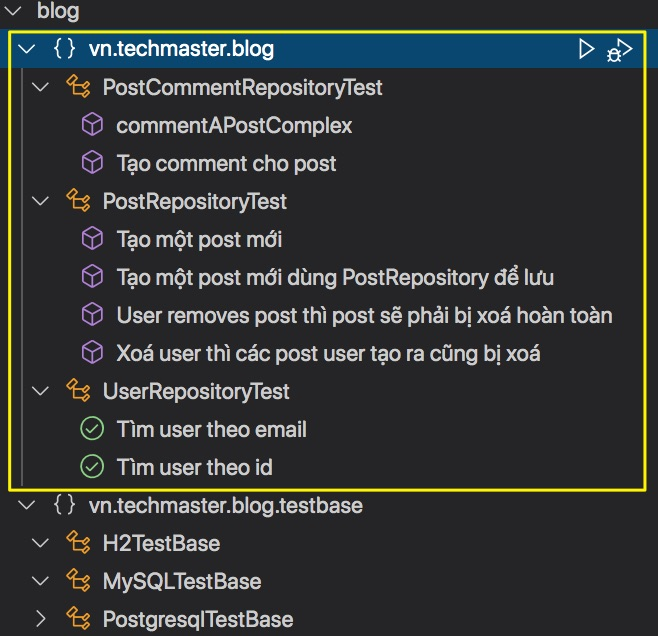

# Ứng dụng TestContainers để kiểm thử cho nhiều CSDL khác nhau.

Bài này chỉ ứng dụng lại những gì đã trình bày ở bài [Kiểm thử với nhiều loại CSDL khác nhau sử dụng TestContainers](https://github.com/TechMaster/SpringBootBasic/tree/main/jpa/05MutipleDatabases/testcontainer)

## Những depedencies trong file pom.xml

```xml
<properties>
  <java.version>15</java.version>
  <testcontainers.version>1.15.1</testcontainers.version> <!--Xác định phiên bản của testcontainers-->
</properties>
```

### Database drivers
```xml
<dependency>
  <groupId>org.postgresql</groupId>
  <artifactId>postgresql</artifactId>
  <scope>runtime</scope>
</dependency>
<dependency>
  <groupId>mysql</groupId>
  <artifactId>mysql-connector-java</artifactId>		
</dependency>
```

### Thư viện hỗ trợ kết nối đến các database container cụ thể
```xml
<dependency>
  <groupId>org.testcontainers</groupId>
  <artifactId>postgresql</artifactId>
  <scope>test</scope>
</dependency>
<dependency>
  <groupId>org.testcontainers</groupId>
  <artifactId>mysql</artifactId>
  <scope>test</scope>
</dependency>
```

### Thư viện viết kiểm thử
```xml
<dependency>
  <groupId>org.testcontainers</groupId>
  <artifactId>junit-jupiter</artifactId>
  <scope>test</scope>
</dependency>		
<dependency>
  <groupId>org.assertj</groupId>
  <artifactId>assertj-core</artifactId>
  <version>3.18.1</version>
  <scope>test</scope>
</dependency>
```

### Quản lý phiên bản TestContainers
```xml
<dependencyManagement>
  <dependencies>
    <dependency>
      <groupId>org.testcontainers</groupId>
      <artifactId>testcontainers-bom</artifactId>
      <version>${testcontainers.version}</version>
      <type>pom</type>
      <scope>import</scope>
    </dependency>
  </dependencies>
</dependencyManagement>
```

## Cấu trúc thư mục kiểm thử test

```
test
├── java
│   ├── vn
│   │   ├── techmaster
│   │   │   ├── blog
│   │   │   │   ├── testbase <-- các abstract class target CSDL khác nhau
│   │   │   │   │   ├── h2.properties
│   │   │   │   │   ├── H2TestBase.java
│   │   │   │   │   ├── MySQLTestBase.java
│   │   │   │   │   └── PostgresqlTestBase.java
│   │   │   │   ├── PostCommentRepositoryTest.java
│   │   │   │   ├── PostRepositoryTest.java
│   │   │   │   └── UserRepositoryTest.java
```
