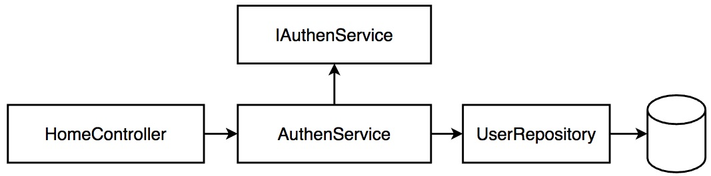
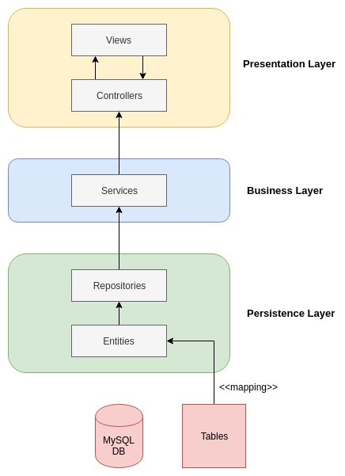
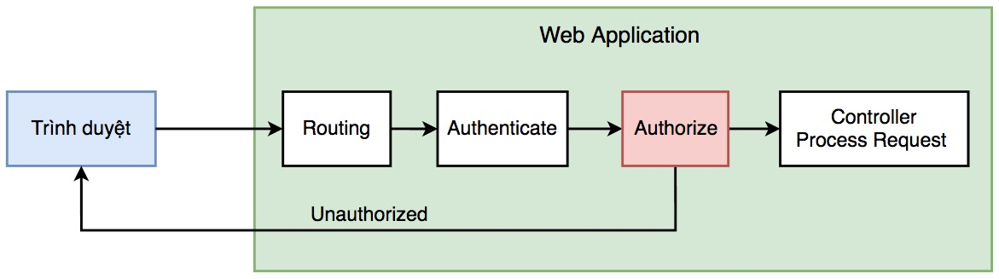

# Login và nhớ người dùng đã đăng nhập bằng Cookie

## Cơ chế Login cổ điển
Trong bài này, chúng ta tự lập trình cơ chế login cổ điển (basic authentication) sử dụng cặp {email, password} để đăng nhập. Các cơ chế bảo mật hơn (2 factors authentication) hay quy mô mở hơn (OAuth2) sẽ được trình bày ở phần Spring Security hoặc sinh viên tự tìm hiểu.

Ở mức đơn giản, thì cần có một bảng user lưu 2 trường: email và password. Tốt hơn nữa là hãy băm password (hashed password) để phòng trường hợp quản trị hệ thống, lập trình có thể quét được password người dùng. Vì theo thói quen người dùng có thể dùng lại password cho nhiều web site khác nhau. Lỗi bảo mật kinh điển như vậy mà dịch vụ credit card lớn ở Mỹ còn mắc phải.

**Vậy chú ý khi sử dụng lại code bài này cần phải bổ xung bước băm để che dấu chuỗi password thực sự.**

### Các bước để login (xác thực) gồm có:

1. Hiển thị form login có 2 trường email và password
2. Người dùng nhập email và password, controller nhận rồi gửi đến dịch vụ tuân thủ interface [IAuthenService.java](src/main/java/vn/techmaster/blog/service/IAuthenService.java), sẽ có một class cụ thể implement interface này là [AuthenService.java](src/main/java/vn/techmaster/blog/service/AuthenService.java). Nếu có lỗi thì ném ra ngoại lệ [AuthenException.java](src/main/java/vn/techmaster/blog/service/AuthenException.java)
3. [AuthenService.java](src/main/java/vn/techmaster/blog/service/AuthenService.java) sẽ gọi đến interface [UserRepository.java](src/main/java/vn/techmaster/blog/repository/UserRepository.java)

Logic login, logout và set cookie khi login thành công để web server nhớ người dùng tôi viết trong [HomeController.java](src/main/java/vn/techmaster/blog/controller/HomeController.java)



### Sử dụng Data Transfer Object để thay vì truyền cả Entity Object về tầng Controller.

Khi làm việc với JPA, chúng ta định nghĩa các Entity với các annotation nhứ ```@Entity```, ```@Table``` rồi ```@Data``` bổ xung thêm nhiều phương thức thêm, xoá, rồi các cấu trúc dữ liệu List, Set để mô hình [quan hệ One to Many](https://github.com/TechMaster/SpringBootBasic/blob/main/jpa/OneToMany.md) hay [quan hệ Many to Many](https://github.com/TechMaster/SpringBootBasic/blob/main/jpa/ManyToMany.md)

Việc trả về trực tiếp đối tượng Entity từ tầng Repository qua Service rồi đến Controller thậm chí đến tầng View chỉ có một ưu điểm là code ít, không phải chuyển đổi nhưng phát sinh vài yêu cầu:
1. Đối tượng Entity có nhiều trường dữ liệu nhạy cảm như password, hoặc không cần thiết phải trả về. Cần phải ẩn, hoặc loại bỏ các trường này.
2. Các trường trong Entity có thể cũng cần biến đổi trước khi trả về.



Hãy xem logic của hàm login trong [AuthenService.java](src/main/java/vn/techmaster/blog/service/AuthenService.java), đọc phần chú thích
```java
@Override
public UserInfo login(LoginRequest loginRequest) throws AuthenException {
    Optional<User> optionalUser = userRepository.findByEmail(loginRequest.getEmail());  //Tìm user theo email
    if (optionalUser.isPresent()) { //Nếu user đó tồn tại
        User user = optionalUser.get();  //Unwrap (bóc vỏ) đối tượng User ra khỏi kiểu Optional<User>
        if (!user.getPassword().equals(loginRequest.getPassword())) {  //So sánh password người dùng gửi lên và password lưu trong CSDL
            throw new AuthenException("Wrong password"); //Sai password thì throw Exception, đừng trả về true hay false. CleanCode chỉ ra rằng cách trả về true false code dễ gây lỗi và khó bảo trì.
        } else {
            return UserMapper.INSTANCE.userToUserInfo(user); //Chuyển đổi đối tượng User sang UserInfo.
        }
    } else {
        throw new AuthenException("User with email " + loginRequest.getEmail() + " does not exist");
    }
}
```

Hãy so sánh hai class [User.java](src/main/java/vn/techmaster/blog/model/User.java) và [UserInfo.java](src/main/java/vn/techmaster/blog/DTO/UserInfo.java)

Cấu trúc của UserInfo tinh gọn và không có trường password lộ ra. Đây chính là điểm mấu chốt để sử dụng Data Transfer Object. Nếu không vì yêu cầu cụ thể, sử dụng DTO chỉ làm ứng dụng chậm đi vì phải chuyển đổi dữ liệu.

```java
@Data
//UserInfo dùng để trả về dữ liệu phía client, nó không chứa những trường nhạy cảm như password !
public class UserInfo {
  private long id;
  private String fullname;
  private String email;
}
```

#### Có những cách nào, thư viện nào để chuyển đổi 2 chiều giữa Entity và DTO ?
Code bằng tay, tạo ra constructor khởi tạo đối tượng đích rồi chuyền tham số là thuộc tính của đối tượng gốc vào
```java
UserInfo userInfo = new UserInfo(user.getId(), user.getFullname, user.getEmail());
```
Bạn nào làm bài kiểm tra cứ dùng cách thủ công này cho tôi. Cần gì phải phức tạp cầu kỳ !

Cách khác là sử dụng các thư viện Java Mapping. Cú pháp chuyển đổi, khả năng mềm dẻo xử lý nhiều trường hợp và tốc độ xử lý là 3 yêu tố để chọn thư viện Java Mapping. Xem bài này [Performance of Java Mapping Frameworks](https://www.baeldung.com/java-performance-mapping-frameworks) và

Trong bài này, tôi sử dụng thư viện [MapStruct](https://mapstruct.org/). Để dùng nó phải bổ xung vào [pom.xml](pom.xml)
```xml
<dependency>
    <groupId>org.mapstruct</groupId>
    <artifactId>mapstruct</artifactId>
    <version>1.4.1.Final</version>
</dependency>
<dependency>
    <groupId>org.mapstruct</groupId>
    <artifactId>mapstruct-processor</artifactId>
    <version>1.4.1.Final</version>
</dependency>
```
Vì UserInfo và User có tên các thuộc tính trùng khớp nhau nên việc chuyển đổi rất đơn giản. Xem [UserMapper.java](src/main/java/vn/techmaster/blog/DTO/UserMapper.java)
```java
@Mapper
public interface UserMapper {
  UserMapper INSTANCE = Mappers.getMapper(UserMapper.class);
  UserInfo userToUserInfo(User user);
  User userInfoToUser(UserInfo userInfo);
}
```
Cái hay của MapStruct là có thể chuyển đổi giữa 2 thuộc tính khác nhau hoặc tự viết Custom Mapper có logic chuyển đổi. Xem
[Quick Guide to MapStruct](https://www.baeldung.com/mapstruct) và [Custom Mapper with MapStruct](https://www.baeldung.com/mapstruct-custom-mapper)
```java
@Mapper
public interface EmployeeMapper {
    @Mappings({
      @Mapping(target="employeeId", source="entity.id"),
      @Mapping(target="employeeName", source="entity.name")
    })
    EmployeeDTO employeeToEmployeeDTO(Employee entity);
    @Mappings({
      @Mapping(target="id", source="dto.employeeId"),
      @Mapping(target="name", source="dto.employeeName")
    })
    Employee employeeDTOtoEmployee(EmployeeDTO dto);
}
```

## Xác thực (authenticate) xong thì sẽ đến phân quyền (authorize)
Authenticate trả lời: user là ai
Authorize trả lời: user được quyền làm gì với tài nguyên hệ thống. Authorize luôn phải đi sau Authenticate.

Trong một ứng dụng web sẽ có nhiều chức năng thể hiện bằng đường dẫn sau domain (relative path) và HTTP Verb GET hoặc POST. Sẽ có chức năng cho phép bất kỳ ai dùng, nhưng có những chức năng không nhưng cần biết user là ai, mà phải có đúng quyền hạn (priviledge) mới được dùng.

SpringBoot Security là một thư viện đã làm sẵn mọi chức năng khiến cho lập trình quên cả bản chất bên trong của authenticate hay authorize. Có hai cách để phân quyền HTTP request khi gửi lên web application:
1. Viết thủ công logic check quyền user trong mỗi hàm xử lý HTTP request. Đây là cách tôi làm trong bài này. Nó đơn giản, nhưng lặp đi lặp lại, code nhiều, không tái sử dụng được.
2. Viết authorization module trước khi chuyển request đến Controller xử lý. Cách này nhiều web framework khác nhau ưa dùng vì có tính module hoá, code gọn.



Logic Authenticate và Authorize phải viết thủ công trực tiếp vào từng method xử lý request trong [PostController.java](src/main/java/vn/techmaster/blog/controller/PostController.java). Trong logic này chúng ta chỉ phân biệt 2 role đơn giản: anonymous user (not yet login) và authenticated user (logined successfully)
```java
@GetMapping("/post")
public String createEditPostForm(Model model, HttpServletRequest request) {
UserInfo user = authenService.getLoginedUser(request);  //Tách cookie từ HTTP request, rồi tìm kiếm user
if (user != null) {  //User khác null có nghĩa là usrer login
    PostRequest postReqest = new PostRequest();
    postReqest.setUser_id(user.getId());
    model.addAttribute("post", postReqest);
    model.addAttribute("user_fullname", user.getFullname());
    return Route.POST;
} else { //User null, user chưa login chuyển hướng về trang home
    return Route.REDIRECT_HOME;
}
}
```
Còn nhiều cơ chế phân quyền hay ho khác như Roled Based Access Controll (RBAC), các bạn google sẽ ra nhiều tài liệu và cả cấu trúc bảng để hiện thực hoá RBAC.


## Bản chất stateless của HTTP và làm sao để HTTP stateful
Phần này chúng ta ôn lại bản chất stateless của HTTP request (không lưu trạng thái) và những kỹ thuật cổ điển, căn bản để nhớ được trạng thái giữa các lần HTTP request. Ai sẽ nhớ? đối với Client thì lưu Cookie còn với Server thì Cookie, Hidden Field, Session.

Hãy đọc bài này [As HTTP is a stateless then how to maintain the session between web browser and web server?](https://www.tutorialspoint.com/as-http-is-a-stateless-then-how-to-maintain-the-session-between-web-browser-and-web-server)

Chúng ta có thể thấy có 3 cách cổ điển:
1. Sử dụng Cookie
2. Sử dụng Hidden Form Fields, rồi post dữ liệu
3. Sử dụng Session


### 1. Sử dụng Cookie
Cơ bản có 2 bước:
1. Set Cookie
2. Get Cookie

Đọc bài này [Cookies và vấn đề bảo mật](https://techmaster.vn/posts/34803/cookies-va-van-de-bao-mat)

[Các loại cookie và vấn đề cross domain cookie](https://www.limevpn.com/what-are-cross-domain-cookies-and-how-do-they-work/)
### 2. Sử dụng Hidden Form Fields
Đọc bài này [input type hidden](https://www.w3schools.com/tags/att_input_type_hidden.asp) để hiểu mục đích của hidden field. Tóm lại, hidden field là trường để lưu những thông tin ẩn, không cần xuất hiện trên giao diện nhưng lại hữu ích khi giao tiếp với web application.
Ví dụ [form.html](https://github.com/TechMaster/SpringBootBasic/blob/main/crud/05EditUpdate/bookstore/src/main/resources/templates/form.html) chúng ta dùng một form duy nhất để tạo mới (create new) và sửa (edit). Khi tạo mới, thì trường id tương đương với khoá primary key của đối tượng chưa có trong CSDL, do đó chúng ta sẽ không quan tâm. Nhưng khi sửa, người dùng chỉ quan tâm và muốn nhìn thấy những trường dữ liệu mà họ cần sửa. Trường khoá primary key không được phép sửa và cũng không nên hiển thị ra cho người dùng.
Do đó hidden field là giải pháp hiệu quả để lưu các primary key của bản ghi. Hidden field còn dùng để lưu token, secret code đối với những chức năng cần xác thực hay phân quyền.

```<input type="hidden" placeholder="id" th:field="*{id}"/><br><br>```

```html
<form action="#" th:action="@{/book/save}" th:object="${book}" method="post"
          novalidate="novalidate">
    <input type="hidden" placeholder="id" th:field="*{id}"/><br><br>
    <input type="text" placeholder="title" th:field="*{title}"/><br><br>
    <input type="text" placeholder="description" th:field="*{description}"/><br><br>
    <button type="submit">Save</button>
</form>
```

#### Khác biệt giữa Cookie và Hidden Field là gì?
- Cookie luôn gửi trong header của HTTP Request gửi lên server. Để Set Cookie, thì server lại đặt thông tin cookie trong header của HTTP Response. Cookie gửi lên server ở bất kỳ loại phương thức HTTP Request nào GET, POST, PUT, DELETE.
- Hidden Field chỉ gửi trong phương thức POST. Khái niệm Hidden Field cũng không có trong REST API request
 - Dung lượng thông tin chứa trong cookie là có giới hạn không được vượt quá 4Kb, và có thời hạn expired date
- Dung lượng thông tin chứa trong hidden field nhiều hơn cookie. Nhưng hidden field không lưu vào ổ cứng mà nó chỉ tồn tại tạm thời giữa các lần request / response.
- Cả Cookie và Hidden Field đều không bảo mật khi dùng giao thức HTTP. Để tránh hacker đánh cắp dữ liệu hoặc thay đổi dữ liệu trên đường truyền, cần chuyển sang giao thức HTTPS.

### 3. Session
Nếu như Cookie và Hidden Field lưu thông tin phía trình duyệt. Nếu web application phía server muốn nhớ, theo vết, hoặc lưu thông tin phức tạp hơn về người dùng, trình duyệt thì phải sử dụng Session. Mỗi vùng nhớ session có key unique sẽ gán cho một user.

Session phía server có thể lưu bằng nhiều cách:
1. In memory key - value data structure nằm ngay trong ứng dụng web
2. In memory key - value key-value caching server như Mem cache
3. Lưu bằng CSDL: Cơ sở dữ liệu quan hệ MySQL, Postgresql... hoặc thậm chí MongoDB cũng được
