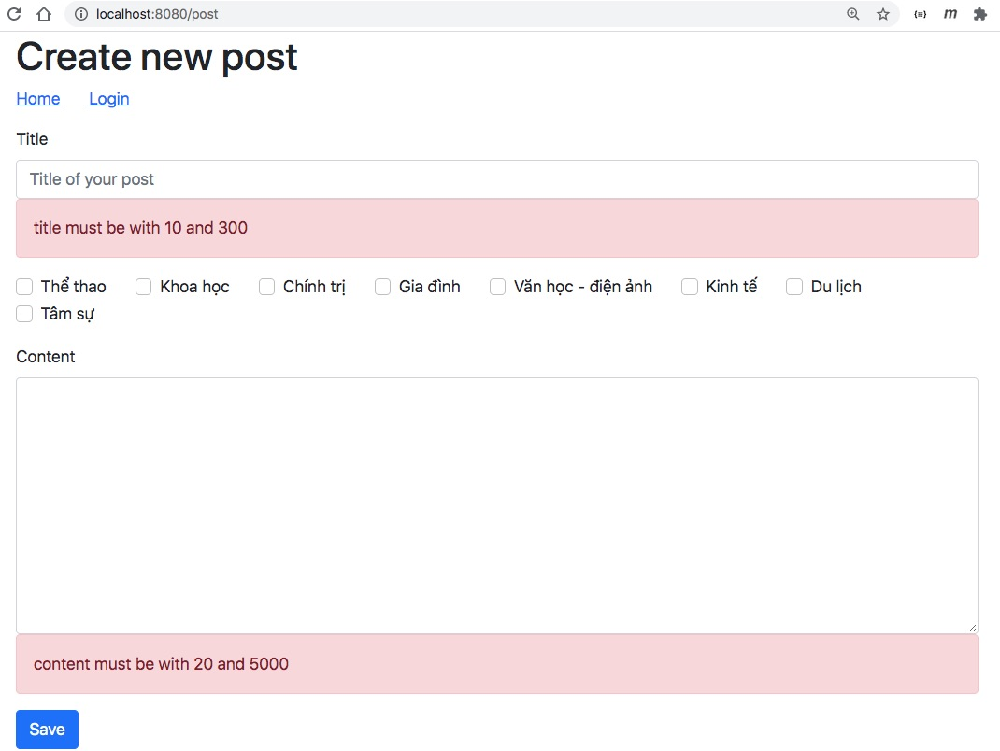

# Post - Tag

Trong phần này chúng ta sẽ bổ xung chức năng phân loại bài viết: tagging a post. Một Post được đánh dấu bởi nhiều Tag. Một Tag dùng để đánh dấu nhiều Post
Bảng TAG


Bảng POST


Bảng trung gian POST_TAG

## Định nghĩa quan hệ nhiều - nhiều ~ Many to Many

Hãy xem [Post.java](src/main/java/vn/techmaster/blog/model/Post.java)
```java
@Entity(name = "post")
@Table(name = "post")
public class Post { 
    // Bỏ phần trên cho ngắn gọn
    @ManyToMany
    @JoinTable(
        name = "post_tag",  //Tên bảng trung gian
        joinColumns = @JoinColumn(name = "post_id"), //Tên cột trong bảng trung gian, mà bảng Post góp foreign key ''
        inverseJoinColumns = @JoinColumn(name = "tag_id") //Tên cột đầu bên kia, bảng Tag
    )
    private Set<Tag> tags = new HashSet<>(); //Cấu trúc dữ liệu Set trong Post Entity để lưu trữ Tag
    
    public void addTag(Tag tag) {  //Thêm Tag vào Post
        tags.add(tag);
        tag.getPosts().add(this);        
    }
 
    public void removeTag(Tag tag) {
        tags.remove(tag);
        tag.getPosts().remove(this);
    }
}
```

Hãy xem [Tag.java](src/main/java/vn/techmaster/blog/model/Tag.java)
```java
@Entity(name = "tag")
@Table(name = "tag")
public class Tag {
  //Lược bỏ phần đầu
  @ManyToMany(mappedBy = "tags", fetch = FetchType.LAZY)
  List<Post> posts = new ArrayList<>();  //Danh sách các Post được tag này đánh dấu
}
```

Chúng ta bổ xung thêm file [tag.sql](src/main/resources/tag.sql) để nạp sẵn dữ liệu cho bảng Tag.

Ở đây chúng ta thấy trong ```class Post``` có 2 phương thức ```addTag(Tag tag)``` và ```removeTag(Tag tag)``` mà tại sao không có chiều ngược lại ở ```class Tag``` kiểu như ```addPost(Post post)``` và ```removePost(Post post)``?
Trả lời: 
- Có thể bổ xung 2 method tương ứng ở ```class Tag``` nhưng việc đó khiến cho code rối.
- Chủ thể quan trọng ở đây là Post. Tag là thông tin bổ trợ, do đó chúng ta tạo 2 phương thức tác động lên Post

## PostRequest.java
Xem [PostRequest.java](src/main/java/vn/techmaster/blog/controller/request/PostRequest.java)

Chúng ta đã có định nghĩa Entity [Post.java](src/main/java/vn/techmaster/blog/model/Post.java) rồi, tại sao lại cần [PostRequest.java](src/main/java/vn/techmaster/blog/controller/request/PostRequest.java)?

Trả lời:
- ```Post``` làm nhiệm vụ lưu thông tin xuống CSDL qua JPA. Nó có cả các phương thức thêm comment, xoá comment, thêm tag, bỏ tag
- ```PostRequest``` có thể hiểu là một Plain Old Java Object dùng để tạo khuôn mẫu cho Form trong method GET và để bóc tách dữ liệu các trường trong Form gửi lên trong method POST.
- Trong ```PostRequest``` các thuộc tính còn cả định nghĩa Validation (```@NotNull```, ```@Size```). Kiểm tra dữ liệu gửi lên (validation) sẽ nói ở tutorial sau. Nó cũng chỉ chứa những cấu trúc dữ liệu nào cần thiết: tags thì có, nhưng comment thì không !

```java
public class PostRequest {
  private Long id;
  @NotNull
	@Size(min=10, max=300, message="title must be with 10 and 300")
  private String title;

  @NotNull
	@Size(min=20, max=5000, message="content must be with 20 and 5000")
  private String content;

  private Long user_id;
  private Set<Tag> tags;
}
```

## PostController.java
Xem [PostController.java](src/main/java/vn/techmaster/blog/controller/PostController.java)

#### Liệt kê tất cả các Post của một User
1. Hứng yêu cầu GET tại đường dẫn /posts
2. Kiểm người dùng có đăng nhập chưa, nếu chưa, quay về trang chủ


```java
@GetMapping("/posts")  //Liệt kê các post của một blogger cụ thể
public String getAllPosts(Model model, HttpServletRequest request) { 
  UserInfo user = authenService.getLoginedUser(request);
  if (user != null) {  //Kiểm tra xem người dùng có đăng nhập không?
    model.addAttribute("user", user); //thêm thông tin người dùng để hiển thị tên
    List<Post> posts = postService.getAllPostsByUserID(user.getId()); //Lấy tất cả các Post của user này
    model.addAttribute("posts", posts); //trả về danh sách Post cho Thymeleaf
    return Route.ALLPOSTS;
  } else { //không đăng nhập, quay về trang chủ
    return Route.REDIRECT_HOME;
  } 
}
```
#### Hiển thị FORM trắng để nhập POST
1. Hứng yêu cầu tại đường dẫn /post
2. Hiển thị một form trống để User viết Post, chọn Tag


```java
@GetMapping("/post")  //Show form để tạo mới Post
public String createEditPostForm(Model model, HttpServletRequest request) {
  UserInfo user = authenService.getLoginedUser(request);
  if (user != null) {
    PostRequest postReqest = new PostRequest();
    postReqest.setUser_id(user.getId());
    model.addAttribute("post", postReqest); //Trả về đối tượng PostRequest rỗng vì là form tạo mới
    model.addAttribute("user", user);
    List<Tag> tags = postService.getAllTags();  //Lấy tất cả tag để tạo checkbox
    model.addAttribute("tags", tags);
    return Route.POST;
  } else {
    return Route.REDIRECT_HOME;
  }
}
```

#### Xử lý Form submit cho 2 trường hợp Create (tạo mới) và Update (cập nhật)
1. Hứng yêu cầu POST tại đường dẫn /post
2. Nếu người dùng đăng nhập và là tác giả của Post
3. Nếu ```postRequest.id``` mà rỗng có nghĩa là Create ngược lại là Update

```java
@PostMapping("/post")
public String createEditPostSubmit(@Valid @ModelAttribute("post") PostRequest postRequest, BindingResult bindingResult, Model model, HttpServletRequest request) {
  UserInfo user = authenService.getLoginedUser(request);
  if (bindingResult.hasErrors()) {
    List<Tag> tags = postService.getAllTags();
    model.addAttribute("tags", tags);
    return Route.POST;
  }  

  if (user != null && user.getId() == postRequest.getUser_id()) { //Kiểm tra nếu người dùng đăng nhập và là tác giả của Post
    try {
      if (postRequest.getId() == null) {
        postService.createNewPost(postRequest); //Create
      } else {
        postService.updatePost(postRequest);  //Update
      }
    } catch (PostException pe) {
      return Route.REDIRECT_HOME;
    }
    
    return Route.REDIRECT_POSTS;
  } else {
    return Route.REDIRECT_HOME;
  }
}
```

#### Lấy ra một post cụ thể cùng comment
1. Hứng yêu cầu GET tại đường dẫn /post/id
2. Trích xuất post.id từ đường dẫn ```@PathVariable("id") long id```
3. Tìm đối tượng Post trong CSDL
4. Chuyển đổi Post sang đối tượng PostPOJO
5. Lấy danh sách Comments trong Post
6. Nếu người dùng đang login thì bật cả chức năng comment lên


```java
@GetMapping("/post/{id}")
public String showPostAndComment(@PathVariable("id") long id, Model model, HttpServletRequest request) {    
  Optional<Post> optionalPost = postService.findById(id);
  if (optionalPost.isPresent()) {
    Post post = optionalPost.get();
    PostPOJO postPOJO = PostMapper.INSTANCE.postToPostPOJO(post);
    model.addAttribute("post", postPOJO);

    Set<Tag> tags = post.getTags();
    model.addAttribute("tags", tags);

    List<Comment> comments = post.getComments(); 
    Collections.reverse(comments); 
    model.addAttribute("comments", comments); //Trả  về danh sách comment

    UserInfo user = authenService.getLoginedUser(request); //Login user

    if (user != null) { //Nếu user login và xem post, cần bổ xung chức năng comment
      model.addAttribute("user", user); //Người dùng đang login
      model.addAttribute("commentRequest", new CommentRequest(postPOJO.getId()));
    } else {
      model.addAttribute("commentRequest", new CommentRequest());
    }
    
    return Route.POST_COMMENT;
  } else {
    return Route.REDIRECT_HOME;
  }    
}
```


## Boostrap
### Fragment, truyền tham số vào Fragment
```th:fragment``` là một khối các mã HTML + Thymeleaf được tái sử dụng

1. Để dùng lại một fragement chúng ta có chọn ```th:replace``` và 
Xem [layout.html](src/main/resources/templates/layout.html)

```html
<!DOCTYPE html>
<html lang="en">
<head th:fragment="head">
  <meta charset="UTF-8">
  <meta name="viewport" content="width=device-width, initial-scale=1.0">
  <link href="https://cdn.jsdelivr.net/npm/bootstrap@5.0.0-beta1/dist/css/bootstrap.min.css" rel="stylesheet" integrity="sha384-giJF6kkoqNQ00vy+HMDP7azOuL0xtbfIcaT9wjKHr8RbDVddVHyTfAAsrekwKmP1" crossorigin="anonymous">
  <script src="https://cdn.jsdelivr.net/npm/bootstrap@5.0.0-beta1/dist/js/bootstrap.bundle.min.js" integrity="sha384-ygbV9kiqUc6oa4msXn9868pTtWMgiQaeYH7/t7LECLbyPA2x65Kgf80OJFdroafW" crossorigin="anonymous"></script>
  <title th:text="${user} ? ${user.fullname} + '\'s micro blog': 'Home page'"></title>
</head>
<body>
  <div th:fragment="menu(title)" class="mb-3">
    <h1 th:text="${title}">Home Page</h1>
    <a href="/" class="me-4">Home</a>
    <a href="/login" class="me-4" th:style="${user==null ? 'display:inline' : 'display:none'}">Login</a>
    <a href="/post" class="me-4" th:style="${user==null ? 'display:none' : 'display:inline'}">Write a post</a>
    <a href="/logout" class="me-4" th:style="${user==null ? 'display:none' : 'display:inline'}" th:text="${user!=null ? 'Log out as ' + user.fullname : ''}">Logout</a><br>
  </div> 
</body>
</html>
```
### Tạo check boxes chọn Tag

```html
<div class="form-check d-inline-flex" th:each="tag : ${tags}">
  <input class="form-check-input me-2" type="checkbox" 
  th:value="${tag.id}" 
  name="tags"
  id="${tag.id}">
  <label class="form-check-label me-4" for="${tag.id}" th:text="${tag.name}"></label>
</div>
```

## Validate form



1. Bổ xung đoạn dưới đây vào [pom.xml](pom.xml)
```xml
<dependency>
  <groupId>org.springframework.boot</groupId>
  <artifactId>spring-boot-starter-validation</artifactId>
</dependency>
```

2. Bổ xung validation annotation vào thuộc tính cần kiểm tra hợp lệ
```java
public class PostRequest {
  private Long id;
  @NotNull
	@Size(min=10, max=300, message="title must be with 10 and 300") //Validate trường title
  private String title;

  @NotNull
	@Size(min=20, max=5000, message="content must be with 20 and 5000") //Validate trường content
  private String content;

  private Long user_id;
  private Set<Tag> tags;
}
```

3. Bổ xung đoạn cảnh báo lỗi từng trường vào [post.html](target/classes/templates/post.html)
```html
<div class="mb-3">
  <label for="title" class="form-label">Title</label>
  <input type="text" th:field="*{title}" class="form-control" id="title" placeholder="Title of your post">
  <p class="alert alert-danger" th:if="${#fields.hasErrors('title')}" th:errors="*{title}">title Error></p>
</div>   
<div class="mb-3 mt-3">
  <label for="content" class="form-label">Content</label>
  <textarea class="form-control" th:field="*{content}" id="content" rows="10" cols="70"></textarea>
  <p class="alert alert-danger" th:if="${#fields.hasErrors('content')}" th:errors="*{content}">Content Error></p>
</div>
```

4. Bổ xung logic kiểm tra ```BindingResult``` có lỗi không trong Controller
```java
@PostMapping("/post")
public String createEditPostSubmit(@Valid @ModelAttribute("post") PostRequest postRequest, BindingResult bindingResult, Model model, HttpServletRequest request) {
  UserInfo user = authenService.getLoginedUser(request);
  if (bindingResult.hasErrors()) {
    List<Tag> tags = postService.getAllTags();
    model.addAttribute("tags", tags);
    return Route.POST;
  }
  ///
}
```

Tham số đặc biệt này ```@Valid @ModelAttribute("post") PostRequest postRequest``` 

Có thể diễn giải như sau: hãy validate, dữ liệu trong form ```<form action="#" th:action="@{/post}" th:object="${post}" method="post">``` chú ý tham số ```th:object="${post}"```. Khi submit form thì đối tượng ```PostRequest postRequest``` sẽ nhận dữ liệu của form này.
