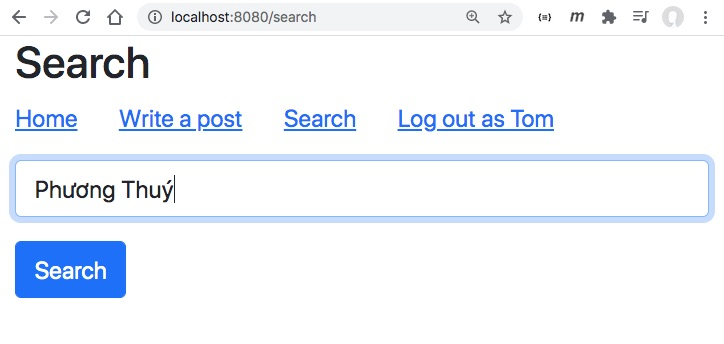
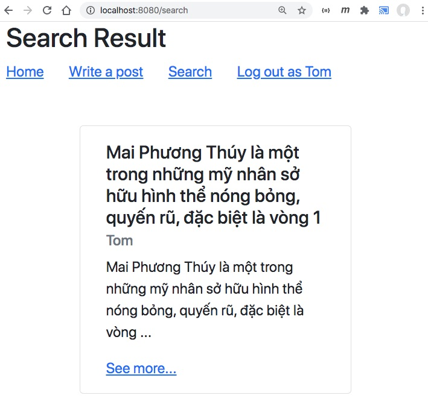

# Hibernate Search

Chúng ta có 2 lựa chọn công nghệ tìm kiếm là Lucence và Elastic Search.

- Lucence gọn nhẹ, gắn luôn vào ứng dụng SpringBoot, lưu danh sách chỉ mục ra file. Dễ làm
- Elastic Search cần cài đặt server riêng, Spring Boot sẽ gọi vào Elastic qua REST API. Khả năng mở rộng tốt hơn, tốc độ tốt hơn.

Trong bài này tôi dùng Lucence để minh hoạ

Màn hình tìm kiếm


Màn hình kết quả

## 1. Bổ xung dependency 

Bổ xung 2 dependencies sau đây vào file [pom.xml](pom.xml)
```xml
<dependency>
  <groupId>org.hibernate.search</groupId>
  <artifactId>hibernate-search-mapper-orm</artifactId>
  <version>6.0.0.Final</version>
</dependency>
<dependency>
  <groupId>org.hibernate.search</groupId>
  <artifactId>hibernate-search-backend-lucene</artifactId>
  <version>6.0.0.Final</version>
</dependency>
```
## 2. Điều chỉnh lại Post Entity
```java
@Entity(name = "post")
@Indexed //Thêm annotation này báo cho Hibernate Search đánh chỉ mục bảng này
public class Post { 
  @Id @GeneratedValue(strategy = GenerationType.IDENTITY)
  private Long id;
  
  @FullTextField //Đánh chỉ mục full text
  private String title;
  
  @FullTextField //Đánh chỉ mục full text
  @Column(length=5000)
  private String content;
}
```

## 3. Thêm phương thức tìm kiếm trong PostService.java
Bổ xung phương thức này để tìm kiếm theo keyword
- ```int limit```: giới hạn số bản ghi trong kết quả trả về
- ```int offset```: bắt đầu lấy bản ghi thứ mấy

```Search``` thuộc package này ```import org.hibernate.search.mapper.orm.Search```
```java
@Override
public List<Post> searchPost(String terms, int limit, int offset) {
  return Search.session(em).search(Post.class).where(f -> f.match().fields("title", "content").matching(terms))
      .fetchHits(offset, limit);
}
```
## 4. Tạo SearchRequest.java để chứa từ cần tìm kiếm
[SearchRequest.java](src/main/java/vn/techmaster/blog/controller/request/SearchRequest.java)
```java
@Data
@AllArgsConstructor
@NoArgsConstructor
public class SearchRequest {
  private String term;
}
```
## 5. Tạo SearchController.java
[SearchController.java](src/main/java/vn/techmaster/blog/controller/SearchController.java) làm 2 nhiệm vụ:

- Trả về form tìm kiếm [search.html](src/main/resources/templates/search.html)
- Nhận yêu cầu tìm kiếm [SearchRequest.java](src/main/java/vn/techmaster/blog/controller/request/SearchRequest.java) và trả về [searchresult.html](src/main/resources/templates/searchresult.html)
```java
@Controller
public class SearchController {
  @Autowired private IAuthenService authenService;
  @Autowired private IPostService postService;

  @GetMapping("/search")
  public String showSearchForm(Model model, HttpServletRequest request) {
    UserInfo user = authenService.getLoginedUser(request);    
    if (user != null) {  //Người dùng đã login      
      model.addAttribute("user", user);
    }
    model.addAttribute("searchRequest", new SearchRequest());
    return Route.SEARCH;
  }

  @PostMapping("/search")
  public String handleSearch(SearchRequest searchRequest, Model model,  HttpServletRequest request) {
    UserInfo user = authenService.getLoginedUser(request);    
    if (user != null) {  //Người dùng đã login      
      model.addAttribute("user", user);
    }
    List<Post> posts = postService.searchPost(searchRequest.getTerm(), 5, 0);
    model.addAttribute("posts", posts);
    return Route.SEARCH_RESULT;
  }
}
```

Trong [Route.java](src/main/java/vn/techmaster/blog/controller/Route.java) cập nhất 2 chuỗi:
```java
public static final String SEARCH = "search";
public static final String SEARCH_RESULT = "searchresult";
```
## 6. search.html và searchresult.html
Form để tìm kiếm [search.html](src/main/resources/templates/search.html)
```html
<menu th:replace="layout :: menu(title='Search')"></menu>
<form action="#" th:action="@{/search}" th:object="${searchRequest}" method="post">
  <input type="text" th:field="*{term}" class="form-control mb-3" id="term" placeholder="term to search">
  <button type="submit" class="btn btn-primary">Search</button>
</form>
```
Hiển thị kết quả tìm kiếm [searchresult.html](src/main/resources/templates/searchresult.html)

## 7. Reindex lại indexing file
[SearchController.java](src/main/java/vn/techmaster/blog/controller/SearchController.java)
```java
@GetMapping("/search/index")
public String reindexFullText(Model model, HttpServletRequest request) {
  UserInfo user = authenService.getLoginedUser(request);    
  if (user != null) {  //Người dùng đã login      
    model.addAttribute("user", user);
  }
  postService.reindexFullText();
  return Route.REDIRECT_HOME;
}
```

Bổ xung phương thức đánh lại chỉ mục trong [PostService.java](src/main/java/vn/techmaster/blog/service/PostService.java)
```java
@Override
public void reindexFullText() {
  SearchSession searchSession = Search.session(em);

  MassIndexer indexer = searchSession.massIndexer(Post.class).dropAndCreateSchemaOnStart(true)
  .typesToIndexInParallel( 2 )
  .batchSizeToLoadObjects(10)
  .idFetchSize(200)
  .threadsToLoadObjects(5)
  .cacheMode(CacheMode.IGNORE);
  indexer.start();    
}
```
