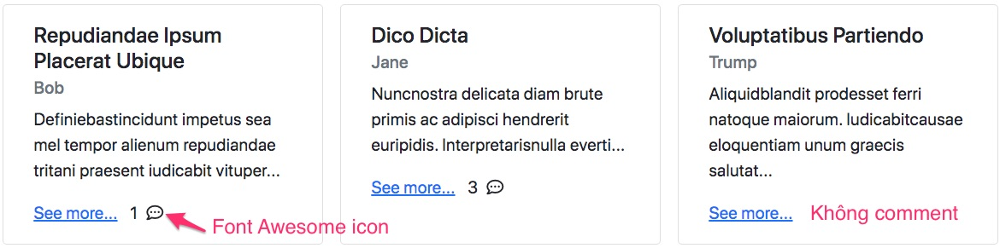
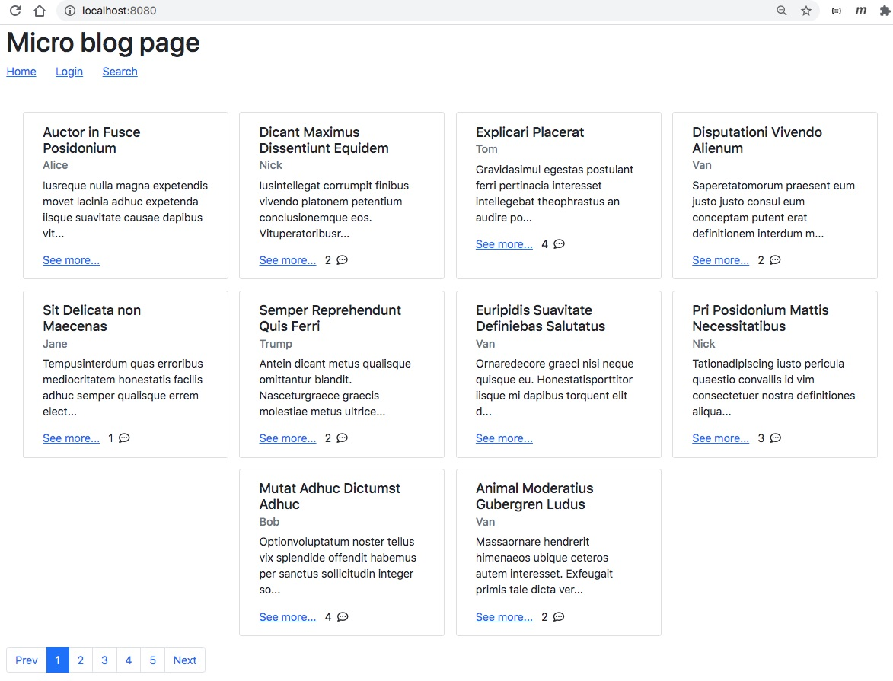

# Pagination và ApplicationRunner

Trong bài này tôi sẽ hướng các bạn phân trang một danh sách và cách chạy code ngay sau khi Spring Boot khởi động. Tình hình huống như sau:

Tôi muốn tạo ra 2000 bản ghi Post tự động để tạo tình huống phải phân trang. Thời điểm tốt nhất để tự động tạo ra 2000 bản ghi Post đó là ngay sau khi Spring Boot application khởi động xong.

**Tham khảo bài viết này**
1. [Spring Boot: ApplicationRunner and CommandLineRunner](https://dzone.com/articles/spring-boot-applicationrunner-and-commandlinerunne)
2. [When and why do we need ApplicationRunner and Runner interface?](https://stackoverflow.com/questions/59328583/when-and-why-do-we-need-applicationrunner-and-runner-interface)


## ApplicationRunner hay là CommandLineRunner
Có 2 interface ```ApplicationRunner``` và ```CommandLineRunner``` để bổ xung logic ngay khi Spring Boot khởi động hoàn tất. Khác biệt giữa hai interface này là:
- ```ApplicationRunner``` run() will get execute, just after applicationcontext is created and before spring boot application startup. ApplicationRunner takes ApplicationArgument which has convenient methods like ```getOptionNames()```, ```getOptionValues()``` and ```getSourceArgs()```.

- ```CommandLineRunner``` run() will get execute, just after applicationcontext is created and before spring boot application starts up.

It accepts the argument, which are passed at time of server startup.

Ví dụ dùng interface ```CommandLineRunner```
```java
@Component
public class MyRunner implements CommandLineRunner {
  private static final Logger logger = LoggerFactory.getLogger(MyRunner.class);

  @Autowired  private UserRepository userRepo;
  @Autowired  private PostRepository postRepo;

  @Override
  public void run(String... args) throws Exception {  //Chú ý tham số String... args
    User bob = userRepo.findByEmail("bob@gmail.com").get();
    User alice = userRepo.findByEmail("alice@gmail.com").get();

    Post post = new Post("Hà nội có tuyết rơi", "Hôm nay trời quá lạnh. Tuyết rời đầy");
    bob.addPost(post);

    Comment comment = new Comment("Tôi cực thích lạnh");
    comment.setUser(alice);
    post.addComment(comment);
    userRepo.flush();
  }
}
```
Ví dụ dùng interface ```ApplicationRunner```
```java
public class SpringBootApplicationRunner implements ApplicationRunner {
  private static Logger LOG = LoggerFactory.getLogger(SpringBootApplicationRunner.class);
  @Override
  public void run(ApplicationArguments args) {
    LOG.info("EXECUTING : Run method of Application Runner");
    final List nonOptionArgs = args.getNonOptionArgs();
    final String[] sourceArgs = args.getSourceArgs();
    final Set  optionNames = args.getOptionNames();

    nonOptionArgs.forEach(nonOption -> LOG.info("## Non Option Args : "+nonOption));
    optionNames.forEach(option -> LOG.info("## Option Names    : "+option));
    Arrays.stream(sourceArgs).forEach(srcArgs -> LOG.info("## Source Args     : "+srcArgs));
    LOG.info("## Option Value of --optionalArg1 : " + args.getOptionValues("optionalArg1"));
    LOG.info("## Option Value of --optionalArg2 : " + args.getOptionValues("optionalArg2"));
  }
}
```
## Tự sinh 2000 bản ghi Post

1. Chúng ta cần bổ xung thêm một depedency vào [pom.xml](pom.xml)
```xml
<dependency>
	<groupId>com.thedeanda</groupId>
	<artifactId>lorem</artifactId>
	<version>2.1</version>
</dependency>
```
Dependecy này giúp chúng ta sinh ngẫu nhiên các đoạn text Lorem Ispum Dolor

2. Viết class [BlogAppRunner.java](src/main/java/vn/techmaster/blog/BlogAppRunner.java)
Phương thức ```void run(String... args)``` sẽ gọi đến  ```postService.generateSampleData();```
```java
@Component
public class BlogAppRunner implements CommandLineRunner {
  @Autowired
  IPostService postService;

  @Override
  public void run(String... args) throws Exception {
    postService.generateSampleData();
  }
}
```

3. Bổ xung phương thức sinh dữ liệu giả trong [PostService.java](src/main/java/vn/techmaster/blog/service/PostService.java)
```java
@Override
@Transactional //Phải có dòng này nếu không sẽ báo lỗi  failed-to-lazily-initialize-a-collection-of-role-could-not-initialize-proxy-no-session
public void generateSampleData() {
  List<User> users = userRepo.findAll();
  List<Tag> tags = tagRepo.findAll();

  int numberOfTags = tags.size();
  int maxTagsPerPost = numberOfTags / 3;

  Lorem lorem = LoremIpsum.getInstance();
  
  Random random = new Random();
  int numberOfUsers = users.size();
  for (int k = 0; k < 200; k++) {
    User user = users.get(random.nextInt(numberOfUsers));
    Post post = new Post(lorem.getTitle(2, 5), lorem.getParagraphs(2, 4));
    
    int numberOfComments = random.nextInt(numberOfUsers/2);
    for (int j = 0; j < numberOfComments; j++) {
      User commenter = users.get(random.nextInt(numberOfUsers));
      Comment comment = new Comment(lorem.getParagraphs(1, 1));
      comment.setUser(commenter);
      post.addComment(comment);
    }

    int numberTagsForPost = Math.max(1, random.nextInt(maxTagsPerPost));
    for (int i = 0; i < numberTagsForPost; i++) {
      post.addTag(tags.get(random.nextInt(numberOfTags)));
    }
    
    user.addPost(post);
    postRepo.save(post);
  }
  userRepo.flush();
}
```

Đoạn code ```user.addPost(post);``` sẽ báo lỗi ```failed-to-lazily-initialize-a-collection-of-role-could-not-initialize-proxy-no-session``` nếu trong [User.java](src/main/java/vn/techmaster/blog/model/User.java) tôi chọn  FetchType của quan hệ User <--> Post là Lazy. Do đó chuyển tạm sang ```FetchType.EAGER```. 

Đọc các bài này. Đặc biệt bài cuối cùng có nhiều cách sửa:
- [How to solve the “failed to lazily initialize a collection of role” Hibernate exception](https://stackoverflow.com/questions/11746499/how-to-solve-the-failed-to-lazily-initialize-a-collection-of-role-hibernate-ex)
- [The best way to handle the LazyInitializationException](https://vladmihalcea.com/the-best-way-to-handle-the-lazyinitializationexception/)
- [Failed to lazily initialize a collection of role could not initialize proxy – no Session
](https://www.netsurfingzone.com/hibernate/failed-to-lazily-initialize-a-collection-of-role-could-not-initialize-proxy-no-session)

Cách sửa nhanh nhất là bổ xung annotation ```@Transactional``` vào
```java
@Override
@Transactional
public void generateSampleData() {
}
```

## Phân trang Pagination

Sau khi sinh động ngẫu nhiên số lượng Post đủ lớn chúng ta sẽ phân trang.

1. Trong [PostService.java](src/main/java/vn/techmaster/blog/service/PostService.java), bổ xung phương thức này trả về dữ liệu phân trang

```java
@Override
public Page<Post> findAllPaging(int page, int pageSize) {
  return postRepo.findAll(PageRequest.of(page, pageSize)); // Bổ xung pagination vào đây !
}
```

2. Trong [HomeController.java](src/main/java/vn/techmaster/blog/controller/HomeController.java)
bổ xung thêm tham số đường dẫn page chỉ page hiện thời

```java
@GetMapping(value = {"/", "/{page}"})
  public String home(@PathVariable(value="page", required = false) Integer page, Model model, HttpServletRequest request) {
    UserInfo user = authenService.getLoginedUser(request);    
    if (user != null) {  //Người dùng đã login      
      model.addAttribute("user", user);
    }
    if (page == null) {
      page = 0;
    }
    Page<Post> pagePosts = postService.findAllPaging(page, 10); //Mỗi page 10 Post

    List<Post> posts = pagePosts.getContent();
    model.addAttribute("posts", posts);
    //Sinh ra cấu trúc dữ liệu phân trang
    List<Paging> pagings = Paging.generatePages(page, pagePosts.getTotalPages());
    model.addAttribute("pagings", pagings);
    return Route.HOME;
  }
```

3. Viết thuật toán phân trang [Paging.java](src/main/java/vn/techmaster/blog/controller/Paging.java)
Phần này chúng ta cần: Cấu trúc dữ liệu Paging và thuật toán để tạo ra mảng Paging

Cấu trúc dữ liệu Paging sẽ đổ vào [paging component của Bootstrap](https://getbootstrap.com/docs/5.0/components/pagination/)

```java
public class Paging {
  public String title; //Title của nút
  public int index; //Số thứ tự trang bắt đầu từ 0
  public String active; //Nếu là trang hiện thời thì trả về 'active' còn không trả về ''
  public Paging(String title, int index, String active) {
    this.title = title;
    this.index = index;
    this.active = active;
  }
}
```

4. Viết hàm static để sinh mảng ```Paging``` gồm 2 nút Prev và Next hai đầu, các các nút ở giữa
```java
public static List<Paging> generatePages(int selectedPage, int totalPages) {
  //https://codereview.stackexchange.com/questions/240235/java-pagination-algorithm
  int offset = Math.min(5, totalPages);
  // set start index relative to selected  
  int start = selectedPage - (offset / 2);
  // adjust for first pages   
  start = Math.max(start, 0);
  // set end index relative to start    
  int end = start + offset;
  // adjust start and end for last pages     
  if (end > totalPages) {
      end = totalPages;
      start = end - offset + 1;
  }
  ArrayList<Paging> pagings = new ArrayList<>();
  pagings.add(new Paging("Prev", selectedPage > 0 ? selectedPage - 1: 0, ""));
  for (int i = start; i < end; i++){
    Paging paging = new Paging(String.valueOf(i + 1), i, (i == selectedPage) ? "active" : "");
    pagings.add(paging);
  }
  pagings.add(new Paging("Next", Math.min(selectedPage + 1, totalPages - 1), ""));
  return pagings;
}
```
5. Sửa lại Thymeleaf [home.html](src/main/resources/templates/home.html). Thêm khối này vào
  ```html
  <nav>
    <ul class="pagination">
      <li class="page-item" th:each="paging : ${pagings}" th:classappend="${paging.active}"><a class="page-link" th:href="${'/' + paging.index}" th:text="${paging.title}"></a></li>       
    </ul>
  </nav>
  ```

## Thêm FontAwesome

Trong [layout.html](src/main/resources/templates/layout.html) phần head thêm dòng này
```html
<script src="https://kit.fontawesome.com/df2eef8f6b.js" crossorigin="anonymous"></script>
```

Trong [home.html](src/main/resources/templates/home.html), thêm đoạn này để hiển thị số comment trong một post. Ý nghĩa là nếu có ít nhất một comment thì hiển thị số lượng comment và icon comment
```html
<div th:if="${post.comments.size > 0}" style="display:inline">
  <span class="me-2" th:text="${post.comments.size}"></span><i class="fa fa-commenting-o" aria-hidden="true"></i>
</div>
```


Thành quả sau một ngày Hackathon nghiêm túc của tôi đây.


