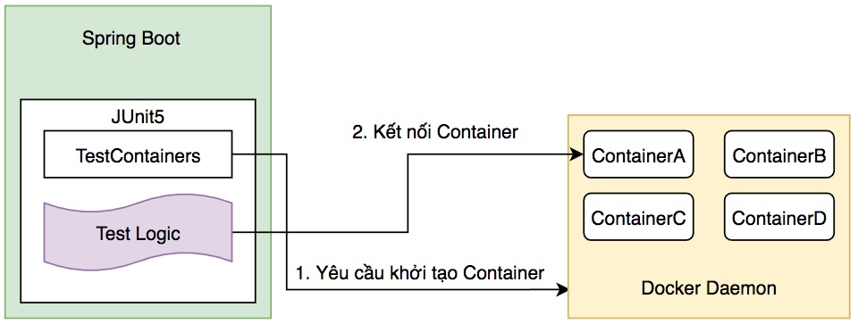
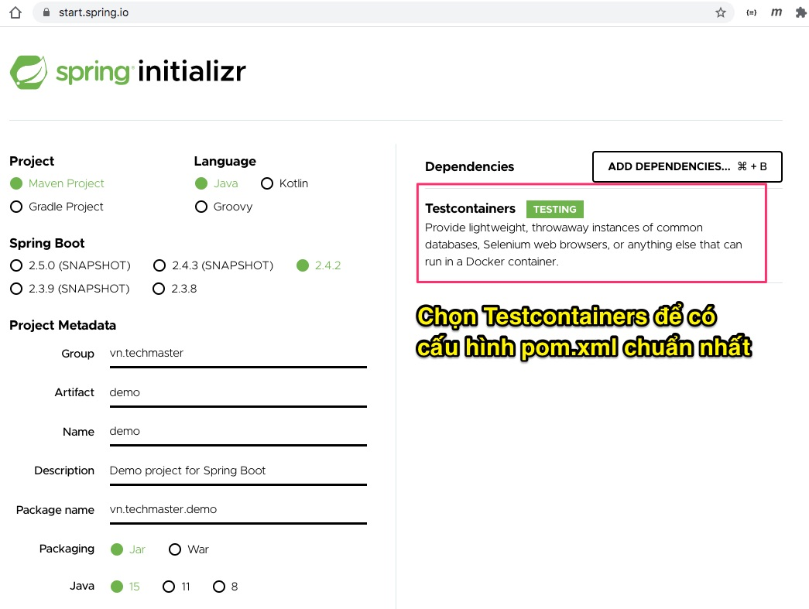
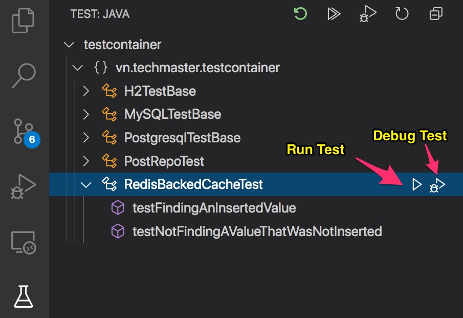
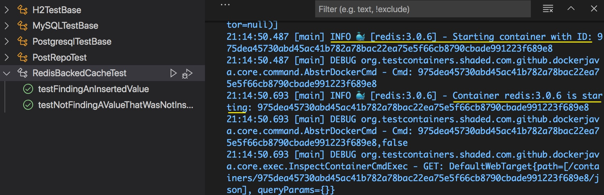
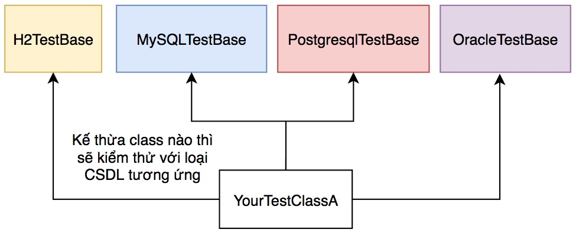

# Kiểm thử với nhiều loại CSDL khác nhau sử dụng TestContainers

## H2 khác với MySQL, Postgresql, Oracle, MS-SQL ở điểm gì?
H2 là cơ sở dữ liệu in memory khởi động cùng ứng dụng Spring Boot hay khi kiểm thử chạy. Dữ liệu không được lưu xuống ổ cứng nên sẽ bị xoá hoàn toàn sau mỗi lần kiểm thử xong. H2 nhẹ, nhanh rất phù hợp để làm CSDL cho việc kiểm thử.

Tuy nhiên khi dùng ở production, chúng ta buộc phải dùng MySQL, Postgresql, Oracle hoặc MS-SQL. Các cơ sở dữ liệu này sẽ lưu xuống ổ cứng, và cú pháp đôi khi cũng khác với H2.

Việc kiểm thử với CSDL thực tế rất cần thiết nhưng chính ví đặc điểm lưu ổn định xuống CSDL nên sau mỗi lần kiểm thử dữ liệu sinh ra không được dọn dẹp (xoá hết) khiến cho kết quả kiểm thử lần sau khó dự đoán.

[TestContainers](https://www.testcontainers.org/) là thư viện cho phép Spring Boot kiểm thử với nhiều loại CSDL, phần mềm server đóng gói trong Docker. Đặc điểm các container được khởi tạo để phục vụ kiểm thử, rồi lại xoá đi khi kiểm thử kết thúc. Thời gian khởi động container, đóng container rất nhanh. Lập trình viên không phải cài đặt, cấu hình CSDL, phần mềm server trực tiếp lên máy tính hay phải làm công việc dọn dẹp dữ liệu. Điều này giúp kiểm thử kết nối ứng dụng Spring Boot với CSDL, phần mềm server thuận tiện, đơn giản rất nhiều.

## Làm sao có thể kiểm thử dễ dàng H2, MySQL, Postgresql?
Chúng ta phát triển một dự án Spring Boot. Ban đầu để kiểm tra mô hình Entity, chúng ta sẽ dùng H2 để viết unit test. Khi đã viết được rất nhiều mã Unit Test rồi, nếu muốn chuyển kiểm thử trên CSDL thực sự như MySQL, Postgresql, Oracle... mà phải viết lại logic kiểm thử thì rất tốn kém. **Do đó mục tiêu chỉ viết mã kiểm thử một lần, nhưng phải chạy được với nhiều CSDL khác nhau!**

## Những gì chúng ta có để kiểm thử
### Entity Post
[Post](src/main/java/vn/techmaster/testcontainer/model/Post.java) rất đơn giản chỉ gồm 2 trường
```java
@Entity(name="POST")
@Table(name="post")
@Data
@NoArgsConstructor
public class Post {
  @Id @GeneratedValue(strategy = GenerationType.IDENTITY)
  private Long id; 
  private String title;
  public Post(String title) {
    this.title = title;
  }
}
```
#### PostRepository
[PostRepository](src/main/java/vn/techmaster/testcontainer/repository/PostRepository.java)
```java
public interface PostRepository extends JpaRepository<Post, Long> {
  @Query(value = "SELECT * FROM post LIMIT 2", nativeQuery = true) // Native Query hỗ trợ LIMIT và phải có tham số nativeQuery = true
  List<Post> getTop2Posts();

  @Query(value = "SELECT p FROM POST AS p") //Java Persistence Query không hỗ trợ LIMIT
  List<Post> getTopPosts(Pageable pageable);
}
```
Để ý một chút, các bạn có 2 loại ```@Query```:
1. Loại thứ nhất là native SQL query được chỉ định bằng tham số ```nativeQuery = true```. Lệnh SQL sẽ được gửi thẳng ra CSDL, không qua lọc, chế biến gì cả. Tên bảng sẽ phải lấy đúng trong tham số name của ```@Table(name="post")```. Native SQL cho phép bạn dùng những tính năng lạ, đặc thù của CSDL nhất nhưng nó sẽ không tương thích với CSDL khác hoặc với H2.

2. Loại thứ hai là JPQL (Java Persistence Query Language). Lệnh JPQL sẽ qua tầng Hibernate để xử lý cho phù hợp, tối ưu nhất với CSDL ở dưới. Tên bảng sẽ phải lấy trong tham số ```@Entity(name="POST")```. JPQL hạn chế những tính năng đặc thù, ngược lại tăng khả năng tương thích nhiều loại CSDL, nhưng khó tối ưu tốc độ.

#### post.sql
[post.sql](src/test/java/vn/techmaster/testcontainer/post.sql) là dữ liệu sẽ nạp vào để kiểm thử.


## Cấu trúc thư mục [test](src/test)
```
├── java
│   └── vn
│       └── techmaster
│           └── testcontainer
│               ├── h2.properties
│               ├── H2TestBase.java <-- base testing class dùng H2
│               ├── MySQLTestBase.java <-- base testing class dùng MySQL
│               ├── post.sql <-- dữ liệu sẽ import vào
│               ├── PostgresqlTestBase.java <-- base testing class dùng Postgresl
│               ├── PostRepoTest.java <-- class kiểm thử PostRepository
│               └── RedisBackedCacheTest.java <-- class kiểm thử RedisBackedCache
└── resources
    └── application.properties <-- File cấu hình cho phần Test
```
## Kiểm thử bằng TestContainers

1. Bổ xung các dependencies cần thiết TestContainers vào [pom.xml](pom.xml)
2. Đánh dấu annotation ```@Testcontainers``` vào test class
3. Thêm thuộc tính có kiểu là ```GenericContainer``` hoặc biến thể của ```GenericContainer``` như ```JdbcDatabaseContainer```, ```MySQLContainer```, ```PostgreSQLContainer```
4. Đảm bảo cài đặt Docker trên máy tính và nó đang chạy bình thường
5. Khi kiểm thử chạy, thư viện TestContainers sẽ kết nối vào Docker daemon ra lệnh tạo Docker container với image, tham số port.... theo yêu cầu. Logic kiểm thử sẽ kết nối container sau khi nó khởi động xong và phục vụ




### 1. Các dependencies phục vụ cho TestContainers


Thư viện chính TestContainers
```xml
<dependency>
    <groupId>org.testcontainers</groupId>
    <artifactId>junit-jupiter</artifactId>
    <scope>test</scope>
</dependency>
```

thư viện kết nối Postgresql Container
```xml
<dependency>
    <groupId>org.testcontainers</groupId>
    <artifactId>postgresql</artifactId>
    <scope>test</scope>
</dependency>
```

thư viện kết nối MySQL Container
```xml
<dependency>
    <groupId>org.testcontainers</groupId>
    <artifactId>mysql</artifactId>
    <scope>test</scope>
</dependency>
```

### 2. Khai báo Test Class với ```@Testcontainers``` và ```@Container```

Ở phần này tôi lấy ví dụ kiểm thử chức năng caching kết nối tới [Redis server đóng gói trong Docker container](https://hub.docker.com/_/redis).

Tham khảo [RedisBackedCacheTest.java](src/test/java/vn/techmaster/testcontainer/RedisBackedCacheTest.java) đây là testing class để kiểm thử thư viện cache [RedisBackedCache.java](src/main/java/vn/techmaster/testcontainer/cache/RedisBackedCache.java) sử dụng Redis server trong Docker container. RedisBackedCache chỉ có 2 phương thức put dữ liệu với key và get dữ liệu theo key. Hãy xem kỹ comment tôi chú thích từng dòng quan trọng để hiểu cách TestingContainers hoạt động cùng với JUnit test class.

```java
@Testcontainers //Đánh dấu testing class này sử dụng TestingContainers
public class RedisBackedCacheTest {

    @Container //Đánh dấu một thuộc tính kiểu GenericContainer để
    public GenericContainer<?> redis = new GenericContainer<>(DockerImageName.parse("redis:alpine"))
                                            .withExposedPorts(6379);
    //Khởi động redis container, và mở port 6379

    private Cache cache;  //Đối tượng Cache sẽ nối vào Redis

    @BeforeEach //Chạy trước mỗi lần kiểm thử 
    public void setUp() throws Exception {
        //Jedis là thư viện Redis client, để khởi tạo Jedis cần địa chỉ IP của docker container Redis và cổng
        Jedis jedis = new Jedis(redis.getContainerIpAddress(), redis.getMappedPort(6379)); 

        cache = new RedisBackedCache(jedis, "test");
    }

    @Test
    public void testFindingAnInsertedValue() {
        cache.put("foo", "FOO");
        Optional<String> foundObject = cache.get("foo", String.class);

        assertThat(foundObject).isPresent();
        assertThat(foundObject.get()).isEqualTo("FOO");
    }

    @Test
    public void testNotFindingAValueThatWasNotInserted() {
        Optional<String> foundObject = cache.get("bar", String.class);
        assertThat(foundObject).isNotPresent();
    }
}
```


Lần chạy kiểm thử đầu tiên, nếu chưa có sẵn Docker imager thì Docker daemon sẽ phải tải Docker image từ internet về nên sẽ hơi lâu. Lần chạy kiểm thử tiếp sau sẽ rất nhanh vì Docker image đã có sẵn ở ổ cứng.



## Một lần viết logic kiểm thử dùng cho nhiều CSDL khác nhau.


Chúng ta tạo sẵn các public abstract class phục vụ kết nối riêng từng CSDL.
- [MySQLTestBase.java](src/test/java/vn/techmaster/testcontainer/MySQLTestBase.java)
- [PostgresqlTestBase.java](src/test/java/vn/techmaster/testcontainer/PostgresqlTestBase.java)
- [H2TestBase.java](src/test/java/vn/techmaster/testcontainer/H2TestBase.java)

#### Giải thích mẫu với MySQLTestBase
```java
@Testcontainers // đánh dấu đây là testing class sẽ kết nối đến Docker container
@DataJpaTest  // đánh dấu đây là testing class kiểm thử JPA - Data Java Persistence Access
@TestInstance(Lifecycle.PER_CLASS) // để cho phương thức @BeforeAll chạy được
public abstract class MySQLTestBase {  //abstract class để kiểm thử với MySQL container 
  @Container //đánh dấu biến container sẽ đại diện cho MySQL container
  private static MySQLContainer<?> container = 
  new MySQLContainer<>("mysql:8")
  .withDatabaseName("foo") //cấu hình tên CSDL trong MySQL container
  .withUsername("foo") //cấu hình user name kết nối MySQL container
  .withPassword("secret"); //cấu hình password kết nối MySQL container
  
  static { 
    container.start();  //Khởi động container
    System.setProperty("DB_DRIVER_CLASS_NAME", "com.mysql.cj.jdbc.Driver");  //Cấu hình các biến trong application.properties
    System.setProperty("DB_URL", container.getJdbcUrl());
    System.setProperty("DB_USERNAME", container.getUsername());
    System.setProperty("DB_PASSWORD", container.getPassword()); 
  }  
}
```

File [application.properties](src/test/resources/application.properties) chứa các biến
```${DB_DRIVER_CLASS_NAME}```, ```${DB_DIALECT}```, ```${DB_URL}```, ```${DB_USERNAME}```, ```${DB_PASSWORD}```. Các biến này sẽ được gán khi Docker container khởi động xong.

```
spring.datasource.driver-class-name=${DB_DRIVER_CLASS_NAME}
spring.jpa.hibernate.ddl-auto=create-drop
spring.jpa.properties.hibernate.dialect = ${DB_DIALECT}
spring.datasource.url=${DB_URL}
spring.datasource.username=${DB_USERNAME}
spring.datasource.password=${DB_PASSWORD}
spring.jpa.properties.hibernate.hbm2ddl.import_files=post.sql
```

JUnit tiếp tục phần logic kiểm thử. Nội dung kiểm thử sẽ gọi đế repository. Các repository sẽ gọi xuống JPA --> Hibernate --> JDBC. JDBC sẽ đọc cấu hình trong [application.properties](src/test/resources/application.properties) để mở kết nối đến Docker container.

#### H2TestBase
Với [H2TestBase.java](src/test/java/vn/techmaster/testcontainer/H2TestBase.java) chúng ta phải xử lý khác với MySQL hay Postgresql vì H2 là embedded database, không cần Docker daemon.
```java
@DataJpaTest
@TestPropertySource("h2.properties")
@TestInstance(Lifecycle.PER_CLASS) // để cho phương thức @BeforeAll chạy được
public abstract class H2TestBase {
  
}
```
 Annotation ```@TestPropertySource``` chỉ rằng, hãy lấy cấu hình kết nối CSDL từ file [h2.properties](src/test/java/vn/techmaster/testcontainer/h2.properties). Chú ý h2.properties phải để ở cùng thư mục với các mã kiểm thử.

#### PostRepoTest.java
[PostRepoTest.java](src/test/java/vn/techmaster/testcontainer/PostRepoTest.java) chứa test class. Muốn kiểm thử với CSDL nào bạn chỉ cần đặt lại base class của ```class PostRepoTest``` là ```H2TestBase``` hoặc ```MySQLTestBase``` hoặc ```PostgresqlTestBase```


```java
 @Sql("post.sql") //Nạp dữ liệu từ post.sql vào database
public class PostRepoTest extends H2TestBase{
  @Autowired
  private PostRepository postRepo; //repository sẽ được dùng để kiểm thử
  // Logic test tạm bỏ qua
}
```


## Kết luận
Trong bài này chúng ta học được kỹ thuật điều khiển Docker để khởi động nhanh bất kỳ phần mềm server nào nhờ việc tạo ra các Docker container tương ứng. TestingContainers giải quyết rất nhiều vấn đề:
1. Dữ liệu kiểm thử lưu xuống CSDL cần phải được xoá sau mỗi lần kiểm thử
2. Cài đặt ứng dụng máy chủ, cấu hình, khởi động, đóng cần phải lập trình được, thời gian càng nhanh càng tốt.
3. Cần phải lập trình tham số hoá server trong Docker container từ kịch bản kiểm thử.