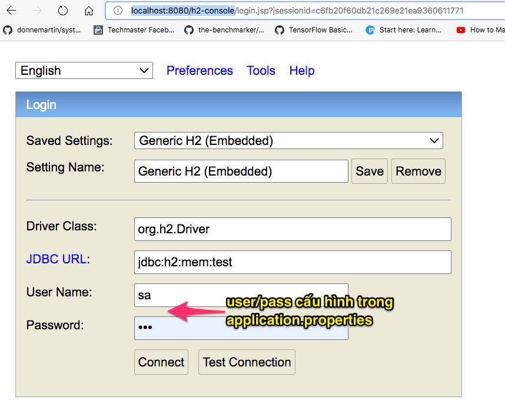

# Load dữ liệu từ file *.sql

Trong phần lớn các trường hợp, ứng dụng ban dần cần được khởi tạo một số dữ liệu. Có một số cách để nạp dữ liệu:

1. Nạp dữ liệu bằng file schema.sql và data.sql trong thư mục resources
2. Nạp dữ liệu từ file nhiều file *.sql trong thư mục resources
3. Nạp dữ liệu bằng ```@Sql``` annotation
4. Nạp dữ liệu bằng lập trình

Đọc thêm [Quick Guide on Loading Initial Data with Spring Boot](https://www.baeldung.com/spring-boot-data-sql-and-schema-sql)

## 2. Nạp dữ liệu từ file nhiều file *.sql trong thư mục resources
Trong file [application.properties](01EntityMapping/demojpa/src/main/resources/application.properties) bổ xung dòng lệnh này để nạp các file country.sql,personsmall.sql,car.sql:

```spring.jpa.properties.hibernate.hbm2ddl.import_files=country.sql,personsmall.sql,car.sql```

## 3. Nạp dữ liệu bằng ```@Sql``` annotation
Tham khảo các file sau đây:
- [animal.sql](01EntityMapping/demojpa/src/main/resources/animal.sql)
- [Animal.java](01EntityMapping/demojpa/src/main/java/vn/techmaster/demojpa/model/mapping/Animal.java)
- [AnimalRepository.java](01EntityMapping/demojpa/src/main/java/vn/techmaster/demojpa/repository/AnimalRepository.java)
- [AnimalRepositoryTests.java](01EntityMapping/demojpa/src/test/java/vn/techmaster/demojpa/AnimalRepositoryTests.java)

Trong file [AnimalRepositoryTests.java](01EntityMapping/demojpa/src/test/java/vn/techmaster/demojpa/AnimalRepositoryTests.java), annotation ```@Sql({"/animal.sql"})``` sẽ nạp dữ liệu từ ```animal.sql``` vào cơ sơ dữ liệu.
```java
@DataJpaTest
@Sql({"/animal.sql"})
public class AnimalRepositoryTests {
  @Autowired
  private AnimalRepository animalRepo;
  
  @Test
  public void getAnimalCount(){
    assertThat(animalRepo.count()).isGreaterThan(10);    
  }
}
```

# Kiểm tra dữ liệu được nạp vào CSDL chưa?

Trong dự án này để đơn giản tôi dùng cơ sở dữ liệu H2.
```xml
<dependency>
  <groupId>com.h2database</groupId>
  <artifactId>h2</artifactId>
  <scope>runtime</scope>
</dependency>
```
Trong [application.properties](01EntityMapping/demojpa/src/main/resources/application.properties) bổ xung cấu hình cho H2 database

```
spring.datasource.url=jdbc:h2:mem:test
spring.datasource.driverClassName=org.h2.Driver
spring.datasource.username=sa
spring.datasource.password=123
spring.jpa.database-platform=org.hibernate.dialect.H2Dialect
spring.h2.console.enabled=true
```

```spring.h2.console.enabled=true``` cho phép truy cập H2 console qua giao diện web tại địa chỉ http://localhost:8080/h2-console

