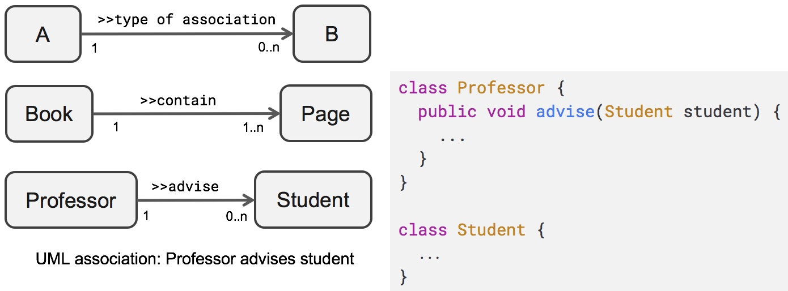

# One to Many : Quan hệ một nhiều
Quan hệ một nhiều được thể hiện một entity A, phía One trỏ đến, liên kết, hoặc bao gồm, chứa nhiều entity B, phía Many. Mỗi entity B chỉ được trỏ đến, liên kết hoặc được chứa bởi duy nhất một entity A. Ở đây entity hiểu là một đối tượng (object trong OOP) hay một bản ghi (record trong ORM) hay một dòng (row trong table).

### Ví dụ

1. Một quyển sách chứa nhiều trang sách.
2. Một quyển sách có nhiều chương.
3. Một giáo sư có thể hướng dẫn 0 đến vài sinh viên.
4. Một người có 2 mắt. 
5. Một ô tô có 4 bánh xe.
6. Một người có thể sở hữu nhiều đồ vật.
7. Một đơn hàng (order) có từ 1 đến nhiều mặt hàng (line item).
8. Một bài viết (post) có thể có 0 đến nhiều bình luận (comment).

Mối liên kết giữa entity A và entity B thường là lỏng lẻo. Entity A chỉ liên kết đến, chứ không quyết định entity B có tồn tại hay mất đi hay không. Ví dụ có hay không có giáo sư, sinh viên vẫn tồn tại. Trong một số trường hợp, entity B không có ý nghĩa nếu không có entity A, ví dụ huỷ đơn hàng, thì huỷ tất cả line item hay xoá một post thì xoá tất cả các comment.



Quan hệ ràng buộc cùng tồn tại. Enity phía Many không còn ý nghĩa nếu Entity phía One bị xoá, không tồn tại nữa.


### Trong cơ sở dữ liệu
Quan hệ một nhiều được thể hiện bởi bảng B (phía Many) có cột Foreign Key (FK) tham chiếu đến cột Primary Key ở bảng A (phía One).
Ví dụ Post - Comment. Bảng Comment có cột postid là Foreign Key tham chiếu đến cột Primary Key, id ở bảng Post


### ```@OneToMany``` và ```@ManyToOne```
*Hibernate là thư viện ORM, còn JPA là thư viện bổ xung thêm API, và sử dụng Hibernate hay Eclipse Link*. Quan hệ One to Many được đánh dấu bởi 2 annotation ```@OneToMany``` và ```@ManyToOne```:

File [Post.java](01EntityMapping/demojpa/src/main/java/vn/techmaster/demojpa/model/blog/Post.java), gọi là Entity phía One.

```java
@Entity(name = "Post") //Tên Entity sử dụng viết câu lệnh Query
@Table(name = "post") //Tên bảng vật lý
@Data
public class Post { 
  // Phần khai báo thuộc tính và constructor bỏ qua cho gọn
  @OneToMany(
    cascade = CascadeType.ALL,
    orphanRemoval = false
  )
  @JoinColumn(name = "post_id")
  private List<Comment> comments = new ArrayList<>();
  public void addComment(Comment comment) {
    comments.add(comment);
    comment.setPost(this);
  }

  public void removeComment(Comment comment) {
    comments.remove(comment);
    comment.setPost(null);
  }
}
```

File [Comment.java](01EntityMapping/demojpa/src/main/java/vn/techmaster/demojpa/model/blog/Comment.java) gọi là Entity phía Many.
```java
public class Comment {
  // bỏ qua thuộc tính và constructor cho gọn
  @ManyToOne(fetch = FetchType.LAZY)
  private Post post;
}
```
### @JoinColumn(name = "post_id")
```@JoinColumn``` đặc tả cột Foreign Key ở Entity phía Many bảng comment. Thuộc tính ```name``` đặt tên cột.

### Cascade Operation
Cascade Operation là Entity phía One có những hành động gì, thì áp dụng hành động tương tự ở Entity phía Many. Có 5 loại hành động Entity thực hiện với Persistence Context. Loại All là tổ hợp tất cả.

1. Persist: lưu entity mới tạo nhưng chưa lưu (đang ở trạng thái transient) vào Persistence Context. Chỉ thêm một động tác flush, thì các thay đổi thực sự được ghi ổn định vào CSDL. 
2. Merge: sát nhập một entity đã tách ra (không được quản lý giám sát thay đổi bởi Persistence Context nữa)
3. Remove: xoá entity ra khỏi Persistence Context.
4. Refresh: đọc lại dữ liệu từ CSDL vào Entity trong Persistence Context.
5. Detach: tách entity ra khỏi Persistence Context. Tạm thời không quản lý thay đổi nữa, nhưng không xoá.
6. All (tổng hợp tất cả các loại hoạt động trên)

Hãy đọc bài [A beginner’s guide to entity state transitions with JPA and Hibernate](https://vladmihalcea.com/a-beginners-guide-to-jpa-hibernate-entity-state-transitions/) và bài này [Overview of JPA/Hibernate Cascade Types](https://www.baeldung.com/jpa-cascade-types)

Hãy chạy JUnit test ở phương thức ```public void removeComments()``` trong file [PostCommentTest.java](01EntityMapping/demojpa/src/test/java/vn/techmaster/demojpa/PostCommentTest.java).
```java
@Test
public void removeComments() {
  long comment1Id = comment1.getId();
  long comment2Id = comment2.getId();
  tem.remove(post1);
  tem.flush();
  Comment findComment1 = tem.find(Comment.class, comment1Id);
  Comment findComment2 = tem.find(Comment.class, comment2Id);
  assertThat(findComment1).isNull();
  assertThat(findComment2).isNull();
}
```

Ở chế độ ```CascadeType.ALL, CascadeType.Remove```, khi xoá một Post, thì tất cả các Comment sẽ bị xoá. Đổi sang ```CascadeType.Refresh```, chạy lại ```removeComments``` sẽ báo lỗi vì các Comment không bị xoá.

### orphanRemoval
Nếu ```orphanRemoval = true```  khi một Entity phía Many không được tham chiếu bởi một Entity phía One, thì nó sẽ bị xoá.
Trong hàm kiểm thử này, ```post1``` loại bỏ ```comment1``` và ```comment2``` ra khỏi danh sách ```private List<Comment> comments = new ArrayList<>();``` 

```java
public void removeComment(Comment comment) {
  comments.remove(comment);
  comment.setPost(null);
}
```
Hãy chạy hàm kiểm thử này: khi comment có post_id = null, không liên kết đến post nào, nó là những bản ghi con rơi (orphan record). Ở lần lưu xuống CSDL tiếp theo, các comment sẽ bị xoá khỏi CSDL.

```java
@DisplayName("Orphan comments should be removed")
@Test
public void removeOrphanComment() {
  long comment1Id = comment1.getId();
  long comment2Id = comment2.getId();
  post1.removeComment(comment1);
  post1.removeComment(comment2);
  tem.flush();

  Comment findComment1 = tem.find(Comment.class, comment1Id);
  Comment findComment2 = tem.find(Comment.class, comment2Id);

  assertThat(findComment1).isNull();
  assertThat(findComment2).isNull();
}
```

Thử đổi ```orphanRemoval = false``` chạy lại hàm kiểm thử này sẽ báo lỗi vì comment1 và 2 không bị xoá

### private List<Comment> comments = new ArrayList<>();
Entity phía One cần có thuộc tính kiểu List, Set hoặc HashMap để lưu các Entity phía Many.
Ngoài ra cần có 2 phương thức thêm và bớt Entity phía Many


```java
public void addComment(Comment comment) {
  comments.add(comment);
  comment.setPost(this);  //Mỗi comment lại gán chính 
}

public void removeComment(Comment comment) {
  comments.remove(comment);
  comment.setPost(null);
}
```

### @ManyToOne
Xem file [Comment.java](01EntityMapping/demojpa/src/main/java/vn/techmaster/demojpa/model/blog/Comment.java):

Annotation ```@ManyToOne``` sẽ đánh dấu cho thuộc tính ```post``` (Entity phía One).
```java
@ManyToOne(fetch = FetchType.LAZY)
private Post post;
```

Chúng ta thấy ở [Post.java](01EntityMapping/demojpa/src/main/java/vn/techmaster/demojpa/model/blog/Post.java) thì có thuộc tính ```List<Comment> comments``` liên kết đến nhiều Comment. Ở [Comment.java](01EntityMapping/demojpa/src/main/java/vn/techmaster/demojpa/model/blog/Comment.java) có thuộc tính ```Post post``` trỏ ngược lại. Quan hệ này là Bidirection (song phương). Còn một biến thể nữa là quan hệ Unidirection (đơn phương). Đọc thêm [What is the difference between Unidirectional and Bidirectional JPA and Hibernate associations?](https://stackoverflow.com/questions/5360795/what-is-the-difference-between-unidirectional-and-bidirectional-jpa-and-hibernat).

### Thuộc tính fetch LAZY vs EAGER
Trong 2 annotation ```@OneToMany``` và ```@ManyToOne``` đều có thuộc tính Fetch quy định cách lấy dữ liệu từ database lên Persistence Context.

1. ```FetchType = LAZY```: trì hoãn việc lấy dữ liệu cho đến khi người dùng đọc thuộc tính đó. Dùng loại này, lần đầu truy vấn tốc độ sẽ nhanh hơn, nhưng phải mất 2 lần truy vấn mới lấy được Entity liên quan.
2. ```FetchType = EAGER```: lấy dự liệu của thuộc tính tham chiếu đến Entity đầu bên kia luôn. Lần đầu truy vấn chậm, nhưng lấy đầy đủ thông tin Entity cả 2 phía.

Hãy chạy hàm test
```java
@Test
@Sql({"/post.sql"})
public void LazyOrEager(){
  Comment findComment1 = tem.find(Comment.class, 1L);
  System.out.println("-----");
  Post post = findComment1.getPost();
  System.out.println(post.getTitle());
  assertThat(post.getTitle()).isNotNull();
}
```
Để thí nghiệm khác biệt giữa ```FetchType = LAZY``` vs ```FetchType = EAGER``` hãy bật chế độ xem câu lệnh SQL trong terminal khi debug unit test:

1. Khai báo trong application.properties dòng lệnh 
  ```
  spring.jpa.show-sql=true
  spring.jpa.properties.hibernate.format_sql=true
  ```
2. Đặt breakpoint ở câu lệnh cần quan sát trong bài này là đoạn tìm đối tượng comment từ CSDL
3. Chạy debug đến breakpoint này, xoá nội dung Terminal cho đỡ rồi
4. Click Step Over để nhìn câu lệnh SQL debug được in ra

Chú ý tôi bổ xung annotation  ```@Sql({"/post.sql"})``` nạp sẵn một số bản ghi vào CSDL H2. Ban đầu chạy hàm test này, bảng post và comment có dữ liệu. Và tôi chủ đích lấy bản ghi chưa được nạp vào vùng nhớ của Persistence Context, khi đó lệnh truy vấn mới được sinh ra và khác biệt 2 chế độ Fetch thể hiện rõ.

Khi Fetch Type là Lazy, lệnh ```Comment findComment1 = tem.find(Comment.class, 1L);``` sẽ chuyển thành câu lệnh SQL như sau
```sql
select
    comment0_.id as id1_3_0_,
    comment0_.post_id as post_id3_3_0_,
    comment0_.title as title2_3_0_ 
from
    comment comment0_ 
where
    comment0_.id=?
```

Vào file [Comment.java](01EntityMapping/demojpa/src/main/java/vn/techmaster/demojpa/model/blog/Comment.java), chuyển sang ```FetchType = EAGER```, câu lệnh ```Comment findComment1 = tem.find(Comment.class, 1L);``` sẽ được JPA -> Hibernate chuyển thành câu lệnh JOIN bảng comment với bảng post để một lần chạy lấy được thông tin của POST luôn.

```sql
select
  comment0_.id as id1_3_0_,
  comment0_.post_id as post_id3_3_0_,
  comment0_.title as title2_3_0_,
  post1_.id as id1_9_1_,
  post1_.created_by as created_2_9_1_,
  post1_.created_on as created_3_9_1_,
  post1_.updated_by as updated_4_9_1_,
  post1_.updated_on as updated_5_9_1_,
  post1_.title as title6_9_1_,
  post1_.version as version7_9_1_ 
from
  comment comment0_ 
left outer join
  post post1_ 
      on comment0_.post_id=post1_.id 
where
  comment0_.id=?
```


