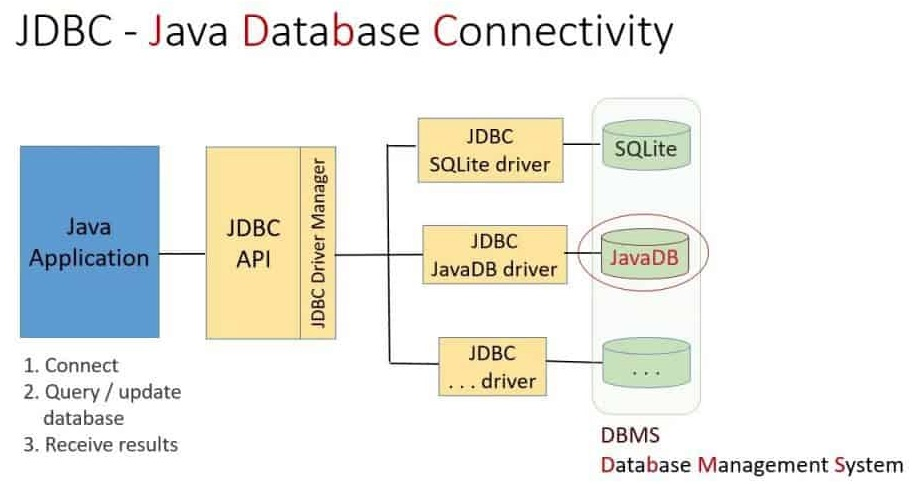
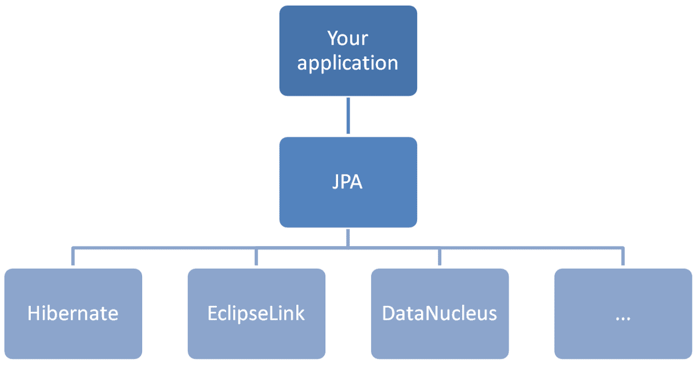
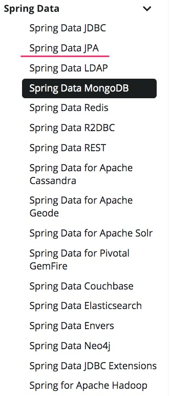

# Lập trình thao tác dữ liệu với Spring Boot Data - JPA

*Chú ý khi đọc tài liệu hướng dẫn này: JPA, ORM, Hibernate, EclipseLink, JDBC là những công nghệ rất phức tạp. Chúng có nhiều phiên bản, biến thể và cải tiến qua nhiều version khác nhau. Chúng ta chỉ học những gì cần thiết nhất để lập trình. Phần còn lại phải tra cứu thêm sách càng mới càng tốt*
## Các nội dung chính
1. [Entity Mapping](EntityMapping.md)
2. [Lombok](Lombok.md)
3. [Data JPA Test](JPATest.md)
4. [Load dữ liệu từ file *.sql](LoadData.md)
5. [JpaRepository, CRUDRepository](Repository.md)
6. [One To Many Relationship](OneToMany.md)
7. [Many to Many Relationship](ManyToMany.md)
8. [Transaction](Transaction.md)
9. [Performance Tuning](performancetuning.md)


## JPA là gì?
JPA là viết tắt của Java Persistence API. Đây là một công nghệ để giúp ánh xạ, chuyển đổi 2 chiều dữ liệu Java Class/Object vào CSDL quan hệ trên nền tảng Java (gồm cả Java, Kotlin, Groovy). Công nghệ này gọi là Object Relational Mapping, viết tắt là ORM.


Trước khi có ORM, chúng ta sử dụng các thư viện như ODBC (Windows), JDBC (Java) để kết nối vào CSDL quan hệ, rồi gửi các câu lệnh SQL đến CSDL. CSDL thực hiện lệnh đó rồi trả về kết quả. Ứng dụng sẽ phải bóc tách kết quả theo cách khá thủ công và tốn nhiều dòng code đó là duyệt qua mảng các bản ghi (array of records), ở mỗi dòng (record), lấy ra từng trường, kiểm tra kiểu dữ liệu từng trường




Đây là đoạn code kết nối MySQL qua JDBC
```java
//STEP 1. Import required packages
import java.sql.*;

public class FirstExample {
   // JDBC driver name and database URL
   static final String JDBC_DRIVER = "com.mysql.jdbc.Driver";  
   static final String DB_URL = "jdbc:mysql://localhost/EMP";

   //  Database credentials
   static final String USER = "username";
   static final String PASS = "password";
   
   public static void main(String[] args) {
   Connection conn = null;
   Statement stmt = null;
   try{
      //STEP 2: Register JDBC driver
      Class.forName("com.mysql.jdbc.Driver");

      //STEP 3: Open a connection
      System.out.println("Connecting to database...");
      conn = DriverManager.getConnection(DB_URL,USER,PASS);

      //STEP 4: Execute a query
      System.out.println("Creating statement...");
      stmt = conn.createStatement();
      String sql;
      sql = "SELECT id, first, last, age FROM Employees";
      ResultSet rs = stmt.executeQuery(sql);

      //STEP 5: Extract data from result set
      while(rs.next()){
         //Retrieve by column name
         int id  = rs.getInt("id");
         int age = rs.getInt("age");
         String first = rs.getString("first");
         String last = rs.getString("last");

         //Display values
         System.out.print("ID: " + id);
         System.out.print(", Age: " + age);
         System.out.print(", First: " + first);
         System.out.println(", Last: " + last);
      }
      //STEP 6: Clean-up environment
      rs.close();
      stmt.close();
      conn.close();
   }catch(SQLException se){
      //Handle errors for JDBC
      se.printStackTrace();
   }catch(Exception e){
      //Handle errors for Class.forName
      e.printStackTrace();
   }finally{
      //finally block used to close resources
      try{
         if(stmt!=null)
            stmt.close();
      }catch(SQLException se2){
      }// nothing we can do
      try{
         if(conn!=null)
            conn.close();
      }catch(SQLException se){
         se.printStackTrace();
      }//end finally try
   }//end try
   System.out.println("Goodbye!");
}//end main
}//end FirstExample
``` 
## Object Relation Mapping - ORM

**Ưu điểm của ORM so với công nghệ kết nối CSDL trước đây JDBC/ODBC là gì?**

1. Giảm việc lập trình thủ công bóc tách từng trường trong mỗi bản ghi trả về. Thay vào đó lập trình viên làm việc với các class, object vốn đã quen hơn.
2. Có sẵn nhiều phương thức căn bản để lập trình viên không cần viết lệnh SQL. Hầu hết các lệnh căn bản sẽ tối ưu hơn và bảo mật hơn (tránh được [SQL INJECTION VÀ CÁCH PHÒNG CHỐNG](https://viblo.asia/p/sql-injection-va-cach-phong-chong-OeVKB410lkW))
3. Nhờ có ORM, mà lập trình viên không còn phải quan tâm qua chi tiết đến từng loại CSDL: H2, SQLite, MySQL, Postgresql, MS-SQL Server, Oracle... Nếu không sử dụng những tính năng đặc thù, hãy những lệnh SQL dành riêng cho từng loại CSDL, thì ứng dụng dễ dàng chuyển đổi giữa các loại CSDL khác nhau.

**Nhược điểm của ORM**
1. Giữa lập trình hướng đối tượng và lập trình SQL trực tiếp CSDL luôn có những điểm khác biệt: kiểu dữ liệu, cách dữ liệu được truy vấn và lưu. Người ta gọi là [ORM impedance mismatch](https://en.wikipedia.org/wiki/Object%E2%80%93relational_impedance_mismatch). Vấn đề này dẫn đến việc khó khăn trong tối ưu tốc độ và bảo mật trong những trường hợp đặc biệt. Với bất kỳ công nghệ nào, bạn không thể đạt tối ưu ở mọi tiêu chí.
2. Không thể giải quyết hết lệnh truy vấn phức tạp. Nếu viết câu lệnh SQL đặc thù, dùng kiểu dữ liệu đặc thù của CSDL ví dụ JSONB, Array, Enum thì sẽ không chuyển sang CSDL khác được nữa !
3. Đôi khi phức tạp hơn mức cần thiết. Lập trình viên vẫn phải học cả ORM và SQL !

## JPA và những công nghệ thao tác CSDL trong liên quan trong Java

1. [JDBC](https://en.wikipedia.org/wiki/Java_Database_Connectivity) thư viện cấp thấp chỉ gửi câu lệnh SQL đến database
2. [Hibernate](https://hibernate.org/) là một thư viện ORM ổn định, lâu đời, nhiều contributor, sử dụng XML để cấu hình
3. [Eclipse Link](https://www.eclipse.org/eclipselink/) là một ORM khác, mới hơn, tập trung có những chức năng mới Annotation, bỏ bớt những chức năng cũ. Code của Eclipse tương đồng rất nhiều với code Spring Boot JPA
4. JPA là thư viện mức cao hơn, sử dụng lại các thư viện ORM cấp thấp hơn như Hibernate và Eclipse Link 



**Hỏi:** Spring Boot Data và Spring Boot JPA có liên quan gì đến nhau?

**Đáp:** Spring Boot Data tập hợp nhiều thư viện thao tác dữ liệu. JPA là một trong số đó, nó tập trung kết nối CSDL quan hệ, Relational Database Managment System. Còn có các thư viên khác kết nối MongoDB, Elastic Search, Neo4J



Nội dung khoá học Spring Boot tại Techmaster sẽ tập trung vào JPA vì nó thông dụng và căn bản nhất. Sau đó các bạn nên tìm hiểu thêm [Spring Data MongoDB](https://spring.io/projects/spring-data-mongodb) cho dữ liệu phi quan hệ và [Spring Data Elasticsearch](https://spring.io/projects/spring-data-elasticsearch) đánh chỉ mục vào tìm kiếm theo từ khoá.


## Tham khảo
- [Spring Boot With H2 Database](https://www.baeldung.com/spring-boot-h2-database)
- [Loading Initial Data with Spring Boot](https://www.baeldung.com/spring-boot-data-sql-and-schema-sql)
- [https://stackoverflow.com/questions/24508223/multiple-sql-import-files-in-spring-boot](https://stackoverflow.com/questions/24508223/multiple-sql-import-files-in-spring-boot)
- [Spring Boot with Multiple SQL Import Files](https://www.baeldung.com/spring-boot-sql-import-files)

https://vladmihalcea.com/prepersist-preupdate-embeddable-jpa-hibernate/

https://vladmihalcea.com/the-best-way-to-map-a-onetomany-association-with-jpa-and-hibernate/


https://vladmihalcea.com/14-high-performance-java-persistence-tips/