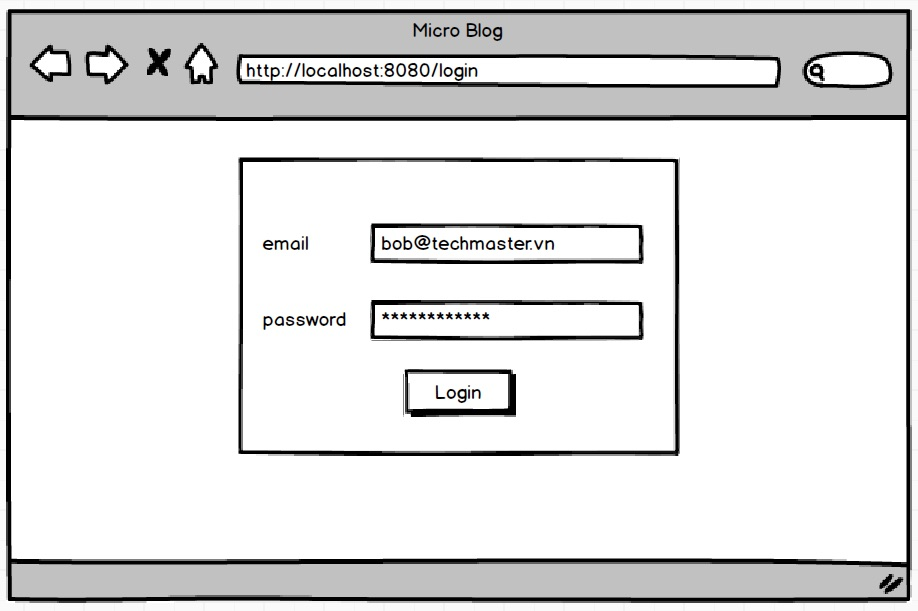
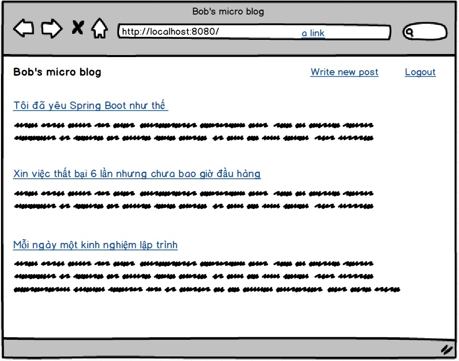
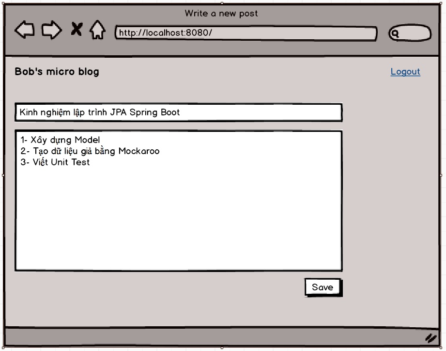
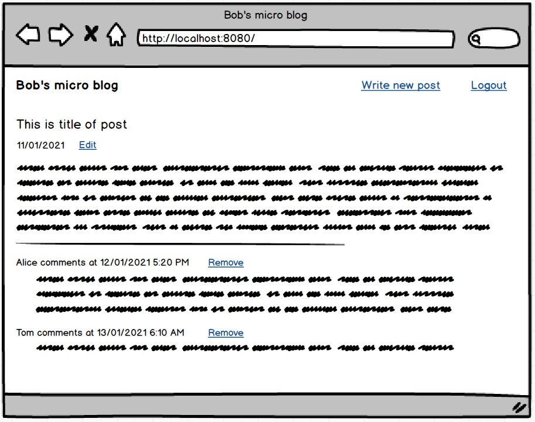

# Lập trình tại lớp 180 phút: ứng dụng Micro Blog

## Yêu cầu

**Bắt buộc**
1. Lập trình ngay tại lớp trong 180 phút, không mang về nhà
2. Sử dụng đúng cấu trúc dự án mẫu
3. Đúng và đủ chức năng Login, CRUD Post, Create - Delete Comment
4. Demo cho giảng viên cuối giờ để được chấm điểm

**Không bắt buộc**
1. Nếu thời gian có hạn, bỏ qua việc viết Unit Test
2. Không cần viết Service component nếu thấy không cần thiết
3. Không cần chức năng Create new account, Change Password...
4. Không cần trang trí CSS. Giảng viên mù tịt boot strap. Ok !

## Mockup giao diện

## Quan hệ giữa các bảng
- One user writes many posts
- One user writes many comments
- One post can receive many comments

## Dữ liệu mẫu có sẵn
6 users mẫu với password là 'abc' đã được nạp sẵn từ file [user.sql](src/main/resources/user.sql)

