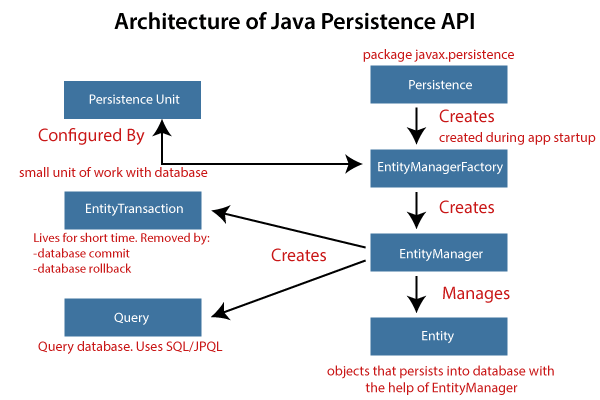
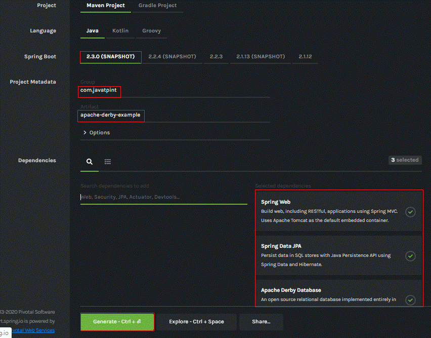
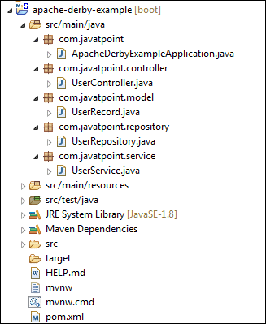
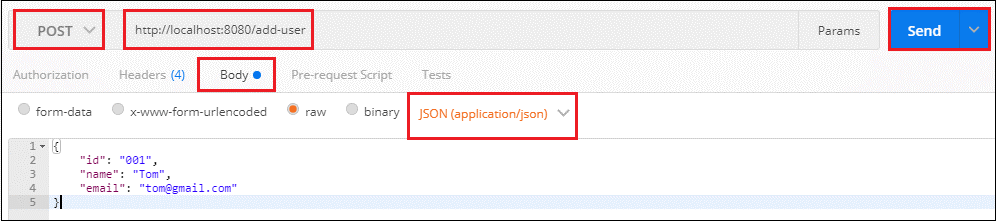
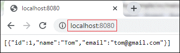

##JPA là gì?

**Spring Boot JPA**  là một bản ghi chi tiết của Java để quản lý dữ liệu  **quan hệ**  trong các ứng dụng Java. Nó cho phép chúng ta truy cập và lưu trữ dữ liệu giữa các object/class Java và database quan hệ. JPA tuân theo  **Object-Relation Mapping**  (ORM). Nó là một tập hợp các interface. Nó cũng cung cấp một API  **EntityManager**  runtime để xử lý các câu query và giao dịch trên các object dựa trên database. Nó sử dụng ngôn ngữ truy vấn hướng đối tượng độc lập nền tảng JPQL (Java Persistent Query Language).

JPA bao gồm ba lĩnh vực:

- The Java Persistence API
- **Object-Relational**  metadata
- Bản thân API, được định nghĩa trong persistence package.

JPA không phải là một framework. Nó định nghĩa một khái niệm có thể được thực thi bởi bất kỳ framework nào.

##Tại sao chúng ta nên sử dụng JPA?

JPA đơn giản hơn, gọn gàng hơn và ít tốn công sức hơn là JDBC, SQL hay ánh xạ viết tay. JPA thích hợp cho các ứng dụng phức tạp không tuân theo hiệu suất. Ưu điểm chính của JPA so với JDBC là: trong JPA, dữ liệu được biểu thị bằng các object và class trong khi trong JDBC dữ liệu được biểu diễn bằng các bảng và bản ghi. Nó sử dụng POJO để biểu diễn dữ liệu liên tục giúp đơn giản hóa việc lập trình database. Có một số ưu điểm khác của JPA:

- JPA tránh viết Ngôn Ngữ Định Nghĩa Dữ Liệu (DDL) bằng phương ngữ SQL dành riêng cho database. Thay vào đó nó cho phép ánh xạ trong XML hoặc sử dụng các annotation Java.
- JPA cho phép chúng ta tránh viết Ngôn Ngữ Thao Tác Dữ Liệu (DML) bằng phương ngữ SQL dành riêng cho database.
- JPA cho phép chúng ta save và load các object và đồ thị Java mà không cần bất kỳ ngôn ngữ DML nào.
- Khi chúng ta cần thực hiện các truy vấn JPQL, nó cho phép chúng ta viết các truy vấn dưới dạng các entity Java mà không phải là bảng và cột SQL.

## Tính năng JPA

Có các tính năng sau của JPA:

- Là một repository mạnh mẽ và  **object-mapping abstraction**  tùy chỉnh  **.**
- Hỗ trợ cho  **cross-store persistence**. Tức là một entity có thể được lưu trữ một phần trong MySQL và Neo4j (Hệ thống quản lý cơ sở dữ liệu đồ thị).
- Tự động tạo các truy vấn từ ngay chính tên các phương thức truy vấn.
- Các lớp dựa vào tên miền cung cấp các thuộc tính cơ bản.
- Hỗ trợ kiểm tra quản lý minh bạch.
- Khả năng tích hợp mã repository tùy chỉnh.
- Dễ dàng tích hợp với Spring Framework với namespace tùy chỉnh.

## Kiến trúc JPA

JPA là một nguồn để lưu trữ các entity doanh nghiệp dưới dạng các entity quan hệ. Nó chỉ ra cách định nghĩa POJO là một entity và cách quản lý các entity quan hệ.

Hình sau mô tả kiến trúc các cấp độ class của JPA, cùng các class và interface cốt lõi mà được định nghĩa trong package **javax persistence**. Kiến trúc JPA chứa các đơn vị sau đây:

- **Persistence:** là một class chứa các phương thức tĩnh để lấy một instance EntityManagerFactory.
- **EntityManagerFactory:**   là một class Factory của EntityManager. Nó tạo và quản lý nhiều instance EntityManager.
- **EntityManager:**  Nó là một giao diện. Nó kiểm soát các hoạt động liên tục trên các đối tượng. Nó hoạt động cho phiên bản Truy vấn.
- **Entity:**  Các entity là các đối tượng lưu trữ lâu dài như một bản ghi trong database.
- **Persistence Unit:**  định nghĩa một tập hợp tất cả các class entity. Trong một ứng dụng, các instance EntityManager quản lý nó. Tập hợp các class entity đại diện cho dữ liệu được chứa trong một kho dữ liệu duy nhất.
- **EntityTransaction:** có mối quan hệ 1:1 với các class EntityManager. Đối với mỗi EntityManager, các hoạt động được duy trì bởi class EntityTransaction.
- **Query (Lệnh truy vấn):** là một interface được thực hiện bởi mỗi nhà cung cấp JPA để có được các object quan hệ đáp ứng các tiêu chí.



## Mối quan hệ class JPA

Các class và interface chúng ta đã thảo luận ở trên duy trì một mối quan hệ. Hình dưới đây cho thấy mối quan hệ giữa các class và interface.


- Mối quan hệ giữa EntityManager và EntiyTransaction là  **1:1**. Có một instance EntityTransaction cho mỗi hoạt động EntityManager.
- Mối quan hệ giữa EntityManageFactory và EntiyManager là  **một-nhiều**. Nó là một class factory chứa các instance EntityManager.
- Mối quan hệ giữa EntityManager và Query là  **một-nhiều**. Chúng ta có thể thực hiện bất kỳ số lượng truy vấn nào bằng cách sử dụng một instance của class EntityManager.
- Mối quan hệ giữa EntityManager và Entity là  **một-nhiều**. Một instance EntityManager có thể quản lý nhiều entity.

## Triển khai JPA

JPA là một API mã nguồn mở. Có nhiều nhà cung cấp doanh nghiệp khác nhau như Eclipse, RedHat, Oracle, v.v. cung cấp các sản phẩm mới bằng cách thêm JPA vào trong sản phẩm. Có một số framework triển khai JPA phổ biến như  **Hibernate, EclipseLink, DataNucleus,**  v.v. Nó còn được gọi là công cụ  **Object-Relation Mapping** (ORM).

## Object-Relation Mapping (ORM)

Trong ORM, ánh xạ (mapping) các đối tượng Java tới các bảng database và ngược lại được gọi là  **Object-Relation Mapping.** Ánh xạ ORM hoạt động như một cầu nối giữa  **database quan hệ**  (bảng và bản ghi) và  **ứng dụng Java**  (các class và object).

Trong hình sau, layer ORM là một layer chuyển đổi. Nó điều chỉnh ngôn ngữ của đồ thị object sang ngôn ngữ của SQL và các bảng quan hệ.


Layer ORM tồn tại giữa ứng dụng và database. Nó chuyển đổi các class và object Java để chúng có thể được lưu trữ và quản lý trong database quan hệ. Theo mặc định, tên class trở thành tên của bảng và các trường trở thành cột. Khi một ứng dụng thiết lập, mỗi hàng trong bảng tương ứng với một object.

## Phiên bản JPA

Các phiên bản trước của EJB định nghĩa persistence layer kết hợp với lớp logic nghiệp vụ bằng cách sử dụng interface  **javax.ejb.EntityBean**. Đặc điểm EJB bao gồm cả việc xác định JPA.

Trong khi giới thiệu EJB 3.0, persistence layer đã được tách ra và được chỉ định là JPA 1.0 (Java Persistence API). Các đặc điểm kỹ thuật của API này đã được phát hành cùng với các đặc điểm kỹ thuật của JAVA EE5 vào ngày 11 tháng 5 năm 2006, sử dụng JSR 220.

Năm 2019, JPA đổi tên thành  **Jakarta Persistence**. Phiên bản mới nhất của JPA là  **2.2**. Nó hỗ trợ các tính năng sau:

- Java 8, API dữ liệu và thời gian
- CDI Injection trong AttributeConvertes
- Tạo ra các annotation @Repeatable

## Sự khác biệt giữa JPA và Hibernate

**JPA:**  JPA là một đặc tính Java được sử dụng để truy cập, quản lý và lưu trữ dữ liệu giữa đối tượng Java và database quan hệ. Đây là một cách tiếp cận tiêu chuẩn cho ORM.

**Hibernate:**  Đây là một công cụ ORM mã nguồn mở, nhẹ được sử dụng để lưu trữ các đối tượng Java trong hệ thống database quan hệ. Nó là một nhà cung cấp của JPA. Nó tuân theo một cách tiếp cận phổ biến do JPA cung cấp.

Bảng sau đây mô tả sự khác biệt giữa JPA và Hibernate.

| **JPA** | **Hibernate** |
| --- | --- |
| JPA là một  **đặc tính Java**  để ánh xạ dữ liệu quan hệ trong ứng dụng Java. | Hibernate là một  **framework**  **ORM**  xử lý sự bền bỉ của dữ liệu. |
| JPA không cung cấp bất kỳ class implementation nào. | Nó cung cấp các class implementation. |
| Nó sử dụng ngôn ngữ truy vấn độc lập nền tảng được gọi là  **JPQL**  (Java Persistence Query Language). | Nó sử dụng ngôn ngữ truy vấn của riêng nó được gọi là  **HQL**  (Hibernate Query Language). |
| Nó được định nghĩa trong package  **javax.persistence**  . | Nó được định nghĩa trong package  **org.hibernate**  . |
| Nó được triển khai trong các công cụ ORM khác nhau như  **Hibernate, EclipseLink,**  v.v. | Hibernate là  **nhà cung cấp**  của JPA. |
| JPA sử dụng  **EntityManager**  để xử lý persistence của dữ liệu. | Hibernate sử dụng  **Session**  để xử lý persistence của dữ liệu. |

## Dữ liệu khởi động Spring Boot JPA

Spring Boot cung cấp dependency **spring-boot-starter-data-jpa**  để kết nối ứng dụng Spring Boot với database quan hệ một cách hiệu quả. Spring-boot-starter-data-jpa bên trong sử dụng dependency spring-boot-jpa.

```xml
  <dependency>    
  <groupId>org.springframework.boot</groupId>    
  <artifactId>spring-boot-starter-data-jpa</artifactId>    
  <version>2.2.2.RELEASE</version>    
  </dependency>  
```

## Ví dụ về Spring Boot JPA

Hãy tạo một ứng dụng Spring Boot sử dụng JPA để kết nối với database. Trong ví dụ sau, chúng tôi đã sử dụng in-memory database  **Apache Derby.**

**Apache Derby:**  Đây là một database quan hệ **mã nguồn mở**  triển khai hoàn toàn bằng Java. Nó có sẵn theo Giấy phép Apache 2.0. Apache Derby có những ưu điểm sau:

- Dễ cài đặt, triển khai và sử dụng.
- Dựa trên các tiêu chuẩn Java, JDBC và SQL.
- Cung cấp một driver embedded JDBC cho phép chúng ta nhúng Derby vào bất kỳ giải pháp dựa trên Java nào.
- Hỗ trợ chế độ client/server với trình điều khiển Derby Network Client JDBC và Derby Network Server.

Spring Boot có thể tự động cấu hình một embedded database như  **H2, HSQL**  và  **Derbydatabases**  . Chúng ta không cần cung cấp bất kỳ URL kết nối nào. Chúng ta chỉ cần một bản dựng dependency vào database nhúng mà chúng ta muốn sử dụng.

Trong Spring Boot, chúng ta có thể dễ dàng tích hợp database Apache Derby chỉ bằng cách thêm dependency  **Derby**  vào tệp pom.xml.

```
<dependency>
 <groupId>org.apache.derby</groupId>
 <artifactId>derby</artifactId>
 <scope>runtime</scope>
</dependency>
```

**Bước 1:**  Mở Spring Initializr [https://start.spring.io/](https://start.spring.io/) .

**Bước 2:**  Chọn phiên bản mới nhất của Spring Boot **2.3.0 (SNAPSHOT)**

**Bước 3:**  Cung cấp tên  **Group**. Chúng tôi đã cung cấp  **com.javatpoint.**

**Bước 4:**  Cung cấp  **Artifact Id**. Chúng tôi đã cung cấp  **apache-derby-example**  .

**Bước 5:**  Thêm các dependencies:  **Spring Web, Spring Data JPA**  và  **Apache Derby Database**  .

**Bước 6:**  Nhấp vào nút  **Generate**. Khi chúng ta nhấp vào nút Generate, nó sẽ gói dự án trong tệp Jar và tải xuống local system.



**Bước 7: Giải nén**  tệp Jar và paste vào vùng làm việc STS.

**Bước 8: Import**  folder project vào STS.

File -&gt; Import -&gt; Existing Maven Projects -&gt; Browse -&gt; Chọn thư mục apache-derby-example -&gt; Finish

Phải mất một thời gian để import.

**Bước 9:**  Tạo một gói với tên  **com.javatpoint.model**  trong thư mục  **src / main / java.**

**Bước 10:**  Tạo một lớp với tên  **UserRecord**  trong gói  **com.javatpoint.model**  và thực hiện như sau:

- Xác định ba biến  **id, tên**  và  **email**  .
- Tạo Getters và Setter.
  Nhấp chuột phải vào file -> Source -> Generate Getter và Setter
- Định nghĩa một constructor mặc định.
- Đánh dấu class là  **entity**  bằng cách sử dụng annotation  **@Entity.**
- Đánh dấu  **Id**  là primary key bằng cách sử dụng annotation  **@Id.**

**UserRecord.java**

```java
package com.javatpoint.model;

import javax.persistence.Entity;
import javax.persistence.Id;

@Entity
public class UserRecord {

  @Id
  private int id;
  private String name;
  private String email;

  // default conatructor
  public UserRecord(){
  }

  public int getId() {
    return id;
  }

  public void setId(int id) {
    this.id = id;
  }

  public String getName() {
    return name;
  }

  public void setName(String name) {
    this.name = name;
  }

  public String getEmail() {
    return email;
  }

  public void setEmail(String email) {
    this.email = email;
  }

}

```
**Bước 11:**  Tạo một package với tên  **com.javatpoint.controller**  trong thư mục  **src / main / java.**

**Bước 12:**  Tạo một class Controller với tên  **UserController**  trong package  **com.javatpoint.controller**  và thực hiện như sau:

- Đánh dấu class là controller bằng cách sử dụng annotation  **@RestController.**
- Tự động kích hoạt class  **UserService**  bằng cách sử dụng annotation  **@Autowired**  .
- Chúng ta đã định nghĩa hai ánh xạ, một ánh xạ lấy  **tất cả Users**  và ánh xạ kia  **add user.**

**UserController.java**
```java
package com.javatpoint.controller;
import org.springframework.beans.factory.annotation.Autowired;
import org.springframework.web.bind.annotation.RequestBody;
import org.springframework.web.bind.annotation.RequestMapping;
import org.springframework.web.bind.annotation.RequestMethod;
import org.springframework.web.bind.annotation.RestController;
import com.javatpoint.model.UserRecord;
import com.javatpoint.service.UserService;
import java.util.List;

@RestController
public class UserController {
  @Autowired  private UserService userService;

  @RequestMapping("/")
  public List<UserRecord> getAllUser() {
    return userService.getAllUsers();
  }

  @RequestMapping(value="/add-user", method=RequestMethod.POST)
  public void addUser(@RequestBody UserRecord userRecord){
    userService.addUser(userRecord);
  }
}
```
**Bước 13:**  Tạo một package với tên  **com.javatpoint.service**  trong thư mục  **src / main / java.**

**Bước 14:**  Tạo một Class Service với tên  **UserController**  trong package  **com.javatpoint.service**  và thực hiện như sau:

- Đánh dấu class là service bằng cách sử dụng annotation  **@Service.**
- Autowired **UserRepository**
- Định nghĩa một phương thức **getAllUsers ()** trả về một List.
- Định nghĩa một tên phương thức **addUser ()** lưu bản ghi User.

**UserService.java**
```java
package com.javatpoint.service;
import java.util.List;
import java.util.ArrayList;
import org.springframework.beans.factory.annotation.Autowired;
import org.springframework.stereotype.Service;
import com.javatpoint.model.UserRecord;
import com.javatpoint.repository.UserRepository;

@Service
public class UserService
{
  @Autowired 
  private UserRepository userRepository;

  public List<UserRecord> getAllUsers(){
    List<UserRecord>userRecords = new ArrayList<>();
    userRepository.findAll().forEach(userRecords::add);
    return userRecords;
  }

  public void addUser(UserRecord userRecord) {
    userRepository.save(userRecord);
  }
}
```
**Bước 15:**  Tạo một package với tên  **com.javatpoint.repository**  trong thư mục  **src / main / java.**

**Bước 16:**  Tạo interface repository với tên  **UserRepository**  trong package  **com.javatpoint.repository**  và mở rộng  **CrudRepository**  .

**UserRepository.java**
```java
package com.javatpoint.repository;
import org.springframework.data.repository.CrudRepository;
import com.javatpoint.model.UserRecord;

public interface UserRepository extends CrudRepository<UserRecord, String> {}
```
**Bước 17:**  Bây giờ, mở file  **ApacheDerbyExampleApplication.java**. Nó được tạo theo mặc định khi chúng ta thiết lập một ứng dụng.

**ApacheDerbyExampleApplication.java**
```java
package com.javatpoint;
import org.springframework.boot.SpringApplication;
import org.springframework.boot.autoconfigure.SpringBootApplication;

@SpringBootApplication
public class ApacheDerbyExampleApplication {
  public static void main(String[] args) {
    SpringApplication.run(ApacheDerbyExampleApplication. class , args);
  }
}
```
Bây giờ, chúng ta đã thiết lập tất cả các class và package cần thiết theo yêu cầu. Lưu ý rằng chúng ta chưa cung cấp bất kỳ  **URL kết nối**  nào cho database. Sau khi hoàn thành tất cả các bước trên, folder dự án trông giống như sau:



Giờ hãy chạy ứng dụng.

**Bước 18:**  Mở file  **ApacheDerbyExampleApplication.java**  và chạy nó như một Ứng dụng Java.

**Bước 19:**  Mở trình duyệt và gọi URL http://localhost:8080/. Nó trả về một list trống vì chúng ta chưa thêm bất kỳ User nào vào List.

Để thêm User vào database, chúng ta sẽ gửi request  **POST**  bằng cách sử dụng  **Postman**.

**Bước 20:**  Mở  **Postman**  và làm như sau:

- Chọn  **POST**
- Gọi URL http://localhost:8080/ add-user.
- Click vào phần  **Body**
- Chọn Content-type là  **JSON**  (application/json).
- Chèn dữ liệu muốn chèn vào database. Chúng ta chèn các dữ liệu sau:
```json
{
  "id": "001",
  "name": "Tom",
  "email": "tom@gmail.com"
}
```
- Click vào nút  **Send**.



Khi chúng ta bấm vào nút Send, nó sẽ hiển thị  **Status:200 OK**. Tức request đã được thực hiện thành công.

**Bước 21:**  Mở trình duyệt và gọi URL http://localhost:8080. Nó trả về user mà chúng ta đã chèn vào cơ sở dữ liệu.



**Nguồn** : https://www.javatpoint.com/spring-boot-jpa