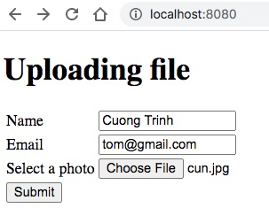
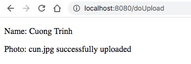

# Upload ảnh và hiển thị ảnh trên web site

Bạn không thể đến Hackathon với bàn tay trắng, không có bất kỳ sự chuẩn bị nào. Chắc chắn bạn sẽ bị động và không kịp thời gian. Cũng như khi vào một dự án phần mềm, chúng ta phải chuẩn bị kỹ năng lập trình, một tập rất nhiều các dự án mẫu nhỏ nhỏ để khi cần là tra cứu. Ngay sau khi đọc đề Hackathon hãy thực hành kỹ việc upload và view ảnh.

Ở phần trước chúng ta đã xong phần định nghĩa Model. Ở phần này chúng ta tập trung thí nghiệm việc upload ảnh, rồi xem ảnh qua đường dẫn. Đây là cách chia nhỏ dự án ra thành vài phần dễ xử lý rồi sau đó ghép lại vào dự án chung. Kỹ thuật upload ảnh đã được học trong buổi File I/O của thầy Thịnh rồi. Giờ chỉ tập trung vào việc upload ảnh xong lưu vào đâu để hiển thị dễ nhất.

Để hiển thị file trong ứng dụng web, tiếng Anh người ta gọi đó là "serve static files". Có từ khoá này chúng ta chỉ việc tìm "Spring Boot serve static files". Nếu bạn lập trình Node.js thì "Node.js serve static files", lập trình Python Django thì "Django serve static files".

Google sẽ ra được bài này [Serve Static Resources with Spring](https://www.baeldung.com/spring-mvc-static-resources). Đọc một lúc thì cách dễ nhất là upload file vào thư mục [src/main/resources/static](src/main/resources/static)

## Các bước upload và server photo files

### 1. Tạo [UploadController.java](src/main/java/vn/techmaster/demoupload/controller/UploadController.java)

Có 2 phương thức quan trọng:
1. Hiển thị form upload
```java
@GetMapping("/")
public String home() {
  return "index";
}
```



2. Hứng Post request
```java
@PostMapping(value = "/doUpload", consumes = { "multipart/form-data" })
public String upload(@ModelAttribute PersonRequest person, Model model) {
  storageService.uploadFile(person.getPhoto());
  model.addAttribute("name", person.getName());
  model.addAttribute("photo", person.getPhoto().getOriginalFilename());
  return "success";
}
```



### 2. Tạo [PersonRequest.java](src/main/java/vn/techmaster/demoupload/controller/request/PersonRequest.java)

```java
@Data
public class PersonRequest {
  private String name;
  private String email;
  public MultipartFile photo;  //Trường này để lưu file binary !
}
```


### 3. Tạo [StorageService.java](src/main/java/vn/techmaster/demoupload/service/StorageService.java)

```java
@Service
public class StorageService {
  @Value("${upload.path}")  //Đọc dữ liệu từ tham số cấu hình upload.path
  private String path;

  public void uploadFile(MultipartFile file) {
    if (file.isEmpty()) {
      throw new StorageException("Failed to store empty file");
    }

    String fileName = file.getOriginalFilename();    
    try {
      var is = file.getInputStream();
      Files.copy(is, Paths.get(path + fileName), StandardCopyOption.REPLACE_EXISTING);
    } catch (IOException e) {
      var msg = String.format("Failed to store file %s", fileName);
      throw new StorageException(msg, e);
    }
  }
}
```

Tham số cấu hình ```upload.path``` được lưu ở [application.properties](src/main/resources/application.properties)

Tôi tạo một thư mục photos trong thư mục [static](src/main/resources/static) để lưu file upload lên. Và cần ghi rõ đường dẫn tính từ thư mục gốc của dự án Spring Boot

```
upload.path=src/main/resources/static/photos/
```

```
. <-- Mặc định file sẽ được upload ở thư mục gốc của dự án
├── src
│   ├── main
│   │   ├── java
│   │   │   └── vn
│   │   │       └── techmaster
│   │   │           └── demoupload
│   │   └── resources
│   │       ├── static <-- Thư mục này phục vụ file tĩnh không cần cấu hình
│   │       │   └── photos
│   │       │       └── cun.jpg <-- Ảnh được lưu ở đây !
│   │       ├── templates
│   │       └── application.properties
```

### 4. View ảnh sau khi upload
Khi thư mục lưu ảnh upload được cấu hình là ```src/main/resources/static/photos/``` thì ảnh ```cun.jpg``` có thể xem được theo đường dẫn sau
```http://localhost:8080/photos/cun.jpg```


### 5. Bắt lỗi. RuntimeException khác gì với Exception?
Việc ghi file ra thư mục tiềm ẩn rất nhiều rủi ro lỗi: file rỗng, thư mục không tồn tại, không có quyền. Trong thao tác xử lý file I/O cần định nghĩa [StorageException.java](src/main/java/vn/techmaster/demoupload/exception/StorageException.java)
```java
public class StorageException extends RuntimeException {
  private static final long serialVersionUID = 6288365963802085889L;

  public StorageException(String message) {
      super(message);
  }

  public StorageException(String message, Throwable cause) {
      super(message, cause);
  }
}
```

Chú ý ```class StorageException extends RuntimeException``` kế thừa ```RuntimeException``` chứ không phải ```Exception``` như mọi khi. Khác biệt lớn nhất của giữa ```RuntimeException``` và ```Exception``` là:

1. Phương thức nào throw class kế thừa ```Exception``` sẽ phải khai báo ```throws XYZException``` ở tên phương thức, nơi nào dùng sẽ phải dùng cú pháp ```try ... catch```. Gọi là checked exception.
2. Phương thức nào throw class kế thừa ```RuntimeException``` không bắt buộc phải làm vậy. Gọi là unchecked exception.

Tuy nhiên phải dùng cách khác để bắt ngoại lệ, xem code dưới đấy trong file [UploadController.java](src/main/java/vn/techmaster/demoupload/controller/UploadController.java)

```java
@ExceptionHandler(StorageException.class)
public String handleStorageFileNotFound(StorageException e, Model model) {
  model.addAttribute("errorMessage", e.getMessage());
  return "failure";
}
```

### 6. Customize thông báo lỗi
Khi tìm một file không tồn tại sẽ có thông báo lỗi, và bạn muốn customize thông báo lỗi này. Cách làm như sau:

Tạo file báo lỗi 404 ở thư mục resources > templates > error > [404.html](target/classes/templates/error/404.html)

```html
<body>
  <h2>404 - Resource not found</h2>
  <p>
    The requested resource was not found; template - specific
  </p>
  <p th:text="${error}">Error Info</p>
  <p th:text="${status}">Status</p>
</body>
```