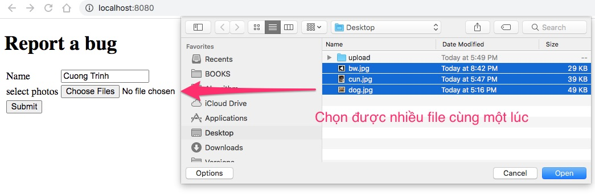
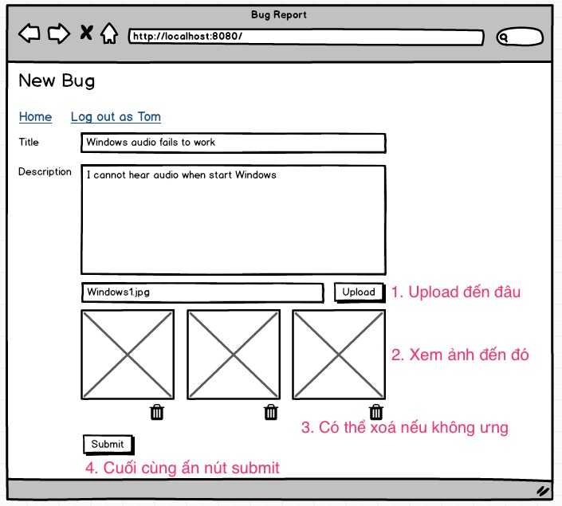

# Upload nhiều files khác rất nhiều với upload một file

Ở bài trước, chúng ta học cách upload 1 file vào thư mục src/main/resources/static/photos rồi xem nó qua đường dẫn http://localhost:8080/photos. Bài này chúng ta bàn về upload multiple files và trải nghiệm người dùng.

Trong thời gian 8 giờ lập trình Hackathon, tuyệt đối không chọn cách quá xịn xò. Đó là tự sát. Hãy chọn cách đơn giản nhất. Đề bài là mỗi bug được đính kèm 3 ảnh. 

## A: Cách đơn giản thực dụng
Chúng ta sẽ chọn phương án upload multiple files.
Tham khảo [Upload mutiple files W3 Schools](https://www.w3schools.com/tags/att_input_multiple.asp)



### 1. Sửa file [index.html](src/main/resources/templates/index.html)

Chú ý ```<input type="file" name="photos" multiple />```
```html
<form action="/doUpload" method="post" enctype="multipart/form-data">
  <table>
    <tr>
      <td>Name</td>
      <td><input type="text" name="name" /></td>
    </tr>
    <tr>
      <td>select photos</td>
      <td><input type="file" name="photos" multiple /></td>
    </tr>
    <tr>
      <td><input type="submit" value="Submit" /></td>
    </tr>
  </table>
</form>
```
### 2. Tạo [BugRequest.java](src/main/java/vn/techmaster/demoupload/controller/request/BugRequest.java)

```java
@Data
public class BugRequest {
  private String name;
  public MultipartFile[] photos; //Mảng chứa các file binary
}
```

### 3. Sửa [UploadController.java](src/main/java/vn/techmaster/demoupload/controller/UploadController.java)

```java
@PostMapping(value = "/doUpload", consumes = { "multipart/form-data" })
public String upload(@ModelAttribute BugRequest bug, Model model) {
  storageService.uploadFiles(bug.getPhotos());  //Xử lý upload nhiều file
  model.addAttribute("name", bug.getName());
  return "success";
}
```
### 4. Sửa [StorageService.java](src/main/java/vn/techmaster/demoupload/service/StorageService.java)

Thêm phương thức ```public void uploadFiles(MultipartFile[] files)```

```java
public void uploadFiles(MultipartFile[] files) {
  for (MultipartFile file : files) {
    uploadFile(file);
  }
}
```
## B: Cách xịn, tăng trải nghiệm người dùng.

Nếu để ý những ứng dụng web được thiết kế tốt, ở những form cho phép upload nhiều file, người ta sẽ thiết kế giao diện để người dùng upload từng file một. Upload thành công file nào thì hiển thị luôn để người dùng xem trước rồi có thể xoá nếu upload nhầm. Ví dụ report bug nhưng upload nhầm ảnh chụp bạn gái chả hạn.


Tác vụ report bug lúc này sẽ gồm 2 tác vụ vừa độc lập nhưng có phần liên quan đến nhau:

1. Nhập các thông tin về bug, trường dạng text hoặc select box ứng với ```@Enumerated```
2. Upload từng ảnh lên, lưu vào ổ cứng trên web server, cho phép người dùng xem trước.
3. Sau cùng khi đã thấy ổn, thì người dùng mới submit.

Chúng ta lại gặp vấn đề rắc rối là http request bản chất là stateless. Có nghĩa giữa các http request chả có liên quan gì đến nhau cả:
- Mỗi lần upload một file là một POST request.
- Mỗi lần xoá file cũng là một GET hoặc POST request.
- Lần cuối cùng khi submit bug lại là một POST request khác nữa.

Tất cả các request này diễn ra ở thời điểm khác nhau, làm sao tập hợp chúng lại vào một phương thức để lưu vào CSDL? 

Câu trả lời đó là dùng Session để biến stateless HTTP request thành stateful HTTP request. Có nghĩa là các HTTP request giờ sẽ chung nhau một số dữ liệu lưu trong session, cụ thể là những file upload lên sẽ lưu vào thư mục tạm rồi lưu đường dẫn các file vào Session. Ở lần cuối cùng, chỉ cần truy vấn Session lấy ra mảng các file này rồi xử lý tiếp.

Tuts này chỉ cần đến đấy đã. Bài tiếp theo chúng ta hoàn thành nốt Hackathon theo cách thực dụng. Cách xịn xò để khi nào tôi rảnh hướng dẫn tiếp.