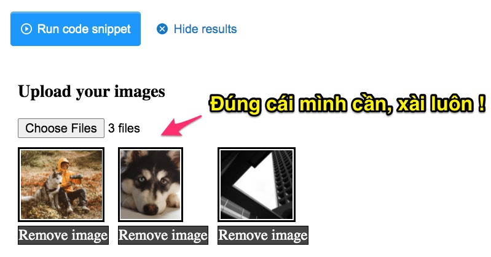
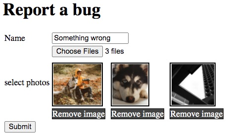
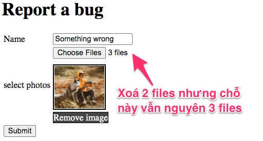
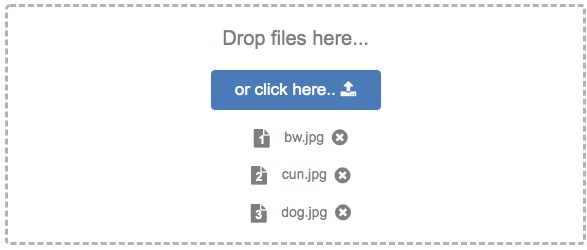
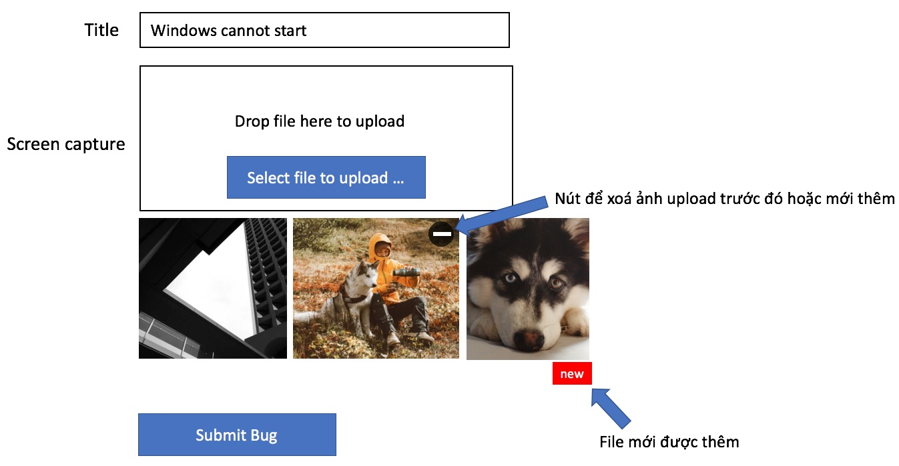

# Upload ảnh, xem trước, xoá nếu muốn

Ở bài trước, chúng ta đã làm được chức năng multiple uploads. Nhưng trải nghiệm tốt phải là người dùng được xem trước file upload, rồi xoá. Tôi đã đề ra phương án lưu tạm file, rồi dùng session để lưu mảng các file lưu tạm. Cách này chưa phải là tối ưu. Thực ra đây là bài toán rất kinh điển đã có nhiều lời giải rồi. Vậy chỉ cần Google đúng keyword thôi. Lập trình thật là đơn giản phải không các bạn. Đọc xong đề Hackathon, google, tìm ra mã nguồn sẵn có, copy - paste, sửa sửa chút và nộp bài.

Thực tế nó lại không dễ như vậy. Vì hầu hết các bạn đi hackathon, chả biết làm gì trước làm gì sau, hoặc quá mải mê hoản thiện một chức năng quá nhỏ. Vậy để hackathon có kết quả tốt thì phải làm gì?

Hãy lập trình nhiều vào, mỗi ngày 8 tiếng, tự đặt cho mình những bài toán khác nhau rồi tự giải.

Rồi vào việc ! Keyword tìm kiếm của tôi lúc này là "jquery preview delete uploaded image" ra ngay kết quả khá đẹp

[Image Upload with preview and Delete option - Javascript / Jquery](https://stackoverflow.com/questions/37205438/image-upload-with-preview-and-delete-option-javascript-jquery)



## Sửa file [index.html](src/main/resources/templates/index.html)

1. Thêm file [style.css](src/main/resources/static/css/style.css)
  ```html
  <head>
    <title>Uploading file</title>
    <meta charset="UTF-8">
    <meta name="viewport" content="width=device-width, initial-scale=1.0">
    <link rel="stylesheet" href="css/style.css">
  </head>
  ```
2. Bổ xung id cho 
```html
  <input type="file" id="photos" name="photos" multiple />
```
3. Ở cuối của file html thêm đoạn code JavaScript này
```javascript
    <script src="https://ajax.googleapis.com/ajax/libs/jquery/3.5.1/jquery.min.js"></script>
    <script>
      $(document).ready(() => {
        if (window.File && window.FileList && window.FileReader) {
          $("#photos").on("change", e => {
            let files = Array.from(e.target.files);
            files.forEach(f => {
              let fileReader = new FileReader();
              fileReader.onload = (e => {
                let file = e.target;
                $("<span class=\"pip\">" +
                  "" +
                  "<br/><span class=\"remove\">Remove image</span>" +
                  "</span>").insertAfter("#photos");

                $(".remove").click(function(){
                  $(this).parent(".pip").remove();
                });
              });
              fileReader.readAsDataURL(f);
            });

          });
        } else {
          alert("Your browser doesn't support to File API")
        }
      });
    </script>
```

Kết quả nhìn có vẻ khả ổn. Ban đầu thử upload 3 files



Sau đó xoá bớt 1 hoặc 2 files



Vấn đề là trường ```<input type="file" id="photos" name="photos" multiple />``` là chỉ đọc, không thể sửa. Do đó không thể dùng JavaScript tác động thay đổi số file đã chọn trong trường này. Hãy xem bài viết này [Removing file from multiple files uploader on button click when using HTML5 file input](https://stackoverflow.com/questions/32062876/removing-file-from-multiple-files-uploader-on-button-click-when-using-html5-file), chạy thử code có vẻ như là xoá được, rất khả thi. Danh sách file upload muốn sửa đổi được phải tạo ra một mảng riêng rồi dùng kỹ thuật upload bằng AJAX mới được, chứ cách submit form cổ điển không thể xong.



Lúc này tôi đã tốn mất 60 phút định nghĩa model, 60 phút vào code thử file upload, nếu tiếp tục sa vào chức năng xịn này chắc chắn sẽ không đủ thời gian hoàn thành hackathon. Do đó tạm để đấy về nhà sẽ cải tiến thêm. Vấn đề chúng ta phải xử lý đủ các trường hợp:

1. Tạo mới Bug, chọn nhiều file ảnh, xem trước, xoá nếu không hài lòng, rồi submit
2. Sửa đổi một Bug hiện có, xoá ảnh cũ, upload ảnh mới. Ảnh cũ lưu trên máy chủ web, ảnh mới mới chỉ đang preview trên trình duyệt.



**Để xử lý hoàn hảo chỗ này, trải nghiệm người dùng tốt có thể mất nguyên 2 ngày lập trình tập trung. Vậy đừng động vào nó vội, dùng phương pháp đơn giản nhất, nộp được bài Hackathon đã.**


## Tham khảo thêm
1. [https://jsfiddle.net/alexjamesbrown/2nzL9f7g/](https://jsfiddle.net/alexjamesbrown/2nzL9f7g/)
2. [https://stackoverflow.com/questions/16943605/remove-a-filelist-item-from-a-multiple-inputfile](https://stackoverflow.com/questions/16943605/remove-a-filelist-item-from-a-multiple-inputfile)
3. [Removing file from multiple files uploader on button click when using HTML5 file input
](https://stackoverflow.com/questions/32062876/removing-file-from-multiple-files-uploader-on-button-click-when-using-html5-file)
4. [Upload file sử dụng AJAX](https://blog.teamtreehouse.com/uploading-files-ajax)
5. [How to upload Image file using AJAX and jQuery](https://makitweb.com/how-to-upload-image-file-using-ajax-and-jquery/)
6. [https://github.com/christianbayer/image-uploader](https://github.com/christianbayer/image-uploader) và [https://christianbayer.github.io/image-uploader/](https://christianbayer.github.io/image-uploader/)