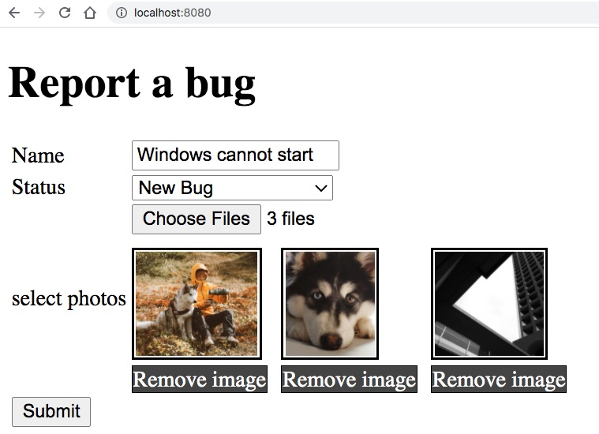

 # Upload ảnh lưu vào CSDL



 Mải mê lập trình upload ảnh, xem trước ảnh, xoá ảnh mất luôn 4 tiếng. Có nghĩa nếu ngồi Hackathon, lúc này đã 2 giờ chiều. Chỉ còn khoảng 4 tiếng nữa để nộp bài nếu mình không gục vì quá mệt mỏi. Một số bạn trong lớp đã bỏ về. Nghe loáng thoáng có tiếng than rồi chửi thề vì code không chạy. Giảng viên cứ đi loanh quanh hỏi "Có ổn không?". Tất nhiên là không ổn. Ổn thì giờ này cũng xong được 50% yêu cầu rồi.

 Tình hình Hackathon cơ bản buổi nào cũng thiếu giờ, áp lực nhiều hơn hẳn khi làm bài tập ở nhà. Nhiều lúc đầu không thể suy nghĩ được gì hết.

 Khi các bạn phải code trong áp lực có mấy khả năng:
 1. Ức chế, chửi sếp giao việc, hoặc chửi giảng viên giao bài khó. Tình hình chỉ xấu thêm.
 2. Bỏ cuộc. Chả được điểm nào. Về nhà với tâm trạng chán nản. Đừng làm vậy
 3. Gập máy tính lại, ra uống nước, hít một hơi thật dài. Gạt bỏ nỗi âu lo, bực tức, chán nản. Tìm xem có cái chức năng đơn giản.  Để kiếm điểm, cứ ngồi lại đến chiều là có 2 điểm rồi. Giờ đơn giản bớt chức năng, làm tạm một cái form demo cho giảng viên kiếm điểm còn hơn bỏ về không nộp bài.

Hãy chọn phương án 3. Rồi sau này trong công việc, áp lực luôn phát sinh. Khi không có áp lực, công việc nhàn têng, có nghĩa là ngày bạn sắp phải rời công ty cũng cận kề. Vì ông chủ nào cũng muốn nhân viên của làm việc hết công suất.


Rồi giờ vào chủ đề chính. Bài trước đã demo cách upload nhiều file. Đã preview được ảnh, xoá ảnh preview nhưng không xoá được file trong danh sách upload. Cách hợp lý là sử dụng tạo AJAX request gửi dữ liệu form + files vào POST handler của Spring Boot.


Phần này khoai để mấy hôm nữa tôi demo nhé.

Bài này chúng ta lưu dữ liệu form và ảnh vào CSDL
### 1. Tạo [BugRequest.java](src/main/java/vn/techmaster/demoupload/controller/request/BugRequest.java)

```BugRequest``` sẽ nhận dữ liệu gửi lên từ form. Nó có dạng như sau

```java
public class BugRequest {
  private String title; //Tiêu đề bug
  private Status status; //Trạng thái của Bug
  public MultipartFile[] photos; //Các ảnh đính kèm
}
```
 Các thuộc tính khác tạm thời bỏ đi cho gọn. Code cần phải chạy được đã. Sau đó đắp sau !

### 2. Đơn giản hoá model [Bug.java](src/main/java/vn/techmaster/demoupload/model/Bug.java)
Vì tôi đang thiếu thời gian Hackathon, tôi chấp nhận bỏ đi các quan hệ với User, Comment... để làm sao cấu trúc của class thật đơn giản
```java
@Entity(name = "bug")
@Table(name = "bug")
@Data
@NoArgsConstructor
@AllArgsConstructor
public class Bug {
  @Id @GeneratedValue(strategy = GenerationType.AUTO)
  private long id;

  @Column(length = 300, nullable = true)
  private String title;

  @Enumerated(EnumType.ORDINAL)
  private Status status;  //Trường này thực ra sau khi thử nghiệm lưu ảnh ok thì mới bổ xung đó

  public static final int PHOTO_LIMIT = 3;
  //Một bug có thể gắn nhiều photo. Nếu muốn giới hạn số photo hãy bổ xung điều kiện trong hàm addPhoto
  @OneToMany(
      cascade = CascadeType.ALL,
      orphanRemoval = true
  )
  @JoinColumn(name = "bug_id")
  private List<Photo> photos = new ArrayList<>();
  public void addPhoto(Photo photo ) throws BugException{
    if (photos.size() == PHOTO_LIMIT) {
      throw new BugException("Số lượng photo cho mỗi bug không được vượt quá " + PHOTO_LIMIT);
    }
    photos.add(photo);
    photo.setBug(this);
  }

  public void removePhoto(Photo photo) {
    photos.remove(photo);
    photo.setBug(null);
  }
}
```

### 3.Tạo [BugRepository.java](src/main/java/vn/techmaster/demoupload/repository/BugRepository.java) và [PhotoRepository.java](src/main/java/vn/techmaster/demoupload/repository/PhotoRepository.java)

Công đoạn này chỉ khai báo thôi, chứ không phải suy nghĩ gì nhiều. Sau bước này cũng đừng viết JUnit test vội, vì thời gian rất gấp gáp. Nếu có lỗi khó debug, khi đó mới cần viết để kiểm tra.

```java
@Repository
public interface BugRepository extends JpaRepository<Bug, Long>{
}
```

### 4. Tạo [IBugService.java](src/main/java/vn/techmaster/demoupload/service/IBugService.java) và [BugService.java](src/main/java/vn/techmaster/demoupload/service/BugService.java)

Ở ví dụ trước khi upload nhiều file, từ [UploadController.java](src/main/java/vn/techmaster/demoupload/controller/UploadController.java), tôi gọi thẳng đến [StorageService.java](src/main/java/vn/techmaster/demoupload/service/StorageService.java). Nhưng giờ cần phải chỉnh lại, luồng xử lý như sau:

1. Người dùng submit bug gồm text và vài ảnh. Dữ liệu gửi lên được đóng gói vào đối tượng [BugRequest](src/main/java/vn/techmaster/demoupload/controller/request/BugRequest.java)
2. [UploadController](src/main/java/vn/techmaster/demoupload/controller/UploadController.java) sẽ truyền BugRequest vào dịch vụ [BugService](src/main/java/vn/techmaster/demoupload/service/BugService.java)
3. BugService sẽ gọi đến [BugRepository](src/main/java/vn/techmaster/demoupload/repository/BugRepository.java) lưu dữ liệu vào CSDL và [StorageService](src/main/java/vn/techmaster/demoupload/service/StorageService.java) lưu file xuống ổ cứng.
4. Bọc hai tác vụ này trong Transaction để đảm bảo nếu một tác vụ có lỗi, thì tác vụ kia cũng huỷ !

```java
@Service
public class BugService implements IBugService {
  @Autowired StorageService storageService;

  @Autowired BugRepository bugRepository;
  @Autowired PhotoRepository photoRepository;

  @Override
  @Transactional(rollbackOn = StorageException.class)
  public void createNewBug(BugRequest bugRequest) throws BugException {
    Bug bug = new Bug();
    bug.setTitle(bugRequest.getTitle());
    bug.setStatus(bugRequest.getStatus());
    bugRepository.save(bug);  //Lưu bug để lấy được id của nó
    long bugId = bug.getId();

    //Lặp qua tất cả các file gửi lên
    for (MultipartFile file : bugRequest.getPhotos()) {
      String newFileName = bugId + "-" + file.getOriginalFilename();      
      storageService.uploadFileSaveNewName(file, newFileName); //Lưu vào ổ cứng với tên mới
      Photo photo = new Photo(newFileName); 
      bug.addPhoto(photo); //Gắn entity photo vào bug
    }
    bugRepository.flush(); 
  }  
}
```

#### Làm sao để lưu file ảnh không bị trùng nhau?

User X chụp màn hình xuất ra file screen.jpg. User Y cũng xuất ra file screen.jpg, khi upload lên sẽ ghi đè lên file trước đó của User X. Do đó chúng ta phải làm động tác đổi tên file khi upload lên.

Quy cách đặt tên file sau khi lưu vào ổ cứng máy chủ có thể là
```userId-bugId-originalFileName.jpg```

Trong phần này, tôi bỏ qua Authentication, Authorization nên quy cách đặt tên chỉ còn là
```bugId-originalFileName.jpg```

```java
String newFileName = bugId + "-" + file.getOriginalFilename();
```

### 5. Bổ xung thuộc tính Status

Logic thực tế sẽ phức tạp hơn. Khi người dùng lần đầu tạo Bug, mặc nhiên Bug có trạng thái Status = New. Sau đó Operator xem, sửa, chuyển trạng thái.... Đây chưa phải là lúc lập trình những luồng như vậy. Chạy được CRUD căn bản đã !

Định nghĩa enum [Status.java](src/main/java/vn/techmaster/demoupload/model/Status.java)
```java
public enum Status {
  NEW("New Bug"), 
  FIXED("Bug is fixed"), 
  FORWARD("Forward bug to other");

  private final String displayValue;

  private Status(String displayValue) {  //Constructor thôi
    this.displayValue = displayValue;
  }

  public String getDisplayValue() {
    return displayValue;
  }
}
```

Bạn nào chưa hiểu hãy đọc thêm bài này nhé [Working with Enums in Thymeleaf](https://www.baeldung.com/thymeleaf-enums) và [Persisting Enums in JPA](https://www.baeldung.com/jpa-persisting-enums-in-jpa)

Trong class [Bug.java](src/main/java/vn/techmaster/demoupload/model/Bug.java), thuộc tính status được khai báo như sau:
```java
@Enumerated(EnumType.ORDINAL)
private Status status;
```

Trong file template [index.html](src/main/resources/templates/index.html), select box chọn status được viết thế này.
```html
<select name="status">
  <option th:each="status : ${T(vn.techmaster.demoupload.model.Status).values()}" 
  th:value="${status}" th:text="${status.displayValue}"></option>
</select>
```
### 6. Chạy thử và kiểm tra dữ liệu bằng H2 console
Bảng Bug


Bảng Photo


Toàn bộ dự án mẫu này, code trong 1 tiếng và 1.5 tiếng viết tuts. Xong được phần này thì bạn có thể bổ xung chức năng User, Comment tham khảo từ chuỗi tutorial [Lập trình MicroBlog](https://github.com/TechMaster/SpringBootBasic/tree/main/jpa/04Hackathon)


### 7. Một số chú ý:

Khác biệt giữa  ```@GeneratedValue(strategy = GenerationType.IDENTITY)``` và ```@GeneratedValue(strategy = GenerationType.AUTO)```

Tóm lại để không bị choáng váng khi vào hackathon, hãy xem kỹ đề bài ra trước đó, nghiên cứu công nghệ, và lập trình các ví dụ mẫu nhỏ để tự tin ghép trong lúc lập trình thật. Nếu bạn tích luỹ được khoảng 50 code mẫu chức năng nhỏ thường gặp trong Spring Boot thì bạn có thể tham gia hầu hết các dự án Spring Boot.
