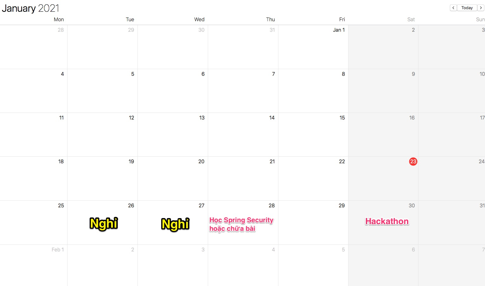
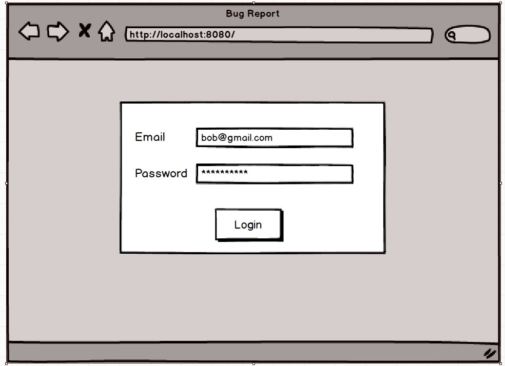
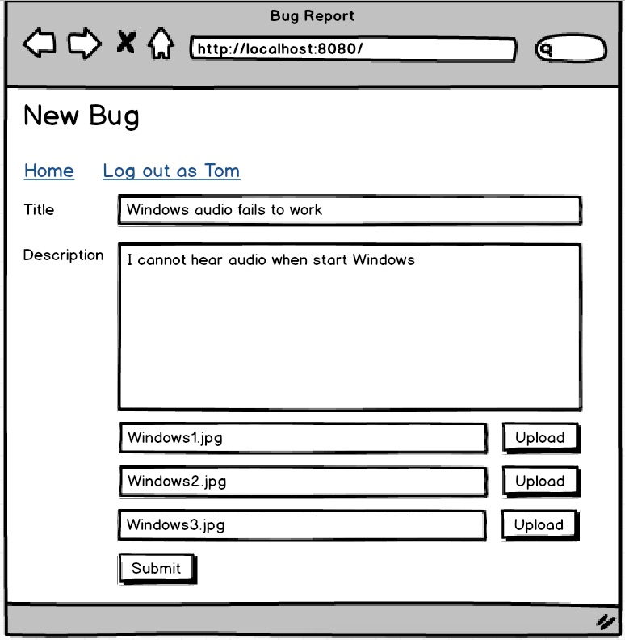

# Hackathon giữa kỳ

## Thời gian - Địa điểm
- Thời gian: 9:00 sáng - 8:30 tối ngày 30/1/2021
- Địa điểm: phòng số 1, 2, 4, 5, cơ sở 48 Tố Hữu, Techmaster

## Đảm bảo an toàn trước nguy cơ Covid
Để đảm bảo an toàn cho sinh viên đến thực hành Hackathon, Techmaster yêu cầu sinh viên tuân thủ các quy định sau đây:

1. Sử dụng thang bộ nếu có thể.
2. Đeo khẩu trang nếu đi thang máy. Rửa tay bằng cồn khi vào lớp.
3. Ngồi mỗi người một bàn, cách nhau tối thiểu 1.4 mét, làm đồ án độc lập.
4. Không bắt tay. Hạn chế trò chuyện trực tiếp.
5. Buổi trưa đi ăn, hãy đeo khẩu trang.

Techmaster bố trí 3 phòng học số 1, số 2, số 4 và số 5 đủ rộng rãi, yên tĩnh cho sinh viên giãn cách và yên tĩnh lập trình.

 Chúng ta còn khoảng 2-3 buổi Hackathon full day để chuẩn bị kỹ năng lập trình trước khi đi xin việc. Nếu vì lý do bất khả kháng bạn không đến dự 1 buổi Hackathon, hãy chấp nhận 0 điểm, rồi gỡ lại ở buổi Hackthon sau. Sau Tết nếu không phải dãn cách, cứ mỗi tuần chúng ta sẽ có 1 buổi Hackathon full day vào thứ 7. Vậy thầy chỉ thông báo, các bạn đừng bắt thầy phải tạo vote. Chúng ta là một tập thể hướng đến một mục đích quan trọng cuối cùng là mỗi sinh viên trở thành lập trình viên Spring Boot có việc làm, có lương tốt. Vậy đừng bàn những việc quá cá nhân ảnh hưởng đến tiến độ học của cả lớp.

Nếu có công điện chính thức của chính phủ yêu cầu dừng hoạt động đào tạo, kinh doanh vào tối nay 29/01/2021 thì buổi Hackathon mới hoãn.

**Học là phải hành: không thực hành, không có đồ án, Techmaster không thể cam kết việc làm.**

------

Do hackathon này diễn ra trong cả ngày nên điểm sẽ nhân đôi. Chỉ chấm trên giao diện chạy. Không tham gia thực hành nhận 0 điểm.

## Chủ đề Hackathon: xây dựng hệ thống khiếu nại báo cáo lỗi.

#### Roles - các vai trò người dùng trong hệ thống:
1. Anonymous user: chưa đăng nhập không được xem hay làm bất kỳ hành động gì
2. Customer: được phép tạo bài viết gồm title tối đa 255 ký tự, mô tả 3000 ký tự, upload tối đa 3 ảnh chụp lại lỗi để phản ánh, khiếu nại. Khách hàng cũng có trả lời, reply bài viết của mình.
   Khác hàng có thể cho điểm mức độ hài lòng của mình sau khi Supporter hỗ trợ. Điểm từ 1 đến 10.
3. Supporter: nhân viên hỗ trợ được phép reply bài viết của khách hàng hoặc chuyển trạng thái của bài viết gồm các trạng thái: hỗ trợ xong, không thể hỗ trợ, cần chuyển lên chuyên gia cấp cao hơn

Bản chất của bài này cũng giống với bài Blog Post nhưng có thêm 3 roles và chức năng upload. Chức năng upload tham khảo ở đây [https://github.com/TechMaster/SpringBootBasic/tree/main/fileio](https://github.com/TechMaster/SpringBootBasic/tree/main/fileio)

### Yêu cầu giao diện:
Màn hình mock up Balsamiq sẽ cập nhật trong 2 ngày nữa.

Giao diện đơn giản nhất có thể nhưng hãy bắt đầu dùng Bootstrap 4. Có một khoá học Bootstrap 4 căn bản ở đây rất hay
[https://scrimba.com/learn/bootstrap4](https://scrimba.com/learn/bootstrap4)

### Dùng SpringSecurity hay tự code phần Authenticate/Authorization
Tuỳ bạn. Để đơn giản tôi sẽ cung cấp sẵn vài User và Roles, bạn tự tạo model và import. Bạn thích dùng Spring Security cũng được.

### Cách thức chấm bài:
1. Tôi sẽ không xem code của các bạn. Vì gần cuối ngày, nếu xem code để chấm thì thời gian sẽ kéo dài đến 10 giờ đêm.
2. Tôi chỉ chấm theo chức năng có tuân thủ theo đúng màn hình mockup bằng Balsamiq không.

## Màn hình Mockup

