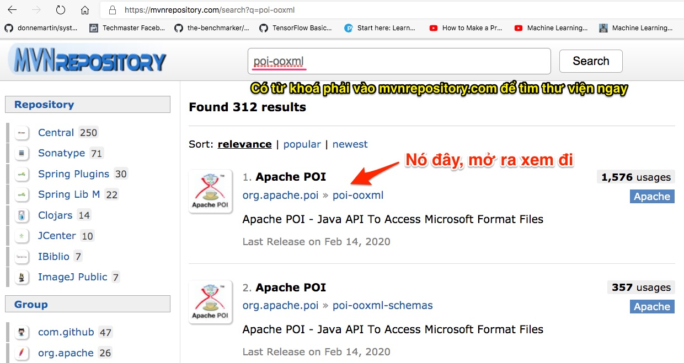

# Hướng dẫn vọc code để đọc Excel

Giả sử tôi là một lập trình viên chưa có nhiều kinh nghiệm. Sau khi tốt nghiệp khoá Spring Boot ở Techmaster và xin việc tại FSoft. Sau vòng phỏng vấn Java căn bản và lý thuyết Spring Boot tạm gọi là thành công trả lời được 70% số câu hỏi, nhà tuyển dụng đưa ra một yêu cầu:
"Em hãy code một ứng dụng Spring Boot đơn giản, đọc file Excel này ra rồi hiển thị lên web site. Lập trình cẩn thận bao hết các khả năng gây lỗi, crash ứng dụng có thể. Em có 48 giờ để nộp. Nhớ viết document giải thích chi tiết, rồi đẩy lên github gửi link cho anh xem !"

## Tìm kiếm giải pháp trên Google, Stack Overflow, YouTube
1. Tiếng Anh của tôi ở mức độ trung bình. Do đó tôi sẽ nghĩ đến vài từ khoá kiểu như
   - "Java đọc file Excel"
   - "Java đọc file Excel vào đối tượng"

Thử tìm luôn bằng từ khoá tiếng Việt, nếu ra được kết quả thì bỏ qua bước dịch tiếng Anh

Chú ý luôn có từ khoá Java để đảm bảo tìm được tutorial bằng ngôn ngữ Java.


2. Dùng Google Translate để dịch sang tiếng Anh ta có được
   - "Java đọc file Excel" -> "java reads Excel file"
   - "Java đọc file Excel vào đối tượng" -> "Java reads the Excel file into the object" -> "Java reads Excel into object"

Kinh nghiệm khi tìm kiếm trên Google nên bỏ bớt những từ thừa như "the", "a", "an"

3. Kết quả tìm được sẽ nhiều, cần bình tĩnh đọc lướt để đánh giá mức độ phù hợp của bài viết với mục tiêu tôi đang tìm kiếm.

Tìm được bài của bạn Nam Hà Minh [How to Read Excel Files in Java using Apache POI](https://www.codejava.net/coding/how-to-read-excel-files-in-java-using-apache-poi). Bài này mới, tác giả Việt nam, phần comment độc giả khen ngợi mạnh. Có vẻ ổn đấy. Giờ bình tĩnh đọc. Đừng cuống. Còn 48 giờ cơ mà.

## Cách đọc một bài viết lập trình
- Hãy gạch đầu dòng những ý chính
- Nếu tác giả viết quá dài dòng, hãy tìm link github nếu có, để tải về chạy thử luôn. Chạy được có vẻ ngon, thì đọc tiếp.
- Nếu quá vội, bỏ qua tất cả phần giới thiệu màu mẻ, nhảy bổ vào ngay đoạn code quan trọng nhất. Chú ý cách này chỉ áp dụng khi trình code đã cao. Còn mới vào nghề cứ phải tĩnh tâm, hít thở đều, tắt Facebook, đóng Zalo mà đọc.
- Đọc đến đâu thử mở IDE ra code luôn kiểm chứng. Chọn code đơn giản nhất, ít dòng nhất để thử.
- Gặp những từ khoá nào mới nếu thấy cần tiếp tục Google, tuy nhiên nếu cấp độ tìm kiếm quá sâu bạn sẽ lạc lối vào mớ hỗn độn những khái niệm mới, công nghệ mới. Càng đọc sẽ càng hoang mang. Đừng làm vậy. Hãy sử dụng Mind Map để vẽ bản đồ liên hệ giữa các khái niệm

**Cụ thể trong bài viết của Nam Hà Minh có mấy ý sau đây**
  - Dùng thư viện Apache POI. Lại Google tiếp
  - Dùng Maven. *Cái này mình đã học ở phần Spring Boot rồi. Nhưng lại chưa tạo dự án Maven mà không có SpringBoot bao giờ*
    Nếu mình dùng Excel 2007 trở đi, tập trung vào POI XML
    ```xml
    <dependency>
      <groupId>org.apache.poi</groupId>
      <artifactId>poi-ooxml</artifactId>
      <version>VERSION</version>
    </dependency>
    ```
    Có từ khoá *poi-ooxml* thì phải vào [https://mvnrepository.com](https://mvnrepository.com) để tra ngay nhé
    

  - Các khái niệm căn bản của POI. Tác giả viết rất sáng sủa rồi.
  

  Sau khi đọc bài viết xong, tôi có thể vẽ mind map để hình dung tổng thế vấn đề. Khi đã code thành công, có thể viết bài chia sẻ lại, lấy điểm trước nhà tuyển dụng.
  


## Code theo tác giả bài viết

Tác giả cũng thừa nhận đây là đoạn code *bẩn*, chưa được tối ưu và bắt lỗi chặt chẽ. Vậy mình copy và cố gắng chạy đã. Đừng cầu toàn. Nhưng ông nào lập trình cầu toàn, kỹ ngay từ đầu thường mất nhiều thời gian.
  
    ```java
    package net.codejava.excel;
   
    import java.io.File;
    import java.io.FileInputStream;
    import java.io.IOException;
    import java.util.Iterator;
    
    import org.apache.poi.ss.usermodel.Cell;
    import org.apache.poi.ss.usermodel.Row;
    import org.apache.poi.ss.usermodel.Sheet;
    import org.apache.poi.ss.usermodel.Workbook;
    import org.apache.poi.xssf.usermodel.XSSFWorkbook;
    
    /**
    * A dirty simple program that reads an Excel file.
    * @author www.codejava.net
    *
    */
    public class SimpleExcelReaderExample {        
      public static void main(String[] args) throws IOException {
        String excelFilePath = "Books.xlsx";
        FileInputStream inputStream = new FileInputStream(new File(excelFilePath));
        
        Workbook workbook = new XSSFWorkbook(inputStream);
        Sheet firstSheet = workbook.getSheetAt(0);
        Iterator<Row> iterator = firstSheet.iterator();
        
        while (iterator.hasNext()) {
            Row nextRow = iterator.next();
            Iterator<Cell> cellIterator = nextRow.cellIterator();
            
            while (cellIterator.hasNext()) {
                Cell cell = cellIterator.next();
                
                switch (cell.getCellType()) {
                    case Cell.CELL_TYPE_STRING:
                        System.out.print(cell.getStringCellValue());
                        break;
                    case Cell.CELL_TYPE_BOOLEAN:
                        System.out.print(cell.getBooleanCellValue());
                        break;
                    case Cell.CELL_TYPE_NUMERIC:
                        System.out.print(cell.getNumericCellValue());
                        break;
                }
                System.out.print(" - ");
            }
            System.out.println();
        }        
        workbook.close();
        inputStream.close();
      }    
    }
    ```
6. Có code rồi nhưng lại vướng ở điểm: trên lớp thầy chỉ hướng dẫn tạo Spring Boot project, một loại Maven template được thiết kế riêng cho dự án Maven. Rồi tôi là Google "cách tạo dự án maven" ra được bài này
[Sử dụng Maven trong việc quản lý thư viện trong dự án](https://viblo.asia/p/su-dung-maven-trong-viec-quan-ly-thu-vien-trong-du-an-ORNZq6jLl0n).
Đọc thấy vẫn hoang mang, ok thử chuyển qua YouTube xem sao. gõ "create maven project vscode"
[Tutorial : Using Visual Studio Code (VSCode) for Java Maven Project](https://www.youtube.com/watch?v=rYaEuDdpMFc). Video này chuẩn đấy.

Tìm hiểu một chút về extension Maven for Java


7. Khi dùng code của người khác cũng cần phải hiểu căn bản về Java một chút, đừng cứng nhắc máy móc quá. Ví dụ sau khi dùng generate code xong, chúng ta có ```public class App``` trong file App.java

Nhưng code trên mạng lại là ```public class SimpleExcelReaderExample```, hãy sửa ```SimpleExcelReaderExample``` thành ```App```.

```String excelFilePath = "Books.xlsx";``` cũng phải sửa để trỏ đến địa chỉ file Excel bạn đang có. Tóm lại copy của người khác, nhưng cũng cần đọc và tinh ý một chút. Không thể copy là mặc nhiên chạy ngay.


## Nếu đã chạy được thì cải tiến code của tác giả.

Đoạn code mẫu trên chạy ok. Nhưng ở VSCode nếu bạn cài Sonarlint nó sẽ cảnh bảo thiếu logic bắt lỗi. Với bất kỳ ngôn ngữ lập trình nào, đặc biệt là Java. Đã đọc ghi file hay tài nguyên y như rằng sẽ có khả năng lỗi, phát sinh ngoại lệ (Exception) kiểu như:
- File không tìm thấy
- Không có quyền ghi vào file.

Cần bổ xung thêm try catch
```java
try (FileInputStream inputStream = new FileInputStream(new File(excelFilePath));
    Workbook workbook = new XSSFWorkbook(inputStream);) {
    \\ Đọc file excel
} catch (Exception e) {

}
```

Xem thêm file [App.java](src/main/java/readexcel/App.java)

### Code của tác giả chỉ chạy ở phiên bản cũ 3.11
Phiên bản mới nhất là 4.1.2
```xml
  <dependency>
      <groupId>org.apache.poi</groupId>
      <artifactId>poi-ooxml</artifactId>
      <version>3.11</version>
  </dependency>
```

Nếu nâng version lên, lập tức code báo lỗi đỏ lỏm. Giờ lại bắt đầu công cuộc nhặt sâu tiếp. Cứ bình tĩnh mà làm. Lập trình không vội được đâu.


Mày mò một tý, sửa lại code như thế này lại chạy ngon ở phiên bản mới
```java
package readexcel;

import java.io.File;
import java.io.FileInputStream;
import java.io.IOException;
import java.util.Iterator;

import org.apache.poi.ss.usermodel.Cell;
import org.apache.poi.ss.usermodel.Row;
import org.apache.poi.ss.usermodel.Sheet;
import org.apache.poi.ss.usermodel.Workbook;
import org.apache.poi.xssf.usermodel.XSSFWorkbook;

public class App {

    public static void main(String[] args) throws IOException {
        String excelFilePath = "/Users/techmaster/Desktop/topcar.xlsx";
    
        try (FileInputStream inputStream = new FileInputStream(new File(excelFilePath));
                Workbook workbook = new XSSFWorkbook(inputStream);) {

            Sheet firstSheet = workbook.getSheetAt(0);
            Iterator<Row> iterator = firstSheet.iterator();

            while (iterator.hasNext()) {
                Row nextRow = iterator.next();
                Iterator<Cell> cellIterator = nextRow.cellIterator();

                while (cellIterator.hasNext()) {
                    Cell cell = cellIterator.next();

                    switch (cell.getCellType()) {
                        case STRING:
                            System.out.print(cell.getStringCellValue());
                            break;
                        case BOOLEAN:
                            System.out.print(cell.getBooleanCellValue());
                            break;
                        case NUMERIC:
                            System.out.print(cell.getNumericCellValue());
                            break;
                    }
                    System.out.print(" - ");
                }
                System.out.println();
            }
        } catch (Exception e) {
            System.out.println(e);
        }
    }
}
```

## Đừng dừng lại ở đây !
Cách của tác Nam Hà Minh cũng cổ điển thôi. Giờ hãy thử tiếp phương pháp đọc từng dòng rồi ánh xạ vào POJO (Plain Old Java Object). Tôi google "Read Excel to POJO" ra được thư viện này

[https://github.com/ozlerhakan/poiji](https://github.com/ozlerhakan/poiji#getting-started)

Nó là thư viện sử dụng lại [Apache POI](https://poi.apache.org/).

Đến đây mình sẽ tạo một thư mục khác để refactor code nhé. Code viết trực tiếp vào hàm main nhìn rất rối, mà phải đóng gói vào trong class

Xem tiếp bài [Đọc file Excel vào POJO](../02readexcelPOJO)