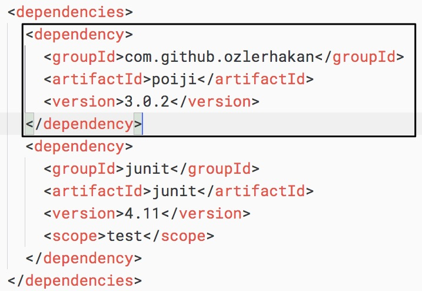
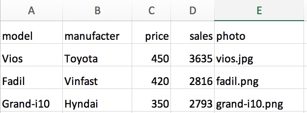

# Đọc file Excel vào POJO

Đọc file CSV, Excel theo kiểu từng dòng, rồi split chuỗi ra thành mảng là cách cổ điển dễ hình dùng. Tuy cách đọc vào POJO giúp ta ánh xạ từng ô (cell) vào từng thuộc tính (property) của một đối Java class cổ điển (Plain Old Java Object).

Thư viện [Poiji] sử dụng lại  POI nhưng bổ xung theo chức năng đọc vào POJO bằng cách tạo các annotation.

Đọc đoạn code mẫu ở link này [https://github.com/ozlerhakan/poiji#getting-started](https://github.com/ozlerhakan/poiji#getting-started) khá dễ hiểu. Tôi chú thích lại bằng tiếng Việt nhé.

```java
//Cấu hình cho Poiji
PoijiOptions options = PoijiOptions.PoijiOptionsBuilder.settings()
        .addListDelimiter(";") (1)  //Trong một cell có thể chứa nhiều giá trị phân cách bởi dấu ;
        .build();

//Có 2 cách đọc file Excel !

//Cách 1: ngắn gọn đúng 1 dòng
List<Employee> employees = Poiji.fromExcel(new File("employees.xls"), Employee.class, options);

//Cách 2: dài hơn chút nhưng có thể bắt Exception tốt hơn. Đừng copy paste cả 2 cách này vào rồi chạy
//IDE báo lỗi đó. Bạn cũng phải hiểu căn bản về Java trước khi copy paste
InputStream stream = new FileInputStream(new File("employees.xls"))
List<Employee> employees = Poiji.fromExcel(stream, PoijiExcelType.XLS, Employee.class, options);

employees.size(); //Lấy ra số phần tử của List<Employee> employees

Employee firstEmployee = employees.get(0); //Lấy ra phần tử đầu tiên
// Employee{rowIndex=1, employeeId=123923, name='Joe', surname='Doe', age=30, single=true, emails=[joe@doe.com, joedoe@gmail.com], biils=[123,10, 99.99]}
```

## Sử dụng mvnrepository

Chúng ta đã có Poiji. Giờ hãy vào web site [https://mvnrepository.com/](https://mvnrepository.com/) tìm kiếm thư viện. Copy đoạn XML trong tab Maven
```xml
<dependency>
    <groupId>com.github.ozlerhakan</groupId>
    <artifactId>poiji</artifactId>
    <version>3.0.2</version>
</dependency>
```
Sau đó paste vào file [pom.xml](pom.xml)



## Cấu trúc file Excel và class POJO tương ứng
Hãy chú ý tên các cột ở hàng đầu tiên



Nội dung file [Car](src/main/java/readexcel/Car.java)
```java
package readexcel;
import com.poiji.annotation.ExcelCell;

public class Car {
  @ExcelCell(0) //Các annotation này để ánh xạ vào cột đánh số thứ tự từ 0
  private String model;

  @ExcelCell(1)
  private String manufacter;

  @ExcelCell(2)
  private int price;

  @ExcelCell(3)
  private int sales;

  @ExcelCell(4)
  private String photo;
}
```

## Viết logic đọc file Excel trong App.java

Rõ ràng lần này code ngắn hơn [cách cổ điển ở bài trước](../01readexcel/). Dữ liệu được đọc thẳng vào POJO [Car](src/main/java/readexcel/Car.java)

```java
public static void main(String[] args) {
    String excelFilePath = "/Users/techmaster/Desktop/topcar.xlsx";

    PoijiOptions options = PoijiOptions.PoijiOptionsBuilder.settings().addListDelimiter(";").build();

    try {
        List<Car> cars = Poiji.fromExcel(new File(excelFilePath), Car.class, options);
        for (Car car : cars) {
            System.out.println(car);
        }
    } catch (Exception e) {
        System.out.println(e);
    }
}
```
Kết quả ở Terminal (Console) sau khi chạy sẽ là thế này
```
Car [manufacter=Toyota, model=Vios, photo=vios.jpg, price=450, sales=3635]
Car [manufacter=Vinfast, model=Fadil, photo=fadil.png, price=420, sales=2816]
Car [manufacter=Hyndai, model=Grand-i10, photo=grand-i10.png, price=350, sales=2793]
```

## Kết luận
Xuất phát từ một bài tập phỏng vấn lập trình thi tuyển vào FSoft hay Viettel, các bạn có 48 tiếng để hoàn thành. Do đó cần phải giải pháp hợp lý. Không cần quá hoàn mỹ cầu toàn vội, mà chạy được đã. Có nhiều đoạn code, keyword chúng ta chưa hiểu, cứ tạm chấp nhận. Khi chạy ra kết quả chúng ta sẽ tự tin, phấn khích hơn rất nhiều. Đó là động lực để tìm hiểu tiếp.

Sau khi đã làm chủ được phương án đơn giản, chúng ta tìm tiếp phương án tốt hơn, hiện đại hơn. Khi tìm kiếm, đọc tài liệu trên mạng, bạn nên dùng Mind Map để ghi chú lại.

Công việc lập trình viên là vậy đó: gặp vấn đề > tìm giải pháp > code thử > fix bug > cải tiến > tìm phương án mới > lặp lại > lặp lại > cho đến khi thấy hài lòng > document > bàn giao hoặc viết bài chia sẻ để ghi chép lại kinh nghiệm.