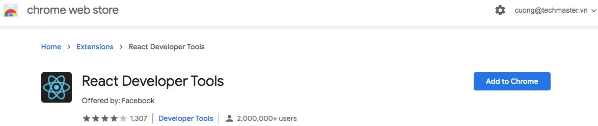
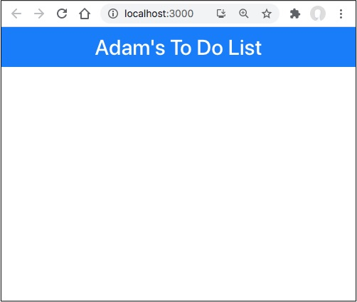
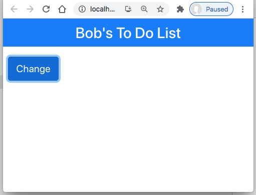

# Cài đặt React và viết ứng dụng đầu tiên

Đây là khoá học Spring Boot Basic, nội dung dạy React chỉ mang tính chất khởi động để các bạn có thể tự học tiếp. Các bước thực hiện mình học từ sách [Pro React 16](https://b-ok.asia/book/3718058/947eab) của Adam Freeman. Một số đoạn code có chỉnh lại theo phiên bản mới. 
## 1. Cài đặt Node.js, npm, git
Trước tiên bạn cần cài đặt Node.js từ web site này [https://nodejs.org](https://nodejs.org/en/)
Mở terminal ra và gõ một số lệnh kiểm tra phiên bản:

```sh
$ node -v
6.14.9

$ npm install -g npm
$ npm -v
7.5.3

$ git --version
git version 2.29.2
```

## 2. Cài đặt create-react-app
create-react-app là công cụ để tạo code mẫu cho dự án React. Tiếng Anh người ta gọi là boiler plate code.

```sh
$ npm install --global create-react-app@latest
```

## 3. Cài đặt React Developer Tools
Cài bổ xung extenstion React Developer Tools vào Chrome. Sau này debug ứng dụng React sẽ dùng đến


## 4. Tạo ứng dụng Todo
Trong terminal gõ lệnh để tạo dự án Todo
```sh
npx create-react-app todo
```

## 5. Bổ xung Bootstrap
```sh
npm install bootstrap@latest
```

Trong [index.js](todo/src/index.js) bổ xung dòng này để nhúng thư viện Bootstrap vào
```js
import 'bootstrap/dist/css/bootstrap.css';
```

## 6. Viết lại App.js

[App.js](todo/src/App.js) là nơi chúng ta sẽ lập trình giao diện và quản lý trạng thái ứng dụng React.js
```js
//import logo from './logo.svg';
//import './App.css';
import { Component } from 'react';  //Cần phải có lệnh import { Component }

export default class App extends Component {
  constructor(props) {
    super(props);
    this.state = {
      userName: "Adam"  //bổ xung thêm thuộc tính userName
    }
  }

  //Hàm render sẽ sử dụng thuộc tính userName
  render() {
    return (
      <div>
        <h4 className="bg-primary text-white text-center p-2">
          {this.state.userName}'s To Do List</h4>
      </div>
    )
  }
}
```
```{this.state.userName}``` sẽ được thay thế bằng giá trị của thuộc tính userName. Hầu hết View Template Engine đều hoạt động giống nhau ở điểm này.

## 7. Chạy thử
Gõ lệnh trong terminal
```sh
yarn start
```
hoặc
```sh
npm start
```
Trình duyệt sẽ tự động được mở và truy cập tới http://localhost:3000

Kết quả như sau:



Hãy thử thay giá trị của thuộc tính ```userName``` các bạn sẽ thấy trình duyệt tự động cập nhật lại giao diện. Nhìn rất phấn khích.

## 8. Thay đổi trạng thái của App
Bổ xung thêm một nút để thay đổi thuộc tính userName, để thấy giao diện tự động vẽ lại (re-render)
```js
export default class App extends Component {
  constructor(props) {
    super(props);
    this.state = {
      userName: "Adam"
    }
  }

  //Bổ xung thêm hàm này để lật qua lật lại 2 giá trị "Adam" và "Bob"
  changeStateData = () => { 
    this.setState({ userName: this.state.userName === "Adam" ? "Bob" : "Adam" }) 
  }
}
```

ở hàm  ```render``` bổ xung thêm nút Change hứng sự kiện ```onClick``` thì gọi đến ```changeStateData```
```js
render() {
  return (
    <div>
      <h4 className="bg-primary text-white text-center p-2">
        {this.state.userName}'s To Do List</h4>
        <button className="btn btn-primary m-2" onClick={ this.changeStateData }>
          Change
        </button>
    </div>
  )
}
```


## 8. Arrow function

Cách viết cổ điển, phải có lệnh ```return ()```
```js
render() {
  return (
    <div>
      <h4 className="bg-primary text-white text-center p-2">
        {this.state.userName}'s To Do List</h4>
        <button className="btn btn-primary m-2" onClick={ this.changeStateData }>
          Change
        </button>
    </div>
  )
}
```

Cú pháp dùng arrow function ```() =>``` không cần lệnh ```return```
```js
render = () => 
  <div>
    <h4 className="bg-primary text-white text-center p-2">
      {this.state.userName}'s To Do List</h4>
      <button className="btn btn-primary m-2" onClick={ this.changeStateData }>
        Change
      </button>
  </div>
```
