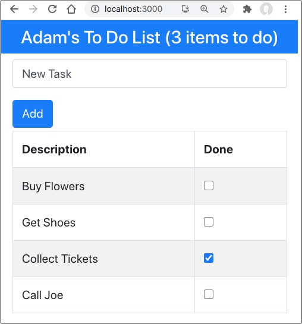
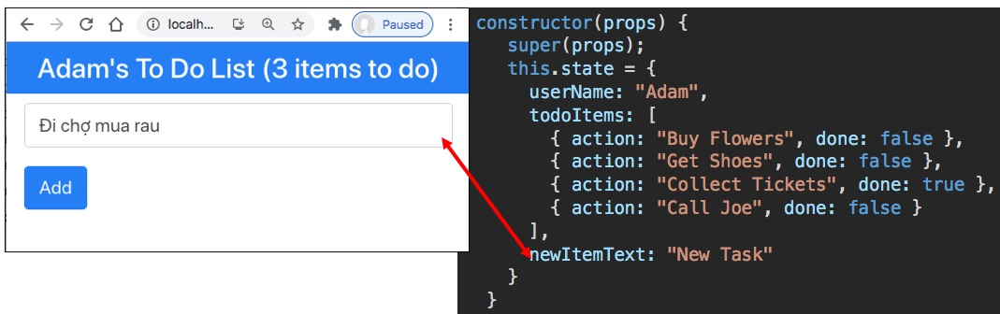
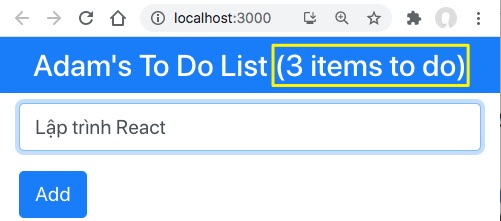

# Bổ xung Todo List

Phần này chủ yếu làm việc trên [App.js](src/App.js)



## 1. Thêm 2 thuộc tính ```todoItems``` và ```newItemText```

- ```todoItems``` là mảng danh sách các Task. Mỗi Task có 2 thuộc tính ```action``` kiểu string và ```done``` kiểu boolean
- ```newItemText``` lưu mô tả Task mới thêm

```js
export default class App extends Component {
  constructor(props) {
    super(props);
    this.state = {
      userName: "Adam",
      todoItems: [
        { action: "Buy Flowers", done: false },
        { action: "Get Shoes", done: false },
        { action: "Collect Tickets", done: true },
        { action: "Call Joe", done: false }
      ],
      newItemText: "New Task"
    }
  }
}
```

## 2. Khi người dùng gõ text thì cập nhật thuộc tính ```newItemText```

input text lấy giá trị từ thuộc tính ```this.state.newItemText```, khi người dùng gõ text thì cập nhật ngược lại.
```html
 <input className="form-control" value={this.state.newItemText} onChange={this.updateNewTextValue} />
```
```js
updateNewTextValue = (event) => {
  this.setState({ newItemText: event.target.value });
}
```


## 3. Hiển thị số tác vụ chưa hoàn thành
```html
<h4 className="bg-primary text-white text-center p-2">
        {this.state.userName}'s To Do List
        ({this.state.todoItems.filter(t => !t.done).length} items to do)
</h4>
```


## 3. Thêm Task mới
```html
<button className="btn btn-primary mt-3" onClick={this.createNewTodo}>Add</button>
```

```js
createNewTodo = () => {
  // Nếu không item nào trong todo list trùng với this.state.newItemText thì thêm task mới
  
  if (!this.state.todoItems.find(item => item.action === this.state.newItemText)) {
    this.setState(
      {
        // Ý nghĩa của 3 dots trong React
        //https://stackoverflow.com/questions/31048953/what-do-these-three-dots-in-react-do
        todoItems: [...this.state.todoItems, { action: this.state.newItemText, done: false }],
        newItemText: "" // Sau đó xoá trắng **newItemText**
      }
    );
  }
}
```

Giải thích dấu 3 chấm ```...``` trong lệnh dưới
```js
todoItems: [...this.state.todoItems, { action: this.state.newItemText, done: false }]
```

là ```todoItems  = todoItems + Task{action: this.state.newItemText, done: false}```

```...``` gọi là spread notation, trải ```this.state.todoItems``` thành các phần tử mảng

## 4. Hàm ```render``` của App.js

```js
render = () =>
  <div>
    <h4 className="bg-primary text-white text-center p-2">
      {this.state.userName}'s To Do List
      ({this.state.todoItems.filter(t => !t.done).length} items to do)
    </h4>
    <div className="container-fluid">
      <div className="my-1">
        <input className="form-control" value={this.state.newItemText}
          onChange={this.updateNewTextValue} />

        <button className="btn btn-primary mt-3"
          onClick={this.createNewTodo}>Add</button>
      </div>
      <table className="table table-striped table-bordered">
        <thead>
          <tr><th>Description</th><th>Done</th></tr>
        </thead>
        <tbody>{ this.todoTableRows() }</tbody>
      </table>
    </div>
  </div>
```
Phần table liệt kê danh sách các task, trong thẻ ```tbody`` gọi đến hàm ```this.todoTableRows()```

```js
todoTableRows = () => this.state.todoItems.map(item =>
  <tr key={ item.action }>    
    <td>{ item.action}</td>
    <td><input type="checkbox" checked={ item.done } onChange={ () => this.toggleTodo(item) } /></td>
  </tr>);
```
Hàm ```todoTableRows``` duyệt qua từng phần tử của ```this.state.todoItems``` (bằng hàm map) để tạo ra các dòng ```<tr><td></td></tr>```

## 5. Hứng sự kiện người dùng tick vào checkbox ứng với từng task

```html
<input type="checkbox" checked={ item.done } onChange={ () => this.toggleTodo(item) } />
```

Hàm hứng sự kiện toogle checkbox sẽ hoạt động như sau. Duyệt qua từng phần tử trong mảng ```todoItems```, phần tử nào thoả mãn điều kiện ```item.action === todo.action``` thì gán nó bằng chính nó nhưng thuộc tính done được lật ngược.
```{ ...item, done: !item.done }```

Cú pháp ``{ ...item, done: !item.done }``` có nghĩa là trải các thuộc tính của item ra, riêng thuộc tính ```done``` sẽ

```js
toggleTodo = (todo) => 
  this.setState({ todoItems: 
    this.state.todoItems.map(item => item.action === todo.action ? { ...item, done: !item.done } : item)
  });
```


