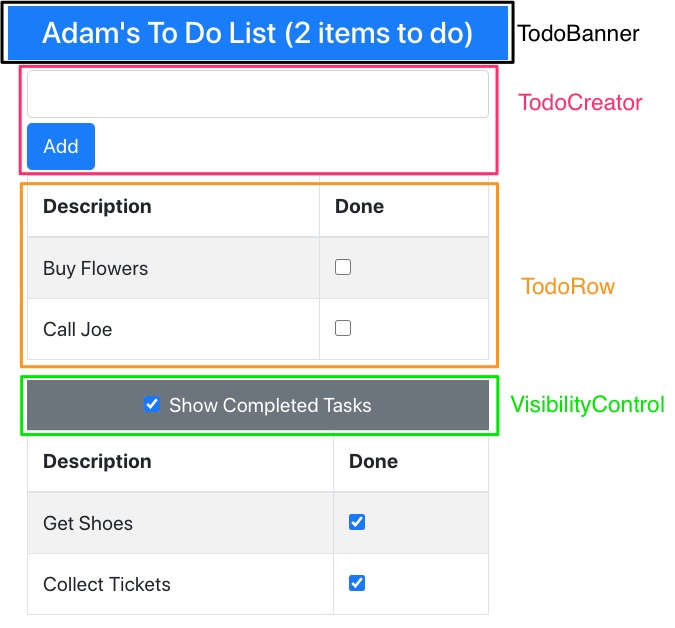
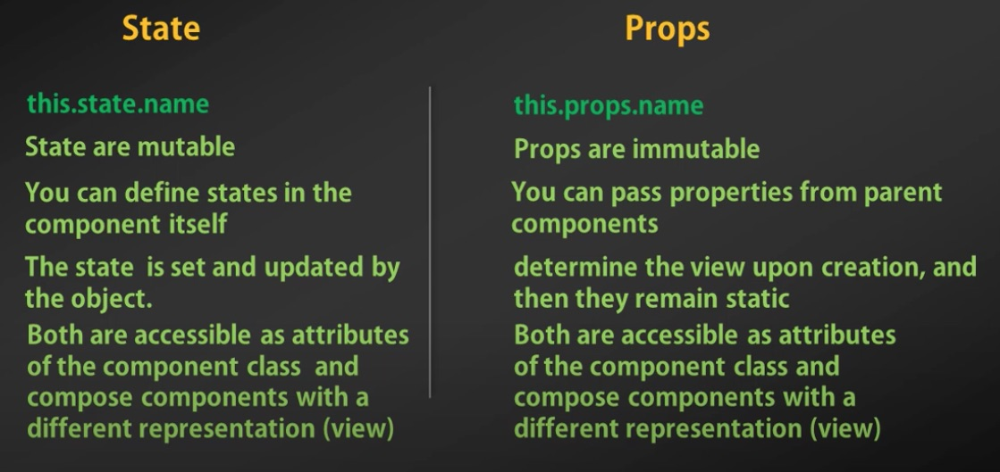

# Xây dựng React app qua các component
Trong bài này chúng ta sẽ chia tách một React app ra thành nhiều thành phần Component.
Ưu điểm của Component đó là khả năng:
1. Tham số hoá
2. Đóng gói, tái sử dụng
3. Đơn giản hoá ứng dụng chính App.js



Cấu trúc file
```
.
├── App.css 
├── App.js  <-- Ứng dụng chính
├── index.css
├── index.js <-- File khởi động
├── TodoBanner.js <-- Component
├── TodoCreator.js <-- Component
├── TodoRow.js <-- Component
└── VisibilityControl.js <-- Component
```

## 1. TodoBanner hiển thị tên user và số lượng task chưa hoàn thành
[TodoBanner.js](todo/src/TodoBanner.js)

Cú pháp để tạo ra React Component là kế thừa từ ```class Componenet```:
```js
  export class MyComponent extends Component
```

Các tham số truyền vào sẽ nằm trong thuộc tính ```this.props```. Trong trường hợp này:
- ```this.props.name```
- ```this.props.tasks```

```js
import React, { Component } from 'react';

export class TodoBanner extends Component {
  render = () =>
    <h4 className="bg-primary text-white text-center p-2">
      {this.props.name}'s To Do List ({this.props.tasks.filter(t => !t.done).length} items to do)
    </h4>
}
```

## 2. TodoCreator gồm text input và nút để thêm Task mới
[TodoCreator](todo/src/TodoCreator.js)
Trong TodoCreator, chúng ta thấy cả ```state``` và ```props```. Khác biệt giữa chúng là gì? 
1. State là trạng thái thay đổi được (mutable). Khi nó thay đổi thì Component được render lại
2. Props (viết tắt của properties) là thuộc tính không thể thay đổi (immutable), truyền từ Component cha vào Compnent con.

View của một Component được vẽ dựa trên cả Props và State. Để thay đổi State sử dụng ```this.setState```



Tham khảo:
1. [What is State? State Verses Props - React For Beginners](https://youtu.be/aLmwln09Tbs)
2. [State vs Props & Application Data](https://youtu.be/qh3dYM6Keuw)


```js
import React, { Component } from 'react';

export class TodoCreator extends Component {

  constructor(props) {
    super(props); 
    this.state = { newItemText: "" } 
  }

  updateNewTextValue = (event) => { 
    this.setState({ newItemText: event.target.value }); 
  }

  createNewTodo = () => { 
    this.props.callback(this.state.newItemText); 
    this.setState({ newItemText: "" }); 
  }

  render = () =>
    <div className="my-1">
      <input className="form-control" value={this.state.newItemText}
        onChange={this.updateNewTextValue} />

      <button className="btn btn-primary mt-1" onClick={this.createNewTodo}>Add</button>
    </div>
}
```

