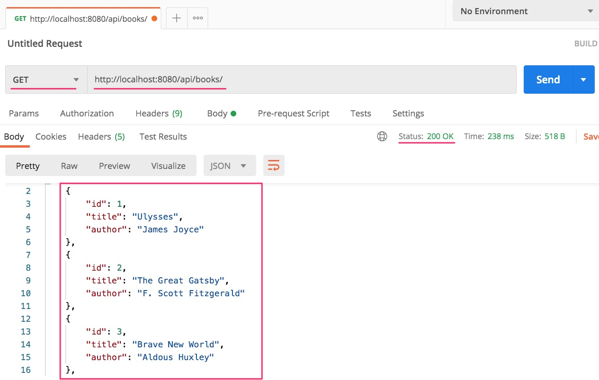
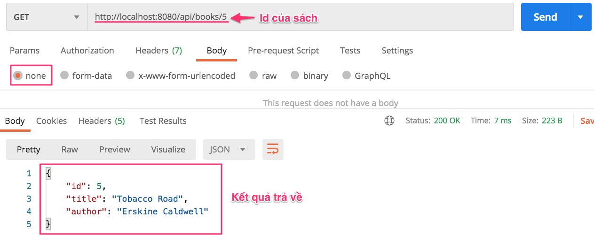
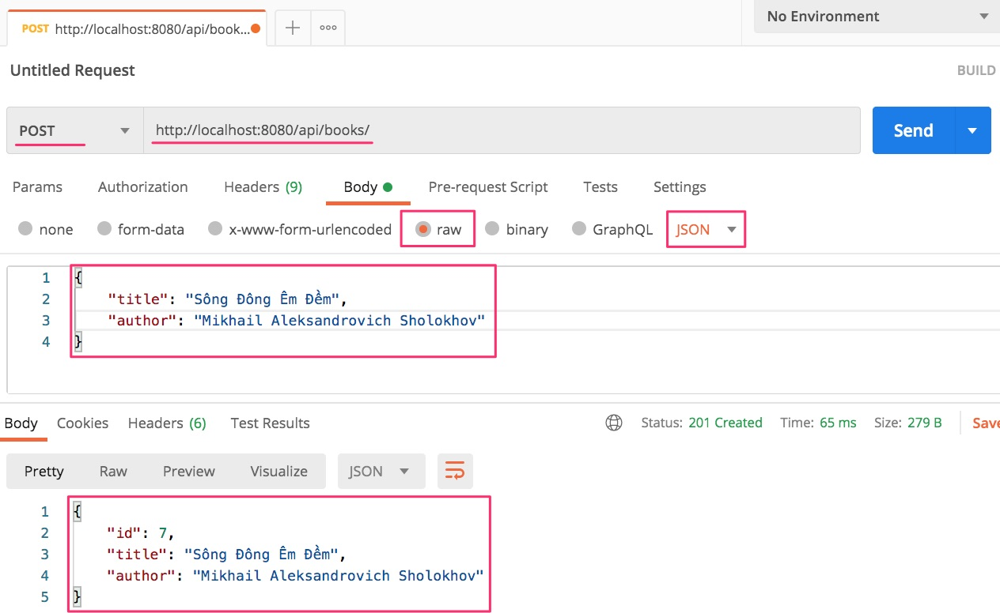
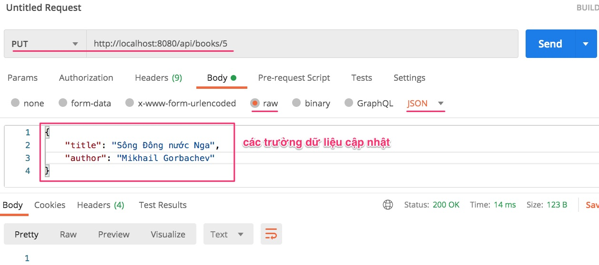
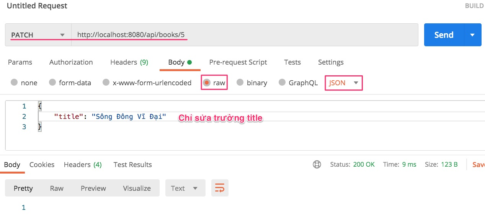
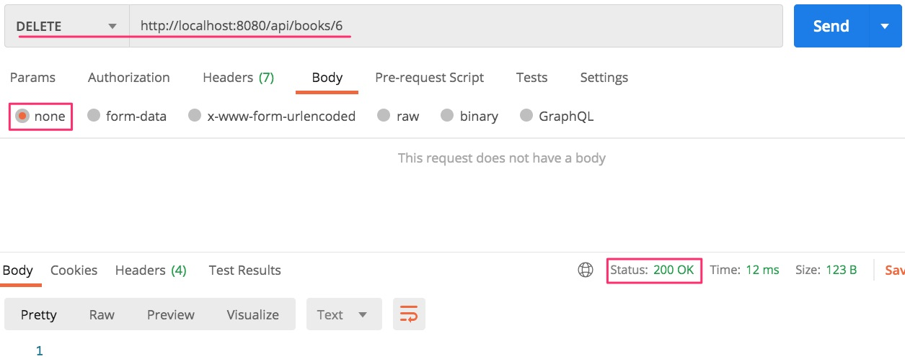

Ví dụ lập trình này để minh hoạ cho bài viết [HTTP Methods in Spring RESTful Services](https://www.dariawan.com/tutorials/rest/http-methods-spring-restful-services/). Hãy đọc kỹ bài này. Viết tiếng Anh rất trong sáng rồi, dịch lại sợ không kỹ bằng tác giả. Tôi chỉ lập trình ví dụ để các bạn chạy thử nghiệm luôn.

## Cấu trúc dự án
```
.
├── main
│   ├── java
│   │   └── vn
│   │       └── techmaster
│   │           └── bookstore
│   │               ├── controller
│   │               │   └── APIController.java  <-- Tạo REST API
│   │               ├── model
│   │               │   ├── Book.java
│   │               │   └── BookPOJO.java
│   │               ├── repository
│   │               │   └── BookRespository.java
│   │               ├── service
│   │               │   ├── BookService.java
│   │               │   └── IBookService.java
│   │               └── BookstoreApplication.java
│   └── resources
│       ├── application.properties
│       └── book.sql
```
[Book.java](src/main/java/vn/techmaster/bookstore/model/Book.java)
```java
@Entity(name = "book")
@Table(name = "book")
@Data
@NoArgsConstructor
@AllArgsConstructor
public class Book {
  @Id @GeneratedValue(strategy = GenerationType.IDENTITY)
  private Long id;

  @Column(nullable = false)
  private String title;

  @Column(nullable = true)
  private String author;

  public Book(String title, String author) {
    this.title = title;
    this.author = author;
  }
}
```

[APIController.java](src/main/java/vn/techmaster/bookstore/controller/APIController.java)
```java
@RestController  //Đánh dấu đây là REST API

@RequestMapping(value = "/api/") // Đường dẫn gốc cho controller này là /api/
public class APIController {
  @Autowired
  private IBookService bookService;  // Sẽ gọi đến BookService

}
```

### GET danh sách toàn bộ Book
Lấy danh sách các books. Lệnh này gọi nhiều lần, nhưng sẽ không thay đổi dữ liệu vì nó chỉ đọc. Gọi là Idempotent methods.
[APIController.java](src/main/java/vn/techmaster/bookstore/controller/APIController.java)
```java
@GetMapping(value = "/books")
public ResponseEntity<List<Book>> findAllBooks() {
  List<Book> books = bookService.findAll();
  return ResponseEntity.ok(books);
}
```

[BookService.java](src/main/java/vn/techmaster/bookstore/service/BookService.java)
```java
@Override
public List<Book> findAll() {
  return bookRepo.findAll();
}
```

```sh
$ curl -X GET "http://localhost:8080/api/books"

[{"id":1,"title":"Ulysses","author":"James Joyce"},{"id":2,"title":"The Great Gatsby","author":"F. Scott Fitzgerald"},{"id":3,"title":"Brave New World","author":"Aldous Huxley"},{"id":4,"title":"1984","author":"George Orwell"},{"id":5,"title":"Tobacco Road","author":"Erskine Caldwell"},{"id":6,"title":"Midnight’s Children","author":"Salman Rushdie"}]
```
Sử dụng công cụ PostMan, lựa chọn GET


### GET by id
Tìm sách theo id cụ thể nếu thành công thì trả về mã 200, còn không tìm thấy trả về lỗi 404

[APIController.java](src/main/java/vn/techmaster/bookstore/controller/APIController.java)
```java
@GetMapping("/books/{bookId}")
public ResponseEntity<Book> findBookById(@PathVariable long bookId) {
  Optional<Book> optionalBook = bookService.findById(bookId);
  if (optionalBook.isPresent()) {
    return ResponseEntity.ok(optionalBook.get()); // return 200, with json body
  } else {
    return ResponseEntity.status(HttpStatus.NOT_FOUND).body(null); // return 404, with null body
  }
}
```
[BookService.java](src/main/java/vn/techmaster/bookstore/service/BookService.java)
```java
@Override
public Optional<Book> findById(Long id) {    
  return bookRepo.findById(id);
}
```


### POST
Tạo mới bản ghi book. Mỗi lần gọi lại tạo ra bản ghi mới, dữ liệu trên server không còn đồng nhất. Đây là inidempotent method
```java
@PostMapping("/books")
public ResponseEntity<Book> addBook(@RequestBody BookPOJO book) {
  Book newBook = bookService.save(book);
  try {
    return ResponseEntity.created(new URI("/api/books/" + newBook.getId())).body(newBook);
  } catch (URISyntaxException e) {
    return ResponseEntity.status(HttpStatus.BAD_REQUEST).build();
  } 
}
```

```java
@Override
public Book save(BookPOJO book) {
  Book newBook = new Book(book.getTitle(), book.getAuthor());
  return bookRepo.save(newBook);
}
```


### PUT cập nhật hầu hết hoặc bất kỳ trường nào

Để sửa đổi toàn bộ, thay thế bản ghi. Hoặc không rõ sửa trường nào, thì gửi đối tượng chứa đủ các trường dữ liệu lên server

```java
@PutMapping("/books/{bookId}")
public ResponseEntity<Void> updateBook(@RequestBody BookPOJO book, @PathVariable long bookId) {
  try {        
    bookService.update(bookId, book);
    return ResponseEntity.ok().build();
  } catch (ResourceNotFoundException ex) {         
    return ResponseEntity.notFound().build();
  } 
}
```

```java
@Override
public void update(long id, BookPOJO book) {
  Book updatedBook = new Book(id, book.getTitle(), book.getAuthor());
  Optional<Book> optionalBook = bookRepo.findById(id);
  if (optionalBook.isPresent()) {
    bookRepo.save(updatedBook);
  } else {
    throw new ResourceNotFoundException();
  }    
}
```



## PATCH chỉ sửa một hoặc vài trường cụ thể

```java
@PatchMapping("/books/{bookId}")
public ResponseEntity<Void> updateBookTitle(@RequestBody String title, @PathVariable long bookId) {
  try {
      bookService.updateTitle(bookId, title);
      return ResponseEntity.ok().build();
  } catch (ResourceNotFoundException ex) {       
      return ResponseEntity.notFound().build();   
  }
}
```

```java
@Override
public void updateTitle(long id, String title) {
  Optional<Book> optionalBook = bookRepo.findById(id);
  if (optionalBook.isPresent()) {
    Book book = optionalBook.get();
    book.setTitle(title);
    bookRepo.save(book);
  } else {
    throw new ResourceNotFoundException();
  }
}
```



## DELETE

```java
@DeleteMapping(path="/books/{bookId}")
public ResponseEntity<Void> deleteBookById(@PathVariable long bookId) {
  try {
    bookService.deleteById(bookId);
    return ResponseEntity.ok().build();
  } catch (ResourceNotFoundException ex) {        
    return ResponseEntity.notFound().build();
}
```

```java
@Override
public void deleteById(long id) {
  Optional<Book> optionalBook = bookRepo.findById(id);
  if (optionalBook.isPresent()) {      
    bookRepo.delete(optionalBook.get());
  } else {
    throw new ResourceNotFoundException();
  }
}
```

