# OpenAPI để tạo văn bản chú thích cho REST API

Thực tế ngày hôm nay, nhiều sản phẩm, ứng dụng Spring Boot đã chuyển sang mô hình Single Page App, Mobile App nối vào REST API. Với doanh nghiệp lớn, mô hình ứng dụng phức tạp, người ta chuyển dần sang microservice.

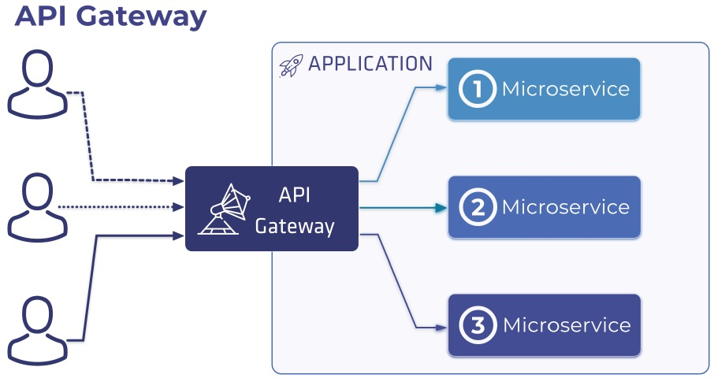

Trong mô hình này, vai trò của lập trình viên back end và front end rất rõ ràng. Lập trình viên back end tập trung vào xử lý thao tác dữ liệu, kết nối đến các dịch vụ phía sau. Còn lập trình viên front end cần những kỹ năng code HTML, CSS, JavaScript hoặc  IOS, Android, Flutter hay React Native.

Để hai nhóm lập trình viên này có thể nói chuyện được với nhau, phía front end cần giải thích trình bày mock up giao diện để lập trình viên back end hình dung ra luồng ứng dụng chạy. Còn lập trình viên back end phải document rõ ràng, chi tiết API mình đang xây dựng để lập viên front end kết nối đến.

Trong mô hình Continous Development - Continous Integration, thì phần back end luôn phải cung cấp văn bản cập nhật nhất. Swagger, Open API là các kỹ thuật để tạo ra văn bản mô tả API rất tiện lợi.
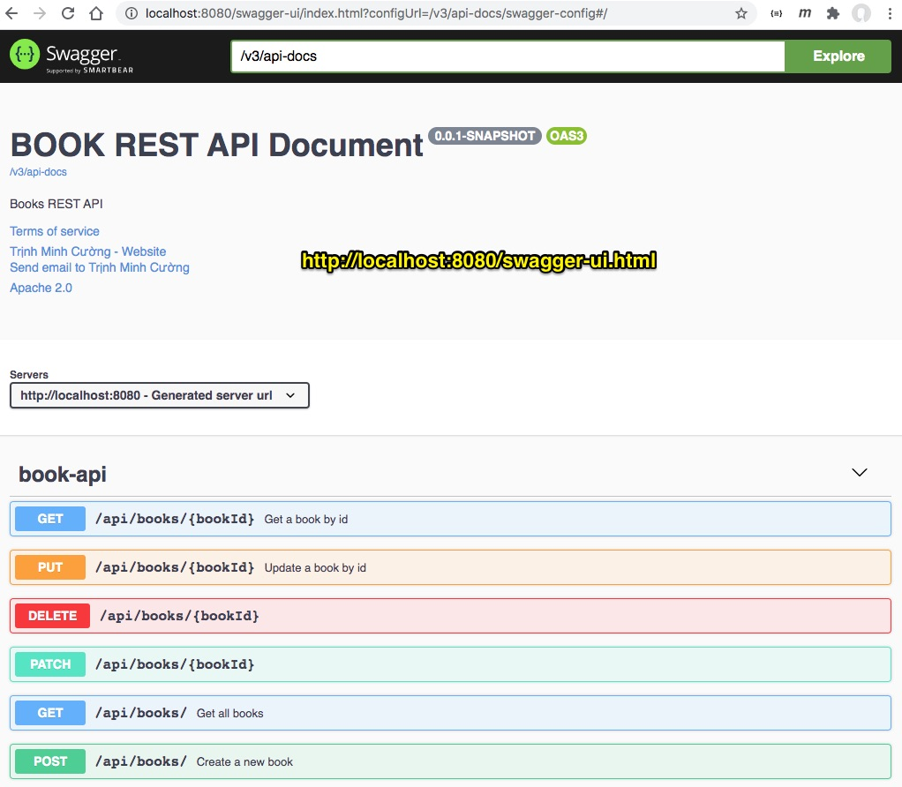

## Thực hành từng bước

### 1. Bổ xung dependency vào pom
Bổ xung dependency vào [pom.xml](pom.xml):
```xml
<dependency>
  <groupId>org.springdoc</groupId>
  <artifactId>springdoc-openapi-ui</artifactId>
  <version>1.5.5</version>
</dependency>
```

### 2. Chạy ứng dụng
Truy cập vào địa chỉ [http://localhost:8080/swagger-ui.html](http://localhost:8080/swagger-ui.html)

### 3. Bổ xung mô tả cho từng phương thức
Để có một mô tả chi tiết như hình dưới đây

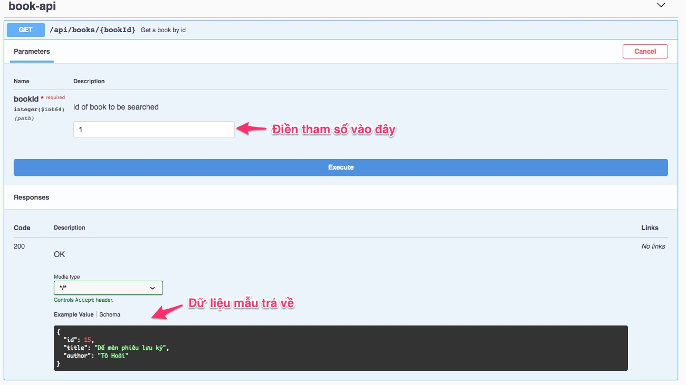

- ```@Operation(summary = "Get a book by id")``` : Mô tả tên phương thức, sẽ được OpenAPI trích xuất
- ```@Parameter(description = "id of book to be searched")```: Mô tả tên tham số sẽ được OpenAPI trích xuất
```java
@GetMapping("/{bookId}")
@Operation(summary = "Get a book by id")
public ResponseEntity<Book> findBookById(
  @Parameter(description = "id of book to be searched")
  @PathVariable long bookId) {
  Optional<Book> optionalBook = bookService.findById(bookId);
  if (optionalBook.isPresent()) {
    return ResponseEntity.ok(optionalBook.get()); // return 200, with json body
  } else {
    return ResponseEntity.status(HttpStatus.NOT_FOUND).body(null); // return 404, with null body
  }
}
```

### 4. Làm sao để có mô tả ràng buộc và dữ liệu mẫu?
Nếu OpenAPI chỉ trích xuất kiểu dữ liệu cho từng trường thì chưa đủ. Để front end developer dễ hình dùng hơn, cần phải mô tả ràng buộc (buộc phải có, độ dài trường...) và dữ liệu mẫu.

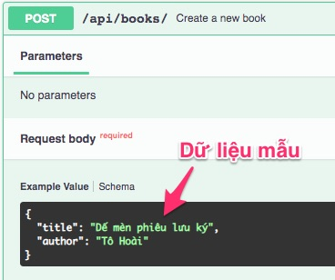

Xem mô tả trong file [BookPOJO.java](src/main/java/vn/techmaster/bookstore/model/BookPOJO.java)

Hãy sử dụng các annotation:
- ```@NotBlank```: không được rỗng
- ```@Size(min = 5, max = 400, message = "Tên sách từ 4 đến 400 ký tự")```: số lượng ký tự min và max. Tham số message dùng để báo lỗi khi dữ liệu phạm quy.
```java
@Data
public class BookPOJO {
  @NotBlank
  @Size(min = 5, max = 400, message = "Tên sách từ 4 đến 400 ký tự")
  @Schema(description = "Tên sách", example = "Dế mèn phiêu lưu ký", required = true)
  private String title;

  @NotBlank
  @Size(min = 5, max = 200)
  @Schema(description = "Tác giả", example = "Tô Hoài", required = true)
  private String author;
}
```

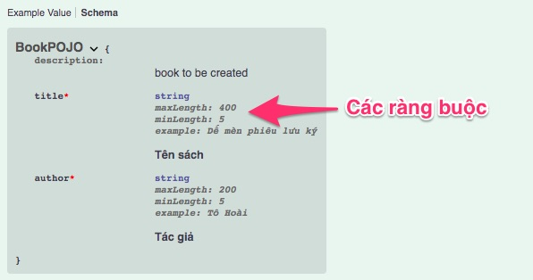

Thêm ví dụ Validation Annotations. Tham khảo bài này [Java Bean Validation Basics](https://www.baeldung.com/javax-validation)

```java
public class User {

    @NotNull(message = "Name cannot be null")
    private String name;

    @AssertTrue
    private boolean working;

    @Size(min = 10, max = 200, message 
      = "About Me must be between 10 and 200 characters")
    private String aboutMe;

    @Min(value = 18, message = "Age should not be less than 18")
    @Max(value = 150, message = "Age should not be greater than 150")
    private int age;

    @Email(message = "Email should be valid")
    private String email;
}
```

Thêm ví dụ về annotation ```@Schema``` ở file [Contact.java](src/main/java/vn/techmaster/bookstore/model/Contact.java)

```java
public class Contact implements Serializable { 
  @Schema(description = "Unique ID of Contact.", example = "1", required = true)
  @Id
  @GeneratedValue(strategy=GenerationType.IDENTITY)
  private Long id;
  
  @Schema(description = "Full name of contact.", example = "Trịnh Minh Cường", required = true)
  @NotBlank
  @Size(max = 100)
  private String name;
  
  @Schema(description = "Mobile contact", example = "0902209011", required = false)
  @Pattern(regexp ="^\\+?[0-9]{10,11}$", message = "Mobile")
  @Size(min=10, max = 11)
  private String phone;
  
  @Schema(description = "Email of contact", example = "cuong@techmaster.vn", required = false)
  @Email(message = "Email Address")
  @Size(max = 100)
  private String email; 
}
```

### 5.  Bổ xung thông tin tổng quan cho OpenAPI

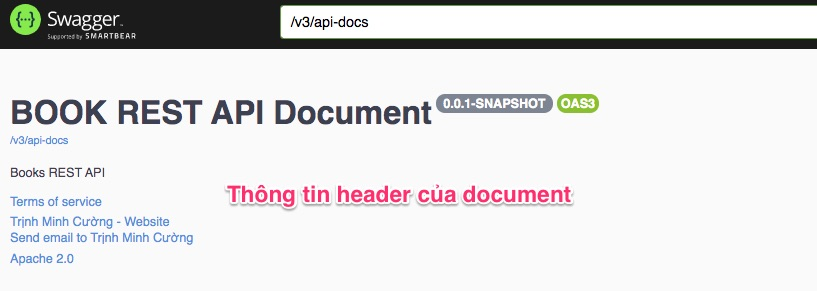

Xem file [OpenAPIConfig.java](src/main/java/vn/techmaster/bookstore/config/OpenAPIConfig.java)

```java
@Bean
public OpenAPI customOpenAPI(
    @Value("${application-description}") String appDesciption,
    @Value("${application-version}") String appVersion) {

  return new OpenAPI()
    .info(new Info().title("BOOK REST API Document")
    .version(appVersion)
    .contact(new Contact().name("Trịnh Minh Cường").email("cuong@techmaster.vn").url("https://techmaster.vn"))
    .description(appDesciption)
    .termsOfService("http://swagger.io/terms/")
    .license(new License().name("Apache 2.0")
    .url("http://springdoc.org")));
}
```

Hai thuộc tính ```application-description``` và ```application-version``` được lấy từ [application.properties](src/main/resources/application.properties) inject qua tham số phương thức tạo Bean

```
application-description=@project.description@
application-version=@project.version@
```

Các tham số còn lại cũng dễ hiểu.

### 6. Chỉ định OpenAPI bỏ qua một phương thức REST API
Cũng có lúc chúng ta muốn ẩn đi secret API, hoặc API đã cũ (deprecated) hoặc API đang ở beta testing. Chúng ta không muốn OpenAPI hiển thị document những API này.

Trong annotation ```@Operation``` hãy thêm tham số ```hidden = true``` như đoạn code dưới.

```java
@Operation(summary = "Beta API method, đang kiểm thử", hidden = true)
@GetMapping(value = "/top5")
public ResponseEntity<List<Book>> getTop5Books() {
  List<Book> books = bookService.findAll();
  List<Book> top5books = books.stream().limit(5).collect(Collectors.toList());
  return ResponseEntity.ok(top5books);
}
```

### 7. Gom nhóm cụm các API cùng chức năng
Một ứng dụng Spring Boot có thể có nhiều model, hay domain dịch vụ khác nhau, nếu liệt kê hết trong một trang thì rất rối rắm. Chúng ta nên gom những phương thức REST thuộc cùng một domain lại thì sẽ dễ hiểu, dễ đọc hơn. Trong ví dụ này, tôi có 2 models [Book.java](src/main/java/vn/techmaster/bookstore/model/Book.java) và [Contact.java](src/main/java/vn/techmaster/bookstore/model/Contact.java), tương ứng có 2 REST Controller [BookAPI.java](src/main/java/vn/techmaster/bookstore/controller/BookAPI.java) và [ContactAPI.java](src/main/java/vn/techmaster/bookstore/controller/ContactAPI.java).

Trong file [OpenAPIConfig.java](src/main/java/vn/techmaster/bookstore/config/OpenAPIConfig.java), tôi bổ xung thêm 2 bean:

```java
@Bean
public GroupedOpenApi bookOpenApi() {  //Phục vụ cho domain Book
  String paths[] = {"/api/books/**"};  //có thể chứa nhiều đường dẫn
  return GroupedOpenApi.builder().group("books").pathsToMatch(paths)
        .build();
}

@Bean
public GroupedOpenApi contactOpenApi() { //Phục vụ cho domain Contact
  String paths[] = {"/api/contacts/**"};
  return GroupedOpenApi.builder().group("contacts").pathsToMatch(paths)
        .build();
}
```
Giờ bạn có thể chọn xem nhóm REST API cùng một domain

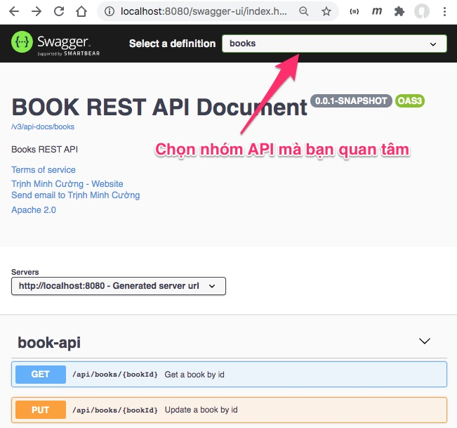

## Bonus: HAL Explorer

HAL viết tắt của cụm từ Hypertext Application Language. Nếu chúng ta tạo ra REST API cần có một cơ chế để giúp lập trình viên phía client tìm hiểu, khám phá các phương thức REST API. Để dùng HAL Explorer hãy bổ xung vào [pom.xml](pom.xml)
```xml
<dependency>
  <groupId>org.springframework.data</groupId>
  <artifactId>spring-data-rest-hal-explorer</artifactId>
</dependency>
```

Sau đó truy cập vào địa chỉ này [http://localhost:8080/explorer](http://localhost:8080/explorer)

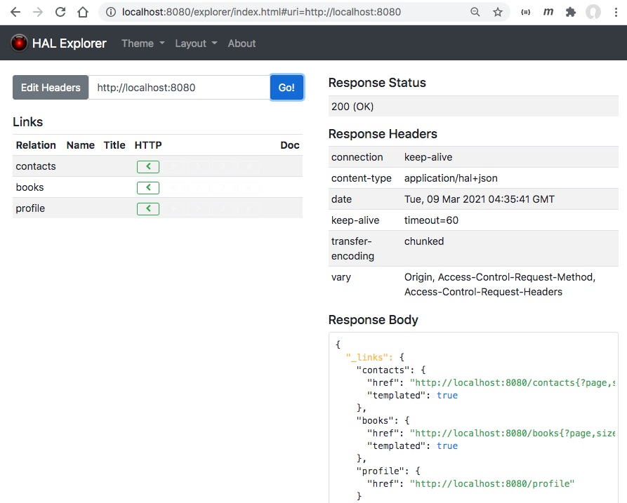

Lấy danh sách Books

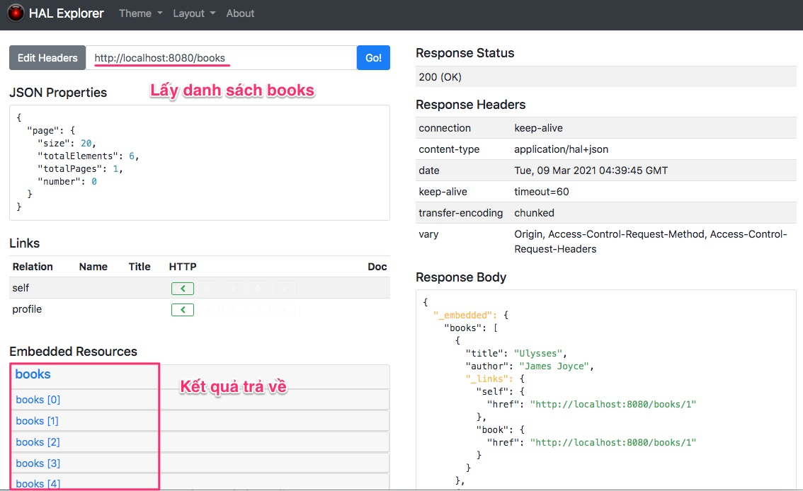

Có thể thao tác : Thêm, Sửa, Xoá bản ghi qua giao diện của HAL Explorer

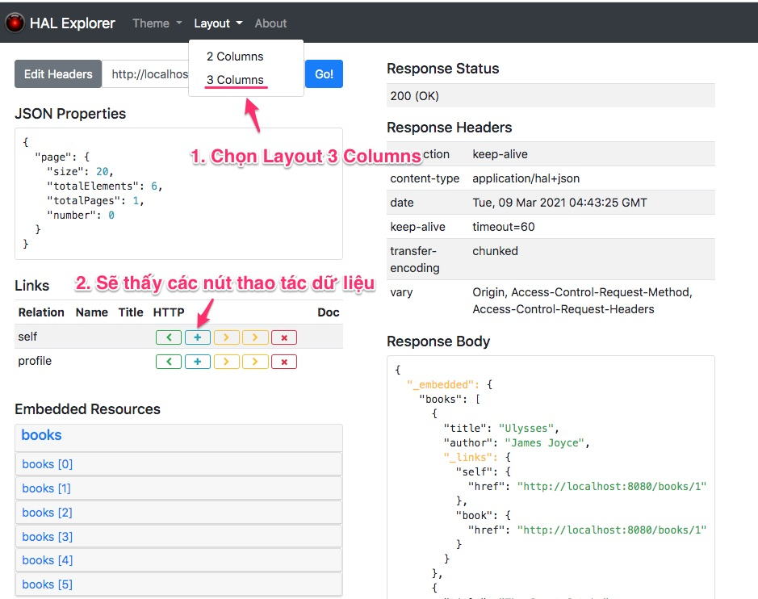

Thêm mới một bản ghi
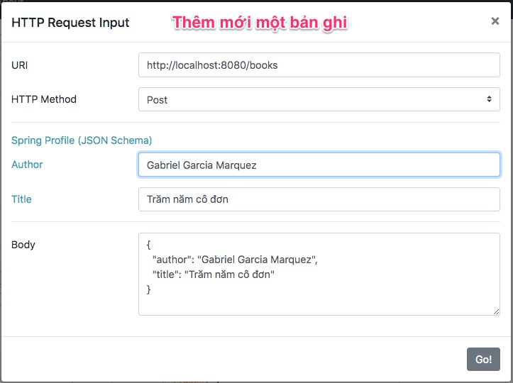