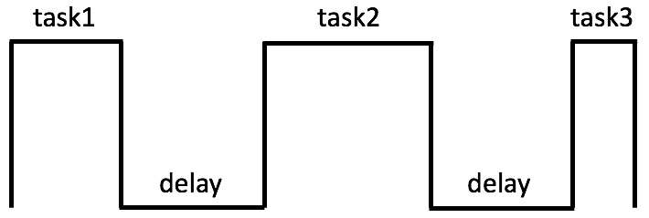
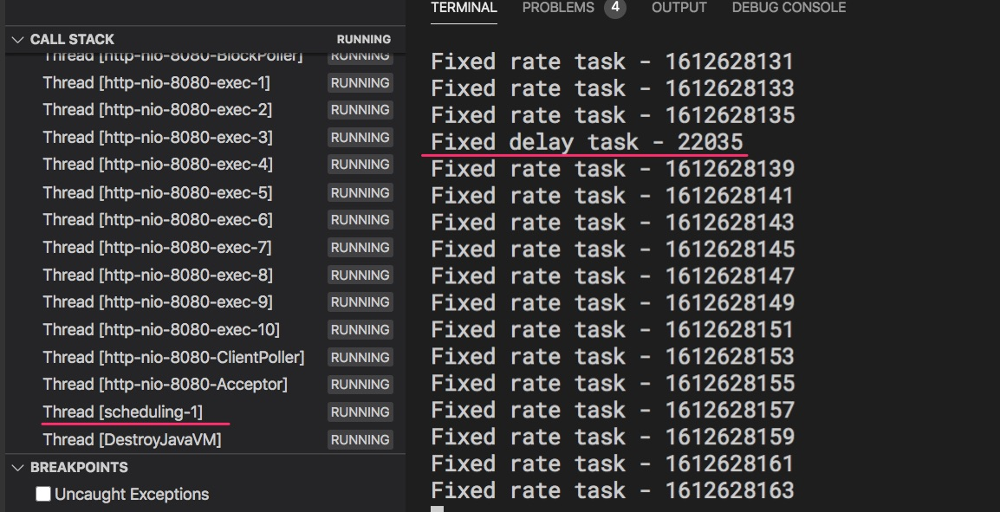
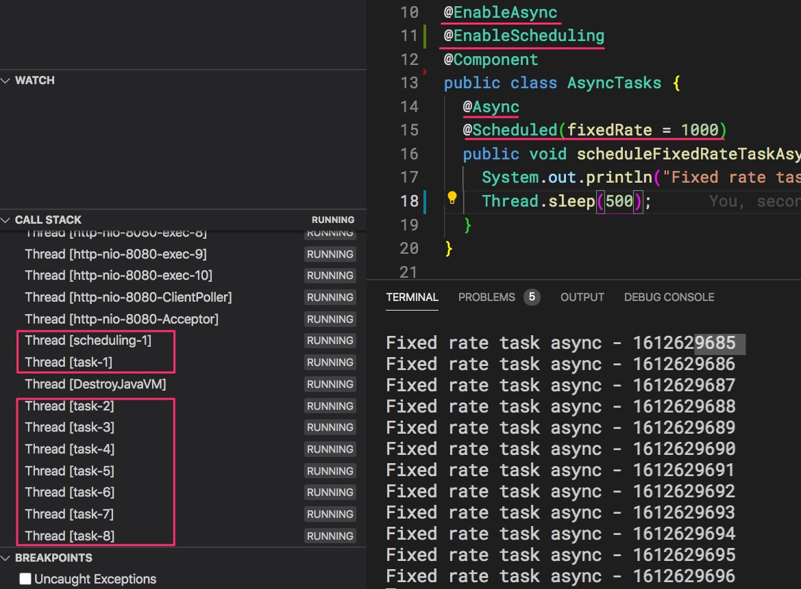

# Chạy tác vụ định thời trong Spring Boot

## Tình huống thực tế
Chúng ta quen với mô hình trình duyệt yêu cầu - web app trả lời (request - response). Tuy nhiên có những trường hợp chúng ta phải chạy các tác vụ định thời:
1. Cuối ngày tổng hợp báo cáo doanh thu gửi cho giám đốc.

2. Mua dịch vụ API trả về tỷ giá tiền tệ. Dịch vụ này mỗi ngày cập nhật 1 lần. Nếu thuần tuý nhận yêu cầu từ người dùng, rồi gọi thẳng lên dịch vụ API thì tốc độ vừa chậm, mà chi phí trả số lượng truy cập dịch vụ cao không cần thiết. Chỉ cần tạo tác vụ định thời mỗi ngày lấy dữ liệu ở dịch vụ API một lần rồi lưu tạm (caching) tại web server. Tốc độ phục vụ vừa nhanh, vừa tiết kiệm số tiền trả thuê bao dịch vụ API !

3. Dọn dẹp server. Khách hàng upload ảnh lên server để nhận dạng ảnh. Sau mỗi ngày số lượng tăng lên khủng khiếp. Khách hàng dùng thử chỉ có thể xem ảnh sau 24 giờ. Vậy cần có một tác vụ xoá toàn bộ ảnh do người dùng thử dịch vụ upload tồn tại quá 24 giờ.

4. Ứng dụng IOT. Chúng ta lập trình một Spring Boot web app để hiển thị tất cả thông số nhiệt độ - độ ẩm của một toà nhà. Cần có một tác vụ cứ mỗi giây kết nối đến các bộ điều khiển cảm biến để thu thập các thông số.

## Schedule Task
Để tạo ra các tác vụ định thời, chúng ta đánh dấu các Bean bằng ```@EnableScheduling```.
Trong ví dụ này tôi tạo ra nhiều kiểu tác vụ khác nhau do đó để các tác vụ không cùng chạy chồng chéo lên nhau tôi dùng thêm ```@ConditionalOnExpression("true")``` khi muốn cho phép tác vụ chạy bằng cách nạp Bean vào Application Context. Ngược lại ```@ConditionalOnExpression("false")``` sẽ vô hiệu hoá Bean, có nghĩa là cũng tắt luôn tác vụ định thời.

Trong một class bạn có thể định nghĩa nhiều phương thức định thời.


### Fixed Delay Task

Thời gian mỗi tác vụ chạy có thể thay đổi, nhưng khoảng thời gian trễ giữa các tác vụ luôn cố định.

```java
@Component
@EnableScheduling  //Đánh dấu đấy là component chưa tác vụ định thời
@ConditionalOnExpression("true")  //"true": Nạp component này vào ApplicationContext. "false": không nạp, hoặc vô hiệu hoá class này
public class FixedDelayTasks {
  private long timeOfLastTask = System.currentTimeMillis();

  @Scheduled(fixedDelay = 1000)
  public void scheduleFixedDelayTask() throws InterruptedException {
    long delay = System.currentTimeMillis() - timeOfLastTask; // Tính độ trễ
    System.out.println("Fixed delay task - " + delay);

    Random random = new Random();
    int sleepTime = random.nextInt(5) * 1000;
    Thread.sleep(sleepTime); //Giả lập thời gian thực hiện task khác nhau


    timeOfLastTask = System.currentTimeMillis();
  } 
}
```
Ứng dụng trên in ra thời gian trễ giữa các tác vụ xấp xỉ 1000 milliseconds
```
Fixed delay task - 1005
Fixed delay task - 1005
Fixed delay task - 1002
Fixed delay task - 1005
Fixed delay task - 1001
Fixed delay task - 1001
Fixed delay task - 1000
```
### Fixed Rate Task

Tác vụ định thời kiểu này, cứ cách đúng 1 khoảng thời gian (fixed rate) là chạy. Nếu tác vụ trước chạy quá lâu, thì tác vụ sau chờ thêm đến điểm là bội số nhỏ nhất của fixed rate rồi chạy.

Đoạn code dưới đây định thời 1 giây là chạy tác vụ. Tuy nhiên mỗi tác vụ kéo dài 2 giây. Do đó thời điểm thực tế các tác vụ chạy cách nhau 2 giây.

```java
@Component
@EnableScheduling
@ConditionalOnExpression("true")
public class FixedRateTasks {
  @Scheduled(fixedRate = 1000)
  public void scheduleFixedRate() throws InterruptedException {
    System.out.println("Fixed rate task - " + System.currentTimeMillis() / 1000);
    Thread.sleep(2000);
  }
}
```

```
Fixed rate task - 1612624012
Fixed rate task - 1612624014
Fixed rate task - 1612624016
Fixed rate task - 1612624018
Fixed rate task - 1612624020
```

Nếu chạy cả 2 tác vụ định thời tần suất thực thi quá dày đặc, sẽ xảy ra trường hợp một tác vụ không còn đủ tài nguyên để chạy. Nhìn hình trên Spring Boot chỉ cấp một thread để chạy các tác vụ.  



### Async Task
Nếu như Fixed Rate và Fixed Delay chỉ sử dụng 1 thread duy nhất để thực thi. Thì Async Task sử dụng nhiều thread để thực thi các tác vụ định thời mà không phải chờ đợi nhau.


 Đoạn code này định thời cứ 1 giây (1000 milliseconds) là chạy tác vụ. Nhưng mỗi tác vụ kéo dài những 2 giây. Nếu không có async, thì các tác vụ cách nhau 2 giây một lần. Nhờ có Async mà có vài thread được tạo ra để đảm bảo cách tác vụ chạy cách nhau đúng 1 giây.

```java
@EnableAsync //Bật chế độ Async
@EnableScheduling
@ConditionalOnExpression("true")
@Component
public class AsyncTasks {
  @Async //Đánh dấu tác vụ này sẽ không chạy tuần tự mà chạy bất đồng bộ
  @Scheduled(fixedRate = 1000)
  public void scheduleFixedRateTaskAsync() throws InterruptedException {
    System.out.println("Fixed rate task async - " + System.currentTimeMillis() / 1000);
    Thread.sleep(2000); //giả lập thời gian chạy mỗi tác vụ là 2 giây
  }
}
```


## Cron Task
Nếu chúng ta cần định thời trong khoản thời gian dài hơn: ngày, tháng, giờ.... thì nên dùng cron task. Cron task được định thời theo biểu thức truyền vào tham số cron:
```java
@Scheduled(cron = "*/5 * * * * ?")
```

```java
@Component
@EnableScheduling
@ConditionalOnExpression("false")
public class CronJob { 
  @Scheduled(cron = "*/5 * * * * ?")
  public void cronJobTask() {
    Timestamp timestamp = new Timestamp(System.currentTimeMillis());
    System.out.println(timestamp);
  } 
```
Cú pháp biểu thức cron gồm các tham số cách nhau bằng khoảng trắng. Để hình dung được cú pháp của cron task hãy vào web site này [https://crontab.guru/](https://crontab.guru/) hoặc vào đây [Cron Expression Generator & Explainer - Quartz](https://www.freeformatter.com/cron-expression-generator-quartz.html)


