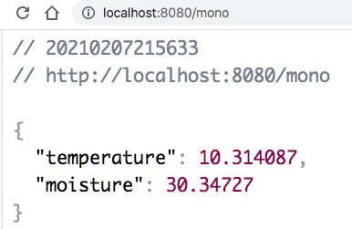
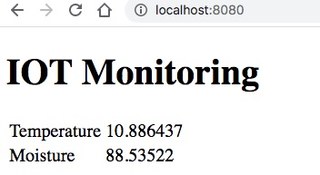
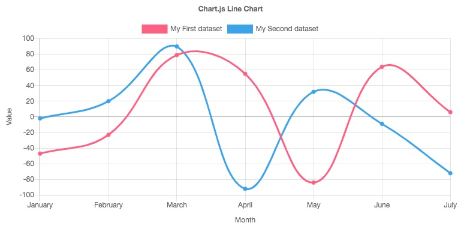

# Giả lập hệ thống IOT đo nhiệt độ và độ ẩm

Giả sử chúng ta nhận được một hợp đồng xây dựng hệ thống quan sát nhiệt độ và độ ẩm của một trang trại cho khách hàng Nhật. Thiết bị phần cứng khách hàng đang phát triển chưa thể gửi sang Việt nam. Khách hàng cần demo sản phẩm ngay trong vòng 1 tuần kể từ khi ký hợp đồng. Nếu ưng họ làm tiếp, không thì dừng hợp đồng, họ kiếm đối tác khác.

Cái khó của chúng ta là không có thiết bị phần cứng IOT thật, không rõ quy mô trang trại như thế nào. Khách hàng chỉ cho biết hệ thống phần cứng sẽ thu thập dữ liệu từ cảm biến chu kỳ mỗi giây một lần. Rồi làm đi !

Trong trường hợp này, chúng ta phải chủ động viết ứng dụng có một tác vụ định thời 1 giây sinh ra dữ liệu ngẫu nhiên nhiệt độ và độ ẩm trả về ở đường dẫn http://localhost

## Các bước thực hiện

### Cấu trúc dự án
```
.
├── java
│   └── vn
│       └── techmaster
│           └── iot
│               ├── controller
│               │   ├── reponse
│               │   │   └── IOTMeasure.java  <-- Cấu trúc dữ liệu lưu nhiệt độ, độ ẩm
│               │   ├── HomeController.java  <-- Trả về các Thymeleaf View
│               │   └── IOTController.java  <-- Trả REST API
│               ├── service
│               │   └── IOTService.java  <-- Dịch vụ thu thập dữ liệu từ cảm biến
│               └── IotApplication.java
└── resources
    ├── static
    ├── templates
    │   └── index.html <-- Trang HTML giao diện chính
    └── application.properties
```
### [IOTService](src/main/java/vn/techmaster/iot/service/IOTService.java)
IOTService sẽ là nơi kết nối các thiết bị IOT để đọc nhiệt độ và độ ẩm định kỳ một giây một lần. Nhưng vì chưa có thiết bị bên Nhật gửi sang, nên dùng ```@Scheduled(fixedRate = 1000)``` để sinh ngẫu nhiên dữ liệu !

```java
@Service
@EnableScheduling  //Cho phép tác vụ định thời chạy
public class IOTService {
  private float temperature;  //Lưu nhiệt độ hiện tại
  private float moisture; //Lưu độ ẩm hiện tại

  //Hàm này giả lập nhiệt độ từ 10 đến 40 độ C. Khi nào có phần cứng thật thì
  public float measureTemperature() {
    float lowTemp = 10F;
    float highTemp = 40F;
    float newTemp = temperature + (new Random().nextFloat() - 0.5F) * 5F;

    newTemp = newTemp < lowTemp ? lowTemp : newTemp;
    newTemp = newTemp > highTemp ? highTemp: newTemp;
    return newTemp;
  }

  //Hàm này giả lập độ ẩm từ 30% đến 100%
  public float measureMoisture() {
    float lowMoisture = 30F;
    float highMoisture = 100F;
    float newMoisture = moisture + (new Random().nextFloat() - 0.5F) * 10F;

    newMoisture = newMoisture < lowMoisture ? lowMoisture : newMoisture;
    newMoisture = newMoisture > highMoisture ? highMoisture: newMoisture ;
    return newMoisture;

  }

  //Phương thức này cứ 1000 milliseconds thì sinh ngẫu nhiên nhiệt độ và độ ẩm
  @Scheduled(fixedRate = 1000)
  public void collectMeasureDataAtFixedRate() throws InterruptedException {
    temperature = measureTemperature();
    moisture = measureMoisture();
  }

  //Phương thức này trả về dữ liệu
  public IOTMeasure getData() {
    return new IOTMeasure(temperature, moisture);
  }
}
```

### [IOTController.java](src/main/java/vn/techmaster/iot/controller/IOTController.java)
Đây là REST Controller phục vụ REST API. Nó có 2 phương thức cùng trả về dữ liệu giống nhau nhưng cách thức hoạt động khác nhau.

```java
@RestController
public class IOTController {

  @Autowired private IOTService iotService;  // Nối đến IOTService
  
  @GetMapping("/iot")
  public IOTMeasure getIOTMeasure() { // Hàm này dạng request response blocking cổ điển
    return iotService.getData();
  }

  @GetMapping("/mono")
  public Mono<IOTMeasure> getIOTMeasureMono() {  //Sử dụng Mono của WebFlux
    return Mono.just(iotService.getData());
  }
  
}
```

Chúng ta bắt đầu làm quen với WebFlux một cơ chế cho phép Spring Boot REST API hoạt động theo cơ chế non-blocking. Đọc thêm [Web on Reactive Stack](https://docs.spring.io/spring-framework/docs/current/reference/html/web-reactive.html)

Để dùng Web Flux cần bổ xung vào [pom.xml](pom.xml)
```xml
<dependency>
    <groupId>org.springframework.boot</groupId>
    <artifactId>spring-boot-starter-webflux</artifactId>
</dependency>
```

Dữ liệu trả về khi truy xuất http://localhost:8080/mono



Hãy ấn F5 liên tục để thấy dữ liệu thay đổi

### jQuery kết nối vào REST API
Hãy xem file [index.html](src/main/resources/templates/index.html)

Phần cấu trúc HTML
```html
<h1>IOT Monitoring</h1>
<table>
<tr>
    <td>Temperature</td>
    <td><span id="temperature"></span></td>
</tr>
<tr>
    <td>Moisture</td>
    <td><span id="moisture"></span></td>
</tr>
</table>
```

Phần JavaScript, jQuery gọi AJAX
```javascript
<script src="https://ajax.googleapis.com/ajax/libs/jquery/3.5.1/jquery.min.js"></script>
<script>
$(document).ready(() => {
    setInterval(() => {  //Hàm định thời 1 giây chạy 1 lần
    $.get("http://localhost:8080/mono", (data, status) => {
        if (status == "success") {  //Nếu thành công thì điền dữ liệu vào 2 thẻ span
            $("#temperature").text(data.temperature);
            $("#moisture").text(data.moisture);
        }
    });
    }, 1000);
});
</script>
```
Và đây là kết quả



### Nâng cấp thư viện [chartjs](https://www.chartjs.org/) để vẽ đồ thị biến đổi nhiệt độ và độ ẩm




## Tham khảo
1. [Spring WebFlux WebSocket with Vue.js](http://kojotdev.com/2019/08/spring-webflux-websocket-with-vue-js/)
2. [Scheduled WebSocket Push with Spring Boot](https://www.baeldung.com/spring-boot-scheduled-websocket)
3. [https://www.chartjs.org/](https://www.chartjs.org/)