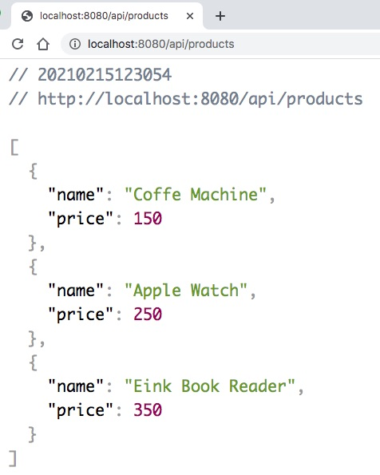
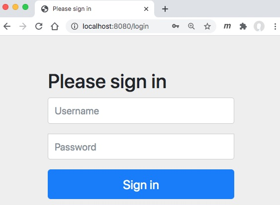
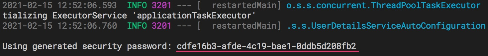

# Spring Security căn bản

Trong bài này thực hành này, chúng ta làm quen với Spring Boot Security theo thứ tự:

- Chưa có dependency ```spring-boot-starter-security```
- Sau khi bổ xung dependency ```spring-boot-starter-security```


### 1. Tạo dự án Spring Boot
Tạo dự án Spring Boot với 3 dependencies căn bản:
1. spring-boot-starter-web
2. spring-boot-devtools
3. spring-boot-starter-test (mặc định có)

Nội dung [pom.xml](pom.xml) sẽ như sau:
```xml
<dependencies>
  <dependency>
    <groupId>org.springframework.boot</groupId>
    <artifactId>spring-boot-starter-web</artifactId>
  </dependency>
  <dependency>
    <groupId>org.springframework.boot</groupId>
    <artifactId>spring-boot-devtools</artifactId>
    <scope>runtime</scope>
    <optional>true</optional>
  </dependency>
  <dependency>
    <groupId>org.springframework.boot</groupId>
    <artifactId>spring-boot-starter-test</artifactId>
    <scope>test</scope>
  </dependency>
</dependencies>
```
### 2. Tạo REST Controller

Xem [APIController.java](src/main/java/vn/techmaster/simpleauthen/controller/APIController.java)

```java
@RestController

@RequestMapping("/api")
public class APIController {

  @GetMapping("/products")
  public List<Product> getProducts() {
    List<Product> result = new ArrayList<>();
    result.add(new Product("Coffe Machine", 150));
    result.add(new Product("Apple Watch", 250));
    result.add(new Product("Eink Book Reader", 350));
    return result;
  }
}
```

Truy cập vào [http://localhost:8080/api/products](http://localhost:8080/api/products), bạn sẽ thấy dữ liệu JSON trả về như sau



### 3. Bổ xung dependency ```spring-boot-starter-security```

```xml
<dependency>
  <groupId>org.springframework.boot</groupId>
  <artifactId>spring-boot-starter-security</artifactId>
</dependency>
```
Khởi động lại ứng dụng và thử vào lại [http://localhost:8080/api/products](http://localhost:8080/api/products), bạn sẽ thấy



Lúc này bạn chả có thể nhập bất kỳ user / pass nào để truy cập được tài nguyên nữa.

## 4. Sử dụng password tự sinh

Hãy để ý trong log của IDE khi chạy Spring Boot




Điền vào login dialog, cặp Username và Password như sau:
```
user
cdfe16b3-afde-4c19-bae1-0ddb5d208fb2
```

Chú ý: password tự sinh ở máy tính của bạn chắc chắn sẽ khác. Do đó phải copy từ terminal log của IDE.

Khi cung cấp đúng Username/password thì bạn sẽ lại xem được dữ liệu ở địa chỉ [http://localhost:8080/api/products](http://localhost:8080/api/products)

## 5. Sử dụng lệnh curl
Nếu sử dụng Terminal, thì bạn dùng lệnh curl với tham số -u
```sh
$ curl -u user:cdfe16b3-afde-4c19-bae1-0ddb5d208fb2 http://localhost:8080/api/products

[{"name":"Coffe Machine","price":150},{"name":"Apple Watch","price":250},{"name":"Eink Book Reader","price":350}]%
```

## 6. Lập trình thêm user và pass thay cho user mặc định, pass tự sinh

Tạo mới [SecurityConfig.java](src/main/java/vn/techmaster/simpleauthen/security/SecurityConfig.java)

Chú ý đây là cách tối giản, ít bảo mật nhất để thêm chức năng authentication. Chúng ta chỉ sử dụng ```InMemoryUserDetailsManager``` và tạo một user. Đồng thời sử dụng ```NoOpPasswordEncoder``` không phải là thư viện mã hoá password an toàn, nó chỉ phục vụ mục đích thử nghiệm cơ chế authentication thôi.

```java
package vn.techmaster.simpleauthen.security;

import org.springframework.context.annotation.Bean;
import org.springframework.context.annotation.Configuration;
import org.springframework.security.core.userdetails.User;
import org.springframework.security.core.userdetails.UserDetailsService;
import org.springframework.security.crypto.password.NoOpPasswordEncoder;
import org.springframework.security.crypto.password.PasswordEncoder;
import org.springframework.security.provisioning.InMemoryUserDetailsManager;

@Configuration
public class SecurityConfig {
  @Bean
  public UserDetailsService userDetailsService() {
    var userDetailsService = new InMemoryUserDetailsManager(); //Tạo đối tượng quản lý danh sách user sử dụng memory

    var user = User.withUsername("tom@gmail.com").password("abc").
    authorities("read").build(); //Tạo một user

    userDetailsService.createUser(user); //Gắn vào userDetailsService
    return userDetailsService;
  }

  @Bean
  public PasswordEncoder passwordEncoder() {    
    return NoOpPasswordEncoder.getInstance();
  }
}
```

Giờ thì bạn có thể truy cập tài nguyên sử dụng ```{Username: tom@gmail.com, Password: abc}```

