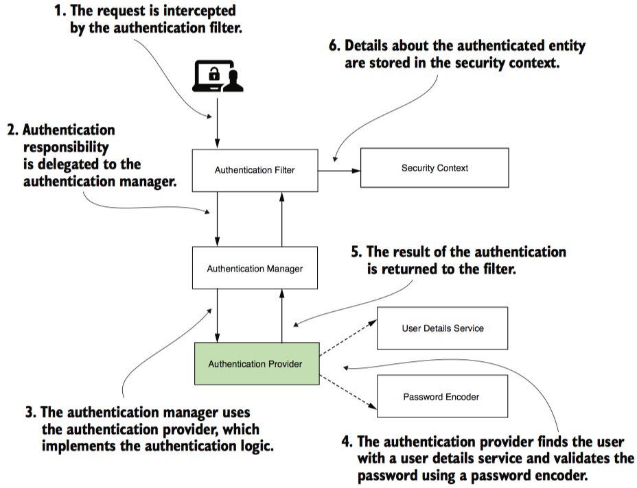

# Spring Security : customize AuthenticationProvider

Ở bài trước, chúng ta học rất nhiều thứ:

1. Tìm hiểu cơ chế authentication http basic, khác gì với http.formLogin
2. Tạo nhiều user trong ```InMemoryUserDetailsManager```
3. Sử dụng BCryptPasswordEncoder thay cho NoOpPasswordEncoder
4. Tiến xa là tuỳ chọn nhiều phương án PasswordEncoder
5. Phân quyền truy cập theo đường dẫn, customize báo lỗi

Ở bài này, chúng ta sẽ tìm hiểu về ```AuthenticationProvider```. Đây là một diagram về cơ chế hoạt động của Authentication trong Spring Security. Ảnh chụp trang 53 quyển sách [Spring Security in Action](https://b-ok.asia/book/6037000/063c4d)



Để tôi trình bày chức năng từng khối trong hình trên nhé:
1. Authentication Filter: là bộ lọc, bóc tách User Name, password hoặc jSessionID, hoặc Token từ header của request gửi lên
2. Security Context lưu thông tin chi tiết của người đang login, hay còn được gọi principle.
3. AuthenticationManagerBuilder dùng để ghép nối các thành phần trong quy trình Authenticate
4. AuthenticationProvider chịu trách nhiệm kiểm tra UserName, Password của người dùng đăng nhập có trùng khớp với bản ghi trong UserDetailManager không.

Tại sao phải customize AuthenticationProvider?

Bởi vì danh sách tài khoản người dùng có rất nhiều cách, cơ chế lưu khác nhau: trong memory, trong CSDL, gọi đến một REST server khác, dùng LDAP server, KeyCloak...


AuthenticationProvider là một interface có 2 phương thức thôi:
- ```Authentication authenticate(Authentication authentication) throws AuthenticationException;```
- ```boolean supports(Class<?> authentication);```

Khi nào cần dùng phải tạo ra một custom AuthenticationProvider mới?
- Bạn muốn thay đổi logic xác thực
- Kết nối đến dịch vụ xác thực khác ví dụ như [Atlassian Crowd](https://www.atlassian.com/software/crowd)

## Xây dựng CustomAuthenProvider

Xem file [CustomAuthenProvider](src/main/java/vn/techmaster/simpleauthen/security/CustomAuthenProvider.java)

```java
@Component
public class CustomAuthenProvider implements AuthenticationProvider {

  @Autowired  //Phải nối vào InMemoryUserDetailsManager để tìm user theo Username
  private InMemoryUserDetailsManager inMemoryUserDetailsManager;
  
  @Autowired  //Dùng để kiểm tra password gửi lên trong login request với Hashed Password lưu trữ
  private PasswordEncoder encoder;

  @Override
  public Authentication authenticate(Authentication authentication) throws AuthenticationException {
    String username = authentication.getName();
    String rawPassword = String.valueOf(authentication.getCredentials()); //Lấy password 

    try {
      UserDetails userDetail = inMemoryUserDetailsManager.loadUserByUsername(username); //Tìm UserDetail theo Username
      if (encoder.matches(rawPassword, userDetail.getPassword())) { //So sánh password bằng method matches
        //Nếu password đúng thì trả về UsernamePasswordAuthenticationToken
        return new UsernamePasswordAuthenticationToken (username, userDetail.getPassword(), userDetail.getAuthorities());
      } else {
        return null;
      }
    } catch (UsernameNotFoundException e) {
      return null;
    }
  }
  @Override // return true nếu CustomAuthenProvider hỗ trợ authentication kiểu Username, Password
  public boolean supports(Class<?> authentication) {
    return UsernamePasswordAuthenticationToken.class.isAssignableFrom(authentication);
  }
}
```

Một số điểm cần lưu ý:

1. Tham số ```Authentication authentication``` là dữ liệu Username/Password được bóc tách ở bước Authentication Filter.
2. Khi password được mã hoá, chúng ta không thể so sánh 2 raw password vì ```userDetail.getPassword()``` trả về password được băm (hashed). Do đó phải dùng phương thức ```encoder.matches```